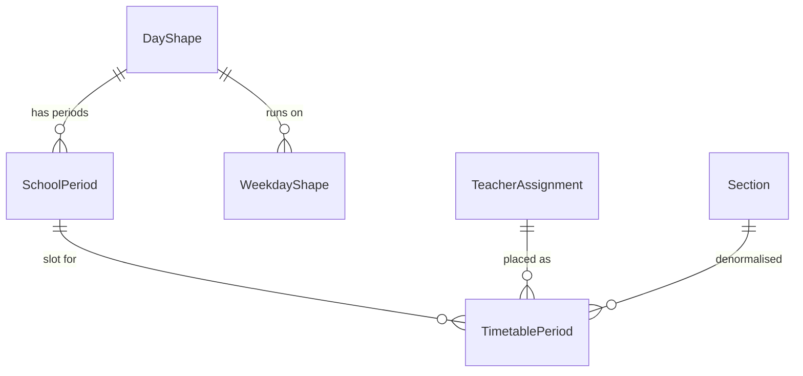
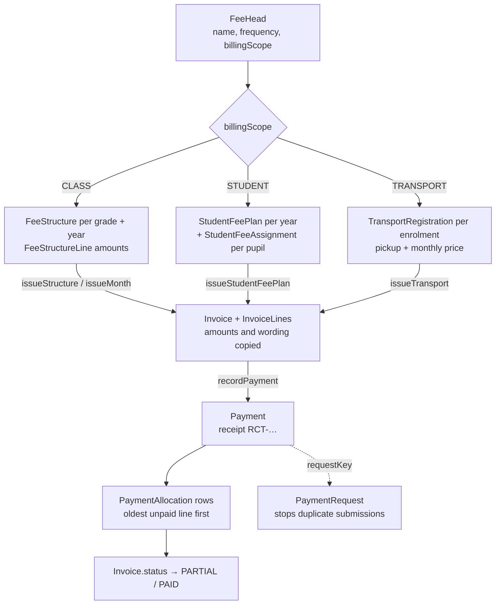
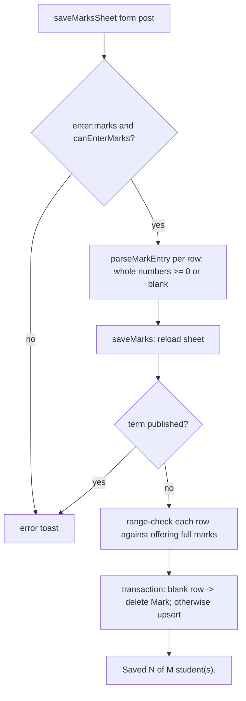
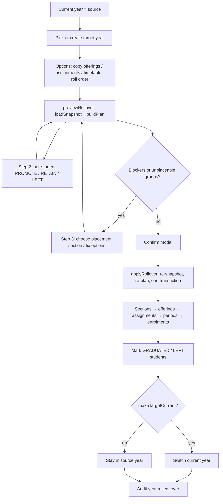

# School Management System — Complete Implementation Guide

This document explains how the school management system works from end to end:
its architecture, roles and permissions, the academic registry, timetable,
attendance, fees, exams, honours, announcements, the mobile API used by the
Expo app, the database, and the operational tooling around backups and
recovery. It is written for developers and administrators who need to
understand, run, maintain, or extend the application.

Implementation snapshot: **27 September 2026**.

Every behaviour described here was read from the code. Where the code does
something surprising — a status that is never set, a check that is missing — the
relevant section says so, and [Known limitations](#27-known-limitations)
collects them in one place.

## Contents

1. [System overview](#1-system-overview)
2. [Technology stack](#2-technology-stack)
3. [Application architecture](#3-application-architecture)
4. [Roles, permissions, and authentication](#4-roles-permissions-and-authentication)
5. [Dashboard, navigation, and route map](#5-dashboard-navigation-and-route-map)
6. [Academic years and school structure](#6-academic-years-and-school-structure)
7. [Subjects and teaching assignments](#7-subjects-and-teaching-assignments)
8. [Staff and teachers](#8-staff-and-teachers)
9. [Students, guardians, and photos](#9-students-guardians-and-photos)
10. [Timetable](#10-timetable)
11. [Attendance](#11-attendance)
12. [Fees and billing](#12-fees-and-billing)
13. [Exams, marks, and grading](#13-exams-marks-and-grading)
14. [Honours: conduct and activities](#14-honours-conduct-and-activities)
15. [Announcements](#15-announcements)
16. [Year rollover and restore points](#16-year-rollover-and-restore-points)
17. [Exports and printing](#17-exports-and-printing)
18. [Mobile API (Expo app)](#18-mobile-api-expo-app)
19. [API reference (non-mobile)](#19-api-reference-non-mobile)
20. [Database model reference](#20-database-model-reference)
21. [Key implementation modules](#21-key-implementation-modules)
22. [Language, dates, and localisation](#22-language-dates-and-localisation)
23. [Audit trail and activity log](#23-audit-trail-and-activity-log)
24. [Local development](#24-local-development)
25. [Backup, recovery, and production](#25-backup-recovery-and-production)
26. [Testing and quality checks](#26-testing-and-quality-checks)
27. [Known limitations](#27-known-limitations)
28. [Common extension workflows](#28-common-extension-workflows)

## 1. System overview

### 1.1 What the product is

The school management system is a single-school administration tool for Nepali
schools. One deployment holds one school's records: its academic years, grades
and sections, students and guardians, staff, subjects, the weekly timetable, the
daily roll call, terminal exams and marks, conduct and activity entries, an
honours ranking, staff announcements, and a fee ledger (class prices, student
services, transport, invoices and payments).

There is no public website. The site root (`src/app/page.tsx`) only redirects a
signed-in visitor to `/dashboard` and everyone else to `/login`. Every other
page lives under the authenticated `/dashboard` tree.

The same Next.js application serves two clients:

1. **The web dashboard** — server-rendered pages under `src/app/dashboard`,
   mutated through Server Actions (`actions.ts` files).
2. **A JSON API for an Expo mobile app** — route handlers under
   `src/app/api/mobile/*`, authenticated with opaque bearer tokens rather than
   the web session cookie (§4.7). Two environment variables configure it,
   `MOBILE_APP_ORIGINS` and `MOBILE_SESSION_TTL_DAYS` (§24).

### 1.2 Who uses it

Accounts have exactly one of three roles, defined by the `Role` enum in
`prisma/schema.prisma` and labelled in `src/lib/auth/roles.ts`:

| Role | Label | Intended user |
| --- | --- | --- |
| `ADMIN` | Administrator | Principal or system owner. Everything, including school settings, logins and the permission matrix. |
| `OFFICE` | Office | Office/administrative staff. All student and staff records, timetable, exams and fees, but no account management. |
| `TEACHER` | Teacher | Class and subject teachers. Marks, attendance and conduct for their own classes only. |

What each role may actually do is decided by a school-editable permission
matrix, not by the role name alone (§4.3).

### 1.3 Main feature areas

The dashboard navigation is defined in `src/app/dashboard/_components/nav-model.ts`:

| Nav group | Item | Route | Purpose |
| --- | --- | --- | --- |
| People | Overview | `/dashboard` | Role-aware home: today's roll-call standing, alerts, schedule, announcements |
| People | Students | `/dashboard/students` | Register, student detail pane, honours view (`?view=honours`) |
| People | Staff | `/dashboard/teachers` | Staff records and photos |
| Timetable | Classes | `/dashboard/classes` | Academic years, grades, sections, and the timetable view (`?view=timetable`) |
| Timetable | Subjects | `/dashboard/subjects` | Subjects and per-grade offerings |
| Timetable | Teaching | `/dashboard/assignments` | Teacher ↔ section/subject assignments and teaching load |
| Daily | Roll call | `/dashboard/attendance` | Daily attendance sheets and statistics |
| Daily | Exams | `/dashboard/exams` | Exam terms, marks grid, printable marksheets |
| Daily | Fees | `/dashboard/fees` | Fee types, class pricing, services, transport, invoices, payments, balances |
| — | Settings | `/dashboard/settings` | School profile, language, accounts, permissions, restore points, activity history |

Two older routes remain as redirects for bookmarks: `/dashboard/timetable` (into
Classes) and `/dashboard/honours` (into Students). `/dashboard/rollover` hosts
the academic-year transition wizard and is reached from Settings rather than the
rail.

### 1.4 Nepali context

The product is built around how Nepali schools operate:

- **Bikram Sambat (BS) calendar.** Academic years run Baisakh–Chaitra and are
  named in BS (`AcademicYear.nameBS`). Every date is entered and displayed in
  BS, while the database stores the Gregorian equivalent (§22.4).
- **Nepal time.** "Today" for the school is computed in `Asia/Kathmandu`
  (`schoolDate()` in `src/lib/dashboard/overview.ts`), and the activity log
  prints timestamps in that zone.
- **Working week.** `SchoolProfile.workingDays` defaults to Sunday–Friday,
  because Saturday is the weekly holiday in Nepal; it is configurable.
- **Rupees.** Fee amounts are whole Nepali rupees stored as integers and shown
  as `Rs. 1,234` (§22.6). Fee billing months are BS months 1–12.
- **Two-script names.** Students, staff and the school itself have an optional
  Devanagari name (`fullNameNp`, `nameNp`). The name form suggests a Devanagari
  spelling from the romanised one (§22.3). A Noto Sans Devanagari face is loaded
  in `src/app/layout.tsx` so these render consistently.
- **Nepali interface.** The whole school can switch the interface language to
  Nepali (`ne`) from Settings (§22.1).

## 2. Technology stack

| Concern | Technology | Notes |
| --- | --- | --- |
| Framework | Next.js 16.3 (App Router) | `next.config.ts` raises the Server Action body limit to `3mb` so a 2 MB school logo upload fits. `src/proxy.ts` uses Next 16's renamed `proxy` convention (formerly `middleware`). |
| React | React 19.2 | Server Components by default; `useActionState` for forms. |
| Language | TypeScript 5 (strict) | Path alias `@/*` → `./src/*` in `tsconfig.json`. |
| Styling | Tailwind CSS 4 via `@tailwindcss/postcss` | `src/app/globals.css` imports `tailwindcss`, `tw-animate-css` and `shadcn/tailwind.css`, defines a token scale on `:root`, and a class-based `dark` variant. |
| UI kit | shadcn (style `base-nova`) on `@base-ui/react` | `components.json` sets RSC, lucide icons, neutral base colour; generated primitives live in `src/components/ui`. |
| Command palette | `cmdk` | `src/components/ui/command.tsx`; ranking rules in `src/lib/search/global.ts`. |
| Tables | TanStack Table 8 | Shared wrapper `src/components/ui/data-table.tsx`, with column/paging/preference helpers in `src/lib/table/*` (density, page size and hidden columns persisted per table). |
| Class helpers | `clsx`, `tailwind-merge`, `class-variance-authority` | `cn()` in `src/lib/utils.ts`. |
| Database | PostgreSQL | `DATABASE_URL`; the `pg` driver is used directly only by `scripts/db-recovery.cjs` and `scripts/seed.cjs`. |
| ORM | Prisma 6.19 (classic engine) | Generator `prisma-client` outputs to **`src/generated/prisma`**, imported as `@/generated/prisma/client` and `@/generated/prisma/enums` — not from `@prisma/client`. `prisma.config.ts` points at `prisma/schema.prisma` and `prisma/migrations` (25 migrations). |
| Authentication | Auth.js / `next-auth` 5 beta | Credentials provider only, JWT sessions (§4). `AUTH_SECRET` must be set. |
| Mobile auth | Custom opaque bearer tokens | SHA-256 digests stored in `MobileSession` (`src/lib/auth/mobile-session.ts`). |
| Password hashing | `bcryptjs`, cost 10 | `src/lib/auth/registration.ts`, `src/lib/auth/credentials.ts`. |
| Dates | `nepali-datetime` 2 | Wrapped by `src/lib/date/bs.ts`; supports BS 2000–2099. |
| Animation | `motion` 13 (`motion/react`) | Page fade in `src/app/dashboard/template.tsx`, table transitions; respects reduced motion. |
| Icons | `lucide-react` | |
| Fonts | `next/font/google` | Bricolage Grotesque (display), Geist (body), Geist Mono, Noto Sans Devanagari. |
| Theme | Custom light/dark | `src/lib/theme/theme.ts` + an inline no-flash script (`ThemeBootstrap`); preference in `localStorage`. |
| Tooling | ESLint 9 (`eslint-config-next`), `scripts/*` | `npm run audit:i18n`, `db:backup`, `db:restore-drill`, `smoke` (Playwright screenshots). |

## 3. Application architecture

### 3.1 Request flow

```mermaid
flowchart TD
    B[Browser] -->|page request| P[src/proxy.ts<br/>Edge: session cookie only]
    P -->|no session| L[/login]
    P -->|session| RSC[Server Component page<br/>requirePage / currentActor]
    RSC --> LIB[src/lib/* domain services]
    B -->|form submit| SA[Server Action<br/>actions.ts: requireCapability]
    SA --> LIB
    SA -->|revalidatePath| RSC
    M[Expo app] -->|Bearer token| RH[Route handler<br/>src/app/api/mobile/*]
    RH -->|guardMobileRequest / requireMobileCapability| LIB
    B -->|CSV / photo| API[src/app/api/export, photo, school-logo]
    API --> LIB
    LIB --> PR[src/lib/prisma.ts<br/>shared PrismaClient]
    PR --> DB[(PostgreSQL)]
```

The proxy matcher excludes every `/api` path, so route handlers are never
covered by it; each handler authenticates itself.

### 3.2 Three kinds of server code

| Kind | Where | Used for | Auth entry point |
| --- | --- | --- | --- |
| Server Components | `page.tsx`, `layout.tsx` under `src/app/dashboard` | Reading data and rendering. Pages call `src/lib/*` read functions directly. | `requirePage(pathname)` or `currentActor()` from `src/lib/auth/guard.ts` |
| Server Actions | `actions.ts` (and `timetable-actions.ts`, `student-fee-actions.ts`, `transport-actions.ts`) beside each route; 15 files marked `"use server"` | Every web mutation, plus a few read helpers used by client drill-downs | `requireCapability(capability)` at the top of each action |
| Route handlers | `src/app/api/**/route.ts` | Mobile JSON API, CSV exports, photo/logo bytes, Auth.js endpoints | `requireMobileCapability` / `guardMobileRequest` (mobile); `auth()` + `currentActor()` + grant check (exports) |

The pattern that runs through the code is that business rules live in
`src/lib/<domain>/*` and are shared by both the web actions and the mobile route
handlers. For example, `recordPayment()` in `src/lib/fees/fees.ts` is called by
`src/app/dashboard/fees/actions.ts` and by `src/app/api/mobile/fees/payments/route.ts`.
The action/handler layer is responsible for parsing input, checking permission,
calling the service, mapping domain errors to messages, and revalidating.

### 3.3 The dashboard shell

`src/app/dashboard/layout.tsx` is a Server Component that checks the session,
loads the permission grants once per request, loads the academic years and the
school letterhead, builds the alert list, filters the navigation against the
stored grants, and renders the top bar and icon rail around the page. §5.2
describes it step by step. Hiding a nav item is only a courtesy; each page and
action repeats the permission check.

### 3.4 Data access

`src/lib/prisma.ts` exports the single `prisma` client. Two problems shaped it:

- **Hot reload** would create a new client and connection pool on every save,
  so the instance is stashed on `globalThis`.
- **Multiple compilation layers.** Next compiles pages/actions (`[app-rsc]`) and
  route handlers (`[app-route]`) into separate copies of the generated client
  module that share one process. An earlier `instanceof` guard treated the other
  layer's client as stale and replaced it, leaking a full pool per layer.

`src/lib/prisma-reuse.ts` solves both with `resolvePrismaClient(slot,
fingerprint, create)`. The fingerprint (`schemaFingerprint(Prisma)`) is a JSON
list of every model and its scalar fields taken from the generated `Prisma`
namespace. A cached client is reused when the fingerprint matches; after
`prisma generate` changes the schema, the old client is disconnected and
replaced. The module deliberately has no Prisma import so the decision can be
exercised on its own.

A few writes use parameterised raw SQL instead of model delegates (the audit
insert in `src/lib/audit.ts`, invoice numbering and `PaymentRequest` in
`src/lib/fees/fees.ts`) so that an already-running older client can still use
newly added tables during a deployment.

### 3.5 Forms

Forms are plain `<form action={formAction}>` elements bound to a Server Action.
The shared conventions are:

- Actions take `(prevState, formData)` and return `{ error?: string; success?: string }`.
  Domain errors (for example `AttendanceError`, `RegistrationError`,
  `ForbiddenError`) are caught and returned as `error`; anything else is
  rethrown to the route's error boundary.
- Client components use `useToastedActionState()` from
  `src/components/ui/toast.tsx` (38 files). It wraps `useActionState`, shows the
  result as a toast, and translates the message into the interface language.
- `src/lib/form.ts` exports `numericField(formData, name)`, which returns a
  positive integer or `null`. It exists because `Number("")` is `0`, which would
  otherwise pass `Number.isInteger` and reach the database as id 0.
- Per-domain parsers (`*-input.ts`, such as `src/lib/attendance/attendance-input.ts`)
  validate form shapes and return `{ ok, value | error }` results.
- After a successful write the action calls `revalidatePath()` for the route or
  the whole dashboard layout.

### 3.6 Folder layout

| Path | Contents |
| --- | --- |
| `src/app/(auth)` | `login` and `signup` pages, forms and the signup action |
| `src/app/dashboard` | Layout, template, overview (`(overview)`), one folder per area with `page.tsx`, `actions.ts`, `loading.tsx` and `_components/` |
| `src/app/dashboard/_components` | Shell pieces: top bar, icon rail, account menu, year switcher, alerts, announcements, nav model |
| `src/app/api/auth/[...nextauth]` | Auth.js GET/POST handlers |
| `src/app/api/mobile` | Expo JSON API (auth, overview, students, classes, subjects, teaching, timetable, attendance, exams, fees, announcements, staff, photos) |
| `src/app/api/export` | CSV exports (students, ledger, per-year kinds) |
| `src/app/api/photo/[id]`, `api/school-logo` | Image bytes from the `Photo` table |
| `src/components/ui` | shadcn/base-ui primitives plus app components (data table, BS calendar/date field, marksheet, name fields, page frame, toast) |
| `src/components/i18n` | `LanguageProvider`, `TranslatedText`, `useLanguage` |
| `src/generated/prisma` | Generated Prisma client (do not edit) |
| `src/types/next-auth.d.ts` | Session/JWT type augmentation |
| `src/proxy.ts` | Edge session check |
| `prisma/` | `schema.prisma`, `migrations/` |
| `scripts/` | Seed, backup/restore drill, UI smoke screenshots, i18n audit, overview preview |
| `docs/` | Local operational notes (gitignored; summarised in §25) |

`src/lib` is organised by domain:

| Path | Responsibility |
| --- | --- |
| `src/lib/auth` | Session config, credentials, guards, roles/capabilities, permission matrix, teacher scope, registration, mobile sessions |
| `src/lib/registry` | Academic years, grades/sections, subjects, staff, students, admission, assignments, teaching load, rollover, year teardown, restore points, school profile, photos |
| `src/lib/attendance` | Roll-call sheets, reports, attendance strips |
| `src/lib/assessment` | Exams, marks, grading |
| `src/lib/fees` | Fee heads/structures, invoices, payments, student services, transport, reconciliation, printable documents, money formatting |
| `src/lib/honours` | Honours score, weights, podium, conduct/activity entries |
| `src/lib/timetable` | Day shapes, bell periods, grid cells, teacher week, clock helpers |
| `src/lib/announcements` | Announcement CRUD, audience/expiry visibility rules |
| `src/lib/dashboard` | Overview query, alerts, insights, roll-call standing, teacher schedule |
| `src/lib/date` | BS conversion and formatting, year status |
| `src/lib/i18n`, `src/lib/nepali` | Nepali dictionaries and translation; romanised → Devanagari names |
| `src/lib/http` | Mobile CORS and route guard helpers |
| `src/lib/table`, `src/lib/search`, `src/lib/export`, `src/lib/theme` | Table preferences, palette ranking, CSV writer, theme |
| `src/lib/audit.ts` | Append-only activity log |
| `src/lib/prisma.ts`, `prisma-reuse.ts` | Shared database client |
| `src/lib/form.ts`, `record-code.ts`, `register-codes.ts`, `utils.ts` | Small shared helpers (form ids, display codes, badge codes, `cn`) |

## 4. Roles, permissions, and authentication

### 4.1 Building blocks

| File | Responsibility |
| --- | --- |
| `src/lib/auth/auth.config.ts` | Edge-safe Auth.js config: public routes, `authorized`, `jwt`, `session` callbacks. No Prisma or bcrypt. |
| `src/lib/auth/auth.ts` | Full Auth.js instance with the Credentials provider; exports `handlers`, `signIn`, `signOut`, `auth`. |
| `src/lib/auth/credentials.ts` | `authenticateCredentials(identifier, password)` — shared by web and mobile login. |
| `src/lib/auth/identity.ts` | `normalizeEmail()` (trim + lowercase) and `isValidEmail()`. |
| `src/lib/auth/registration.ts` | Bootstrap sign-up, account creation/validation, role change, staff linking, deletion. |
| `src/lib/auth/roles.ts` | `Capability` type, `CAPABILITIES`, labels, `DEFAULT_GRANTS`, `ROUTE_CAPABILITY`, `capabilityFor()`, timetable-view helpers. |
| `src/lib/auth/permissions.ts` | Stored permission matrix: `readGrants`, `loadGrants` (request-cached), `granted`, `setGrant`, `resetGrants`. |
| `src/lib/auth/scope.ts` | `Actor` type and teacher scoping: `allowedSectionIds`, `canEnterMarks`, `canTakeAttendance`, `canRecordConduct`, `canReorderRolls`. |
| `src/lib/auth/guard.ts` | `currentActor`, `requireCapability`, `requirePage`, `ForbiddenError`. |
| `src/lib/auth/mobile-session.ts` | Bearer-token sessions for the Expo app. |
| `src/proxy.ts` | Runs the `authorized` callback on the Edge for every non-API, non-static request. |
| `src/types/next-auth.d.ts` | Adds `id`, `username`, `role` to Auth.js `User`, `Session` and `JWT`. |

### 4.2 Capabilities and default grants

A capability is a string from the `Capability` union in `src/lib/auth/roles.ts`.
There are ten. The built-in defaults (`DEFAULT_GRANTS`) are:

| Capability | Label shown in Settings | ADMIN | OFFICE | TEACHER |
| --- | --- | :-: | :-: | :-: |
| `manage:settings` | School settings and logins | ✓ | | |
| `manage:registry` | Students, staff, classes and subjects | ✓ | ✓ | |
| `manage:timetable` | Build the class timetable | ✓ | ✓ | |
| `manage:exams` | Create and publish exams | ✓ | ✓ | |
| `manage:fees` | Fee structures, invoices and collections | ✓ | ✓ | |
| `enter:marks` | Enter marks | ✓ | ✓ | ✓ (own subjects) |
| `take:attendance` | Take attendance | ✓ | ✓ | ✓ (own sections) |
| `record:conduct` | Record conduct and activities | ✓ | ✓ | ✓ (own sections) |
| `view:records` | View student and staff records | ✓ | ✓ | ✓ |
| `post:announcements` | Post announcements to staff | ✓ | | |

`CAPABILITY_NOTE` adds the caveats the matrix displays; notably, teachers always
see their own timetable whether or not `manage:timetable` is granted.

### 4.3 The stored permission matrix

The `RolePermission` model holds one row per `(role, capability)` that the school
has changed from the default (`@@unique([role, capability])`, `granted Boolean`).
Absence means "use the default", so a fresh install needs no seeding.

`readGrants()` in `src/lib/auth/permissions.ts`:

1. Starts from `DEFAULT_GRANTS` for each role.
2. Applies each stored row, ignoring rows for capabilities no longer in the code
   and any row for `ADMIN`.
3. Restates `ADMIN` as holding every capability (`ADMIN_IS_FIXED`), so a stray
   row can never lock administrators out of the matrix itself.

`loadGrants` is `readGrants` wrapped in React `cache()`, so a page that checks
several capabilities makes one query per request.

Editing happens in Settings (`permission-matrix.tsx` → `togglePermission` /
`restoreDefaultPermissions` in `src/app/dashboard/settings/actions.ts`, both
requiring `manage:settings`). `setGrant()` refuses `ADMIN` and unknown
capabilities, then either deletes the row (when the new value equals the
default) or upserts it, so only differences are stored and a later change to a
default still reaches the school. Both `setGrant` and `resetGrants` write an
audit event in the same transaction (§23). The action revalidates the whole
dashboard layout, so navigation updates immediately.

### 4.4 Sign-up and account creation

Public sign-up is a one-time bootstrap. `isSignupOpen()` returns true only while
the `User` table is empty.

- `/signup` (`src/app/(auth)/signup/page.tsx`) is rendered per request; once any
  account exists it shows "Sign-up is closed" instead of the form.
- The `createUser` action re-checks `isSignupOpen()` itself, because a Server
  Action is a public endpoint. The bootstrap account is created with the
  `createAccount` default role, **`OFFICE`** (the schema default is also
  `OFFICE`).
- After bootstrap, accounts are created in Settings by `addAccount`
  (`manage:settings`). A `TEACHER` account must be linked to a staff record,
  because teacher scoping reads it.

`validateAccount()` is shared by both paths: username ≥ 3 characters and no `@`
(so a username cannot shadow an email at login), a valid email, password ≥ 8
characters. `createAccount()` hashes with bcrypt cost 10, lowercases the email,
and relies on the database unique indexes to reject duplicates (Prisma `P2002`
is mapped to a friendly `RegistrationError`).

Other account rules in `src/lib/auth/registration.ts` and the settings actions:

- `deleteAccount` refuses to delete the last account; the action also refuses to
  delete the signed-in account. The staff link is cleared first.
- `setAccountRole` refuses to demote the last `ADMIN`.
- `linkStaff` moves the one-to-one `Staff.userId` link.
- Any signed-in user may change or clear their own email (`updateEmail`); the
  account id comes from the session, never the form. A cleared email is stored
  as `NULL` so the unique index does not collide.

### 4.5 Login and session lifecycle

1. The login form (`src/app/(auth)/login/login-form.tsx`) calls
   `signIn("credentials", { identifier, password, redirect: false })`.
2. The Credentials provider in `src/lib/auth/auth.ts` calls
   `authenticateCredentials()`, which matches the identifier against
   `username` **or** normalised `email`. It always runs one bcrypt comparison —
   against a fixed dummy hash when no user exists — so response time does not
   reveal whether an account exists. The form shows one message for both
   failure cases.
3. On success the `jwt` callback copies `id`, `username` and `role` onto the
   token; the `session` callback exposes them as `session.user.*`.
4. The client pushes to `/dashboard` and calls `router.refresh()` so server
   components re-render with the new cookie.

Sessions use the Auth.js JWT strategy (there is no database adapter and no
`Session` table). No custom `maxAge` is configured, so the library default
applies. Sign-out uses Auth.js `signOut`.

The token's `role` is effectively informational. Every authorisation decision
calls `currentActor()`, which re-reads the user row (role and linked staff id)
from the database on each request. A role change or deletion therefore takes
effect on the next request, not the next sign-in.

### 4.6 Route protection

Protection has two layers.

**Edge proxy (`src/proxy.ts`).** It builds a config-only Auth.js instance and
runs `authorized` from `auth.config.ts`:

- `/login` and `/signup` are the only public routes (an allow-list, so a new
  page is protected by default).
- A signed-in user visiting a public route is redirected to `/dashboard/students`.
- Any other route requires a session cookie; otherwise Auth.js redirects to
  `/login`.
- The proxy never checks capabilities: it has no database and the token may
  predate a permission change.

**Server guards (`src/lib/auth/guard.ts`).**

- `requirePage(pathname)` — for pages. Redirects to `/login` without an actor.
  It looks up the required capability with `capabilityFor(pathname)` (longest
  matching prefix in `ROUTE_CAPABILITY`) and redirects to `/dashboard?denied=1`
  when it is not granted. Unlisted paths (such as `/dashboard` itself) need only
  a session.
- `requireCapability(capability)` — for actions. Throws `ForbiddenError` (never
  returns a falsy value, so a forgotten check cannot leave a hole). Actions catch
  it and return `{ error }`.

`ROUTE_CAPABILITY`:

| Path prefix | Capability |
| --- | --- |
| `/dashboard/settings/academic-years` | `manage:registry` |
| `/dashboard/settings` (incl. `activity`, `readiness`) | `manage:settings` |
| `/dashboard/classes`, `/subjects`, `/assignments`, `/teachers`, `/rollover` | `manage:registry` |
| `/dashboard/students`, `/dashboard/honours` | `view:records` |
| `/dashboard/attendance` | `take:attendance` |
| `/dashboard/exams` | `enter:marks` |
| `/dashboard/fees` | `manage:fees` |

Special cases:

- **Classes / timetable.** `src/app/dashboard/classes/page.tsx` does not call
  `requirePage`. It uses `currentActor()` and allows entry with
  `manage:registry` **or** `canOpenTimetableView()` (holds `manage:timetable`,
  or is a `TEACHER` with a linked staff record). Only `manage:timetable` makes
  the timetable editable (`timetableViewIsEditable`). `/dashboard/timetable` is
  deliberately absent from `ROUTE_CAPABILITY`.
- **Settings.** The page first redirects actors who have `manage:registry` but
  not `manage:settings` to the academic-years tool, before loading any account
  data.
- **Exports.** `src/app/api/export/*` check `auth()`, then `currentActor()` and
  the capability of the matching page via `capabilityFor()`.
- **Photos.** `src/app/api/photo/[id]` requires only a session; the school logo
  route is used on the login page.

### 4.7 Mobile API sessions

`src/lib/auth/mobile-session.ts` implements a separate session type for the Expo
app:

1. `POST /api/mobile/auth/login` runs the same `authenticateCredentials()`.
2. `createMobileSession()` generates 32 random bytes (base64url), stores only
   the SHA-256 digest in `MobileSession` with an expiry
   (`MOBILE_SESSION_TTL_DAYS`, 1–365, default 30), and deletes expired rows in
   the same transaction. The raw token is returned once, together with the
   user and the list of capabilities the role currently holds.
3. Clients send `Authorization: Bearer <token>`. `readMobileSession()` looks up
   the digest, deletes and rejects expired sessions, and builds the same `Actor`
   shape the web uses.
4. `requireMobileCapability()` checks the stored matrix (uncached `readGrants`)
   and throws `MobileAuthError` with status 401 or 403.
5. `GET /api/mobile/auth/session` returns the payload; `POST .../logout` deletes
   the row. Deleting a user cascades to its mobile sessions.

`src/lib/http/mobile-cors.ts` enforces a browser-origin allow-list:
`MOBILE_APP_ORIGINS` (comma-separated) plus, outside production, Expo dev
origins on ports 8081 and 19006. Requests with no `Origin` header (native apps)
are allowed. `src/lib/http/mobile-route.ts` bundles the origin and capability
check as `guardMobileRequest()` and provides id parsing helpers that reject
values above Postgres INT4.

### 4.8 Teacher scoping

Capabilities say *what* a role may do; `src/lib/auth/scope.ts` says *where* a
teacher may do it. Non-teacher roles are unrestricted by scope. A teacher's
scope comes from their linked `Staff` record (`Actor.staffId`); an unlinked
teacher login reaches nothing of its own.

| Helper | Teacher rule |
| --- | --- |
| `allowedSectionIds(actor)` | Sections where they are class teacher (`Section.classTeacherId`) plus sections where they have any `TeacherAssignment`. Returns `"all"` for other roles. |
| `canTakeAttendance(actor, sectionId)` | Section is in `allowedSectionIds`. |
| `canRecordConduct(actor, sectionId)` | Same as attendance. |
| `canEnterMarks(actor, sectionId, subjectOfferingId)` | An exact `TeacherAssignment` for that section **and** subject exists. Being class teacher of a section does not grant its subjects' marks. Non-teachers need `enter:marks`. |
| `canReorderRolls(actor, sectionId)` | `manage:registry`, or class teacher of that section. |

The capability and the scope are checked separately. For example
`saveAttendance` in `src/app/dashboard/attendance/actions.ts` calls
`requireCapability("take:attendance")` and then `canTakeAttendance()`; the
exams action calls `canEnterMarks()` after its capability check. The mobile
attendance, marks and student routes use the same helpers. On the Students page
the full register is listed to anyone with `view:records`, but opening a
student outside a teacher's sections redirects back with `?denied=1`.

### 4.9 Checking permissions in new code

- **Page:** `const actor = await requirePage("/dashboard/<area>")`, and add the
  prefix to `ROUTE_CAPABILITY` if the area needs a capability.
- **Conditional UI on a page:** `const grants = await loadGrants();
  granted(grants, actor.role, "<capability>")`.
- **Server Action:** start with `requireCapability("<capability>")` inside a
  `try` that maps `ForbiddenError` to `{ error }`, then apply the `scope.ts`
  helper for section/subject-level rules.
- **Mobile route:** `guardMobileRequest(request, "<capability>")` or
  `requireMobileCapability`, then the same scope helper.

## 5. Dashboard, navigation, and route map

### 5.1 Root layout and theme bootstrap

`src/app/layout.tsx` is the outermost shell. It reads the school letterhead
(`getLetterhead()` in `src/lib/registry/school.ts`) on every request, so the
browser-tab title and the `<html lang>` follow the school name and interface
language set in Settings without a rebuild. It loads four Google fonts (Bricolage
Grotesque for display, Geist for body, Noto Sans Devanagari for Nepali names and
BS dates, Geist Mono), then wraps every page in `ThemeBootstrap`,
`LanguageProvider` and `ToastProvider`.

### 5.2 Dashboard shell

`src/app/dashboard/layout.tsx` renders a CSS grid: a top bar across the full
width, a 64px icon rail on the left from the `shell` breakpoint up
(`--breakpoint-shell: 54rem` in `src/app/globals.css`), and a scrolling `<main
id="dashboard-main">`. A "Skip to main content" link comes first. On each
dashboard navigation the layout:

1. Calls `requirePage("/dashboard")`, which redirects to `/login` without a
   session.
2. Loads the stored permission matrix (`loadGrants()`), the academic years, the
   current year and the letterhead.
3. Builds the current year's overview (`getDashboardOverview`) and turns it into
   the alert list (`dueItems`) for the bell icon.
4. Works out which nav items this account may see. It calls `capabilityFor(href)`
   on each item and checks the result against the *stored* grants, not the JWT.
   A permission change therefore shows in the navigation on the next navigation,
   without the user signing in again. Settings is also shown to anyone holding
   `manage:registry`, because they can reach the academic-years sub-page.

`src/app/dashboard/template.tsx` re-mounts on every navigation and fades each
page in with `motion`. It honours `prefers-reduced-motion`. `loading.tsx` and
`error.tsx` supply the segment's skeleton and error boundary.

### 5.3 Top bar

`_components/top-bar.tsx` shows, from left to right:

- the brand mark and school name, plus the address and today's BS date
  (formatted in Nepali when the school language is `ne`);
- an empty centre slot. The comment there says the global search trigger
  "lands here in Phase 3", and it is not wired yet (§5.7);
- `YearSwitcher`, which lists the academic years. Switching calls
  `switchAcademicYear` in `src/app/dashboard/actions.ts`. That action requires
  `manage:registry`, changes the school-wide current year, and revalidates the
  whole `/dashboard` layout;
- `AlertsPopover`, a bell with a red dot when there are items and a "Needs
  attention" list;
- `ThemeToggle`;
- `AccountMenu`, which offers sign out, a theme switch, and phone overflow links
  to every allowed section that is not in the mobile bar.

### 5.4 Navigation model

All navigation is defined in `src/app/dashboard/_components/nav-model.ts`:

| Group | Items (id → href) |
| --- | --- |
| people | `home` → `/dashboard`, `students` → `/dashboard/students`, `teachers` ("Staff") → `/dashboard/teachers` |
| timetable | `classes` → `/dashboard/classes`, `subjects` → `/dashboard/subjects`, `assignments` ("Teaching") → `/dashboard/assignments` |
| daily | `attendance` ("Roll call") → `/dashboard/attendance`, `exams` → `/dashboard/exams`, `fees` → `/dashboard/fees` |
| (bottom) | `SETTINGS` → `/dashboard/settings` |

Each item has a `tint`. The same colour marks the rail pill, the page header
icon and the empty states for that area. `activeId(pathname)` highlights the
item with the longest matching prefix, so `/dashboard/students` does not also
light up Overview. `visibleGroups(allowed)` drops items the account cannot open
and removes any group left empty. The comments are explicit that hiding a link
is only a courtesy: pages and actions enforce permissions themselves.

`icon-rail.tsx` renders two navs. From the `shell` breakpoint up it shows a
vertical rail, with a divider between groups and Settings pinned to the bottom.
Below that breakpoint it shows a fixed bottom bar with the five `MOBILE_IDS`
(`home`, `students`, `teachers`, `attendance`, `fees`) and a "More" sheet
holding everything else, Settings included.

Timetable and Honours no longer have rail entries. They live as views inside
Classes (`?view=timetable`) and Students (`?view=honours`). Their old routes
redirect so that bookmarks keep working.

### 5.5 Route map

Access comes from `ROUTE_CAPABILITY` / `capabilityFor()` in
`src/lib/auth/roles.ts`, enforced by `requirePage()` in `src/lib/auth/guard.ts`.
A user who lacks the capability is redirected to `/dashboard?denied=1`, and the
Overview shows a notice. `src/proxy.ts` (the Next.js 16 name for middleware)
only enforces "signed in" for every non-`/api` path, except `/login` and
`/signup`.

| Route | Purpose | Who can access |
| --- | --- | --- |
| `/` | No content. Redirects to `/dashboard` with a session, otherwise to `/login` (`src/app/page.tsx`) | Anyone |
| `/login` | Credentials sign-in with the school's name and logo. `force-dynamic` so a rename shows | Public. The proxy sends signed-in users to `/dashboard/students` |
| `/signup` | One-time bootstrap account. Open only while the `User` table is empty | Public until the first account exists |
| `/dashboard` | Overview (§5.6) | Any signed-in user |
| `/dashboard/students` | Student register. `?student=` opens a record pane, `?view=honours` shows the honours view | `view:records`. A teacher opening a student outside their sections is sent back with `denied=1` |
| `/dashboard/students/[id]` | Redirects to `?student=<id>` | Same as above |
| `/dashboard/honours` | Redirects to `/dashboard/students?view=honours` | `view:records` |
| `/dashboard/teachers` | Staff register. `?staff=` opens a pane | `manage:registry` |
| `/dashboard/teachers/[id]` | Redirects to `?staff=<id>` | `manage:registry` |
| `/dashboard/classes` | Views `structure` (grades and sections), `years`, and `timetable` (§10) | Structure and Years need `manage:registry`. Timetable needs `manage:timetable` (editable) or a teacher with a linked staff record (read-only). The page does its own check rather than using `requirePage` |
| `/dashboard/timetable` | Redirects to `/dashboard/classes?view=timetable`, keeping `section`, `teacher` and `shape` | Session only; the target page checks the view |
| `/dashboard/subjects` | Subjects and per-grade offerings | `manage:registry` |
| `/dashboard/assignments` | "Teaching": subject-teacher assignments | `manage:registry` |
| `/dashboard/attendance` | Roll call (§11). `?section=`, `?date=` (BS) | `take:attendance` |
| `/dashboard/exams` | `?view=marks` (default), `ledger`, `exams` | `enter:marks` |
| `/dashboard/exams/print` | Printable marksheet/ledger (`?exam`, `?section`, `?student`) | `enter:marks` |
| `/dashboard/fees` | Fee workspace. `?pupil=` | `manage:fees` |
| `/dashboard/fees/print` | Invoice/receipt/statement print (`?invoice`, `?receipt`; comma-separated receipts produce a statement) | `manage:fees` |
| `/dashboard/rollover` | Redirects to `/dashboard/settings/academic-years` | `manage:registry` (enforced on the target page) |
| `/dashboard/settings` | School settings, accounts, permission matrix, restore points (`?view=`, `?staff=`) | `manage:settings`. A registry-only account is redirected to academic years |
| `/dashboard/settings/academic-years` | Years and rollover | `manage:registry` |
| `/dashboard/settings/activity` | Append-only activity history (`?before=` paging) | `manage:settings` |
| `/dashboard/settings/readiness` | Read-only operational/reconciliation checks (`?year=`) | `manage:settings` |

API routes are excluded from the proxy matcher and authorize themselves:
`/api/auth/[...nextauth]`, `/api/export/{ledger,students,year/[kind]}`,
`/api/photo/[id]`, `/api/school-logo`, and the bearer-token mobile API under
`/api/mobile/*`. The mobile `overview` and `alerts` endpoints reuse
`getDashboardOverview` and `dueItems`.

### 5.6 Overview page

`src/app/dashboard/(overview)/page.tsx` loads four things for the current year:
`getDashboardOverview`, today's periods for a teacher
(`getTeacherScheduleForToday`, fetched only on a school day), `getRoleInsights`,
and announcements. It passes them to `_components/overview-workspace.tsx`.
Without a current academic year, it shows a welcome card instead. That card
links to Classes for users with `manage:registry` who are not teachers, and
tells everyone else to ask an administrator.

#### How the overview is computed (`src/lib/dashboard/overview.ts`)

- **School date.** `schoolDate(now)` takes today's calendar date in
  `Asia/Kathmandu` and stores it as UTC midnight, matching `@db.Date`.
  `recentDays(day, 14)` builds the trend window.
- **Access flags.** Each flag is resolved from the stored grants on every call:

| Flag | Rule |
| --- | --- |
| `records` / `attendance` / `marks` / `announce` | `view:records` / `take:attendance` / `enter:marks` / `post:announcements` |
| `registry`, `fees`, `settings` | Capability held **and** not a teacher |
| `manageExams` | Not a teacher, with both `manage:exams` and `enter:marks` |
| `timetable` | A teacher with a linked staff record, or anyone else with `manage:timetable` |

- **Scope.** A teacher's sections are those they lead (`classTeacherId`) or
  teach in (`assignments.some.staffId`). A teacher with no linked staff record
  returns the empty overview straight away, so a null `staffId` is never used in
  a query.
- **`schoolDay`** is true only if today falls within the year's
  `startsOn`–`endsOn` range **and** today's weekday is in `getWorkingDays()`.
- **Counts and gaps.** The overview produces these counts and gaps:
  - staff totals, subjects and offerings (registry only);
  - `unassignedSlots`: for each section, the grade's offerings minus the
    section's assignments, floored at 0;
  - sections without a class teacher;
  - unpublished exam terms (only with `manageExams`);
  - `unbilledMonths` from `unbilledMonthCount` (only with `fees`).
- **Today.** The overview records which sections have an `AttendanceSession`
  today and counts today's `ABSENT` records. `missingAttendance` is filled only
  when `schoolDay` is true and the reader can take attendance.
- **Trend.** `summariseTrend` buckets 14 days of records. PRESENT and LATE count
  as present, and empty days stay in the series as real gaps.
- **Personal.** Today's sessions taken by this staff member, plus the conduct
  and activity entries this user recorded today.

`rollCallStanding()` in `src/lib/dashboard/standing.ts` returns one shared
reading of roll call: `total`, `saved`, `pending`, `percent`, and `due` (true
when `schoolDay && access.attendance`). The hero line, the "Roll calls pending"
tile, the primary button and the RollCall panel all read this one value, so they
cannot disagree.

#### Alerts (`src/lib/dashboard/alerts.ts`)

`dueItems()` builds one list, used by both the top-bar popover and the
Overview's "Needs attention" panel. The panel drops the attendance item, because
the RollCall panel already covers it. Each item appears only if the reader may
act on it:

| Key | Shown when | Tone | Links to |
| --- | --- | --- | --- |
| `attendance` | `access.attendance` and sections still missing roll call today | warn | `/dashboard/attendance` |
| `exams` | `access.manageExams` and unpublished exam terms | neutral | `/dashboard/exams` |
| `class-teacher-<id>` | `access.registry`, one per section without a class teacher | warn | `/dashboard/classes` |
| `assignments` | `access.registry` and `unassignedSlots > 0` | neutral | `/dashboard/assignments` |
| `fees` | `access.fees` and `unbilledMonths > 0` | warn | `/dashboard/fees` |

#### Panels by role (`overview-workspace.tsx`, `overview-panels.tsx`)

- **Hero.** A roll-call headline plus one primary action. The action is "Open
  roll call" or "Mark my class" when registers are pending, and deep-links to the
  first pending section. Otherwise it is "View my timetable" for teachers, "Open
  fee collections" for office staff, or the first quick action.
- **At a glance.** Administrators only. Four tiles: students enrolled, class
  sections, active staff, and roll calls pending (or teaching assignments).
- **Main column.** Announcements, then in this order:
  - Schedule (teachers);
  - RollCall (attendance);
  - My activity (office);
  - Marks to enter (teachers with marks);
  - Pupils to watch (attendance);
  - Classes (non-admins);
  - Needs attention (non-teachers with registry or exam management).
- **Sidebar.** Quick access (the action list minus the hero's primary route),
  Money (non-teachers with fees), a 14-day attendance trend, My activity
  (non-office), and a scope note.

`src/lib/dashboard/insights.ts` supplies the role-specific panels:

- **Marks to enter** (teachers). For each unpublished exam term and each of the
  teacher's subject offerings, the expected count is the enrolments across the
  teacher's sections for that offering. It is compared with the `Mark` rows
  entered. The panel shows at most 6 rows, emptiest first.
- **Pupils to watch.** Students with 3 or more `ABSENT` records
  (`WATCH_THRESHOLD`) in the last 14 days (`WATCH_DAYS`) within scope. At most 6
  are shown, the most absent first.
- **Money** (non-teachers). Four figures:
  - today's COMPLETED payments;
  - total billed, from invoice lines on invoices that are not CANCELLED;
  - collected, from allocations of COMPLETED payments;
  - outstanding, which is billed minus collected.

`src/lib/dashboard/teacher-schedule.ts` returns today's `TimetablePeriod` rows
for the signed-in teacher only. There is deliberately no teacher-id parameter.
It uses `schoolTime(now)` for the Nepal weekday and minute, and flags the
current period with `periodIsCurrent`.

### 5.7 Global search and command palette

`src/lib/search/global.ts` holds only the ranking rules, with no Prisma:

- `matchScore()` returns 0 for a prefix match on any field, 1 for a substring
  match, and `null` for no match.
- `rank()` keeps matches, sorts them stably (prefix hits first, arrival order
  kept within each band) and caps the result at `limit` (default 5).

`src/components/ui/command.tsx` wraps `cmdk`. **Neither is imported anywhere
else in the current tree.** The top bar's centre slot is still empty, so a
global search/command palette is not yet available to users. The Fees student
picker (`fees/_components/student-picker.tsx`) has its own local name/admission
number filter instead.

### 5.8 Data tables

`src/components/ui/data-table.tsx` is the shared TanStack Table wrapper, with
sorting, pagination, column visibility, density, optional row selection, a row
detail pane and row actions. Its helpers are:

- `src/lib/table/prefs.ts`: per-table preferences (`density`
  comfortable/compact, `pageSize` 25/50/100, `hidden` columns). They are stored
  in `localStorage` under `table:<id>`. `parsePrefs` validates each field on its
  own and falls back to the default, so an older build's data cannot break a
  table. `defaults()` returns a fresh copy so tables never share a mutable array.
  Storage failures are swallowed.
- `src/lib/table/columns.ts`: `hideableColumnIds()` derives column ids the way
  TanStack does (`id`, else `accessorKey` with dots turned into `_`). It skips
  `enableHiding: false`, so a stale preference cannot permanently hide a
  now-mandatory column.
- `src/lib/table/paging.ts`: `clampPageIndex()` keeps the page index in range
  when the rows shrink.

The column meta `hideBelow: "sm" | "md"` drops a column at narrow widths. This
is kept separate from columns the user hid. Clicks on controls inside a row
(`ROW_CONTROL` selector) do not trigger row selection.

### 5.9 Theme

`src/lib/theme/theme.ts`:

- `resolveTheme(stored, systemDark)`: an explicit `light` or `dark` wins, and
  anything else follows the OS.
- `applyTheme()` toggles the `dark` class on `<html>`, dispatches the
  `themechange` event, and saves the choice to `localStorage["theme"]`.
- `NO_FLASH_SCRIPT` is an inline-script version of the same rule. It is
  exported but not currently referenced; the comment in
  `components/ui/theme-bootstrap.tsx` notes that React 19 does not execute
  script tags introduced during client render. `ThemeBootstrap` applies the
  theme in a `useLayoutEffect` instead.

`use-theme.ts` exposes `useTheme()` through `useSyncExternalStore`. The document
class is the store, and the top-bar toggle and the account menu both follow it.
Colours are CSS tokens in `src/app/globals.css`, with a `.dark` override block
and `@custom-variant dark`. Subject colours use `--subject-0..7` (§10.6).

## 6. Academic years and school structure

The registry follows one rule: **grades and subjects belong to the whole
school, while sections, offerings, enrolments and teaching assignments belong
to one academic year.** "Class 5" exists every year. "Class 5 B" may exist in
2082 and not in 2083. The code for this lives in `src/lib/registry/`. The
dashboard server actions call into it, and so do the mobile API routes under
`src/app/api/mobile/`. Validation that both surfaces share sits in pure
`*-input.ts` modules with no Prisma imports, so it can be unit-tested with
plain Node.

### 6.1 Academic years

An `AcademicYear` row has a unique `nameBS` (a Bikram Sambat year such as
`"2082"`), a derived AD span (`startsOn`, `endsOn`), and an `isCurrent` flag.

| Operation | Function (`src/lib/registry/academic-year.ts`) | Rules |
| --- | --- | --- |
| Create | `createAcademicYear` | The BS year is the only input. It must be an integer in `BS_MIN_YEAR`–`BS_MAX_YEAR` (2000–2099, `src/lib/date/bs.ts`). The AD span comes from `bsYearRange(year)`: Baisakh 1 to the last day of Chaitra. The new year becomes current when **no** year is current, not only when it is the first year ever created. |
| Rename | `renameAcademicYear` | Same range check. The AD span is derived again, so the name and the dates always agree. |
| Make current | `setCurrentAcademicYear` | Checks that the id exists (`UnknownYearError`). Inside one transaction it takes the Postgres advisory lock `pg_advisory_xact_lock(73628401)`, clears every `isCurrent` row, then sets the chosen one. This leaves exactly one current year. It writes a `year.activated` audit event. |
| Delete (empty only) | `deleteAcademicYear` | Refuses if the year has any section, offering or enrolment. The `removeAcademicYear` action in `classes/actions.ts` wraps it, but no web component calls that action. The UI deletes years through the teardown flow instead (§16.5). |

Duplicate names come back from Prisma as `P2002`. The actions translate this
with `duplicateYearMessage()` from `year-input.ts`, which is shared with the
mobile `years` routes.

**The current year drives almost every page.** The Students, Subjects,
Assignments, Classes and Teachers pages all call `getCurrentAcademicYear()` and
scope their queries to it. With no current year they show an empty state that
points to Classes. The header year switcher calls `switchAcademicYear` in
`src/app/dashboard/actions.ts`. That action requires `manage:registry` and
revalidates the whole `/dashboard` layout. `listAcademicYearsWithSize()` feeds
the switcher section and enrolment counts, so it can warn before someone
switches into an empty year.

Year CRUD in the web UI lives on the **Years** view of `/dashboard/classes`
(`?view=years`). Add, rename and make-current are all `manage:registry`
actions in `src/app/dashboard/classes/actions.ts`.

### 6.2 Grades

A `Grade` has a unique `name` and a unique integer `order`. Promotion during a
rollover follows `order`: the next grade is the one with the next higher order
(§16.2).

- **Validation**: `parseGradeInput` (`structure-input.ts`) requires a non-empty
  name. The order must be a whole number from 0 to 2147483647, the INT4 limit.
- **Move up/down**: `moveGrade(id, direction)` swaps a grade with its
  neighbour. Because `order` is unique, the moved row is first parked at
  `min(order) - 1`, and all three writes run in one transaction. It returns
  `null` at the top or bottom, and the action reports "Already at the top".
- **Drag-and-drop reorder**: `reorderGrades(ids)` (UI in
  `classes/_components/reorder-grades.tsx`, action `setGradeOrder`) rewrites
  every order to `0..n-1`. `validateGradeOrder` rejects the whole request if
  the list is empty, contains duplicates, names an unknown id, or leaves out
  any existing grade.
- **Tidy ("Renumber")**: `normaliseGradeOrder()` (action `tidyGradeOrder`)
  closes gaps left by deletions and renumbers from 0. Both whole-list rewrites
  first park every row below `parkingFloor(min)`, which is
  `min(lowest, 0) - 1`, so the temporary values cannot collide with the
  `0..n-1` range they are about to write.
- **Delete**: `deleteGrade` refuses while any section or subject offering, in
  any year, still references the grade (`StructureInUseError`).
- **Short labels**: nothing about short labels is stored. `shortGrade()`
  (`grade-label.ts`) turns "Class 7" into "7" and "Senior Kindergarten" into
  "SK". `gradeCode()` and `sectionCode()` (`src/lib/register-codes.ts`) build
  the register tab badges, for example "10B" or "SKA".

### 6.3 Sections

A `Section` is unique on `(gradeId, academicYearId, name)` and may have an
optional `classTeacherId`, which points to a `Staff` row.

- Names are trimmed and upper-cased by `parseSectionName` ("a" becomes "A").
- `createSection` always uses the `academicYearId` posted by the Classes page,
  which is the current year.
- `deleteSection` refuses while the section has any enrolment ("Move them
  first").
- The class teacher is set by `assignClassTeacher` in
  `src/app/dashboard/teachers/actions.ts`, which the Classes workspace calls.
  An empty value clears it. The picker lists only active staff
  (`listActiveStaffForSelect`), but the action itself does not check
  `isActive`.
- **No capacity field exists.** The schema does not limit how many students a
  section can hold. `listGradesWithSections` only reports a live
  `_count.enrollments`.

Each section row on the Structure view also has the roll-number tools
described in §9.4.

### 6.4 School profile and logo

`SchoolProfile` is a single settings row with `id = 1`, read and written in
`src/lib/registry/school.ts`. It holds `name`, `nameNp`, `address`, `phone`,
`email`, the interface `language`, and `logoId`. The same row also holds
`workingDays` and the honours weights, which other modules own.

- `updateSchool` (in `settings/actions.ts`, requires `manage:settings`)
  requires a name of at least 2 characters, a valid email if one is given, and
  a supported language. An uploaded logo goes through the same `readUpload()`
  validation as photos (§9.8).
- `saveSchool` upserts row 1 inside a transaction. When the logo changes or is
  removed, it creates the new `Photo`, points `logoId` at it, and **deletes the
  old `Photo` row**, so replaced logos never pile up in backups.
- `getLetterhead()` returns what printed documents need. If no name has been
  saved yet it falls back to "School name not set". When the language is `ne`
  and `nameNp` exists, `displayName` uses the Nepali name.
- The action revalidates `/`, the `/dashboard` layout and `/login`, because the
  name and logo also appear on the sign-in page.
- `GET /api/school-logo` (`src/app/api/school-logo/route.ts`) is **public**
  (`force-dynamic`, `Cache-Control: public, immutable`). It only ever serves the
  logo row, never any other photo.

### 6.5 Settings pages

| Route | Guard | Content |
| --- | --- | --- |
| `/dashboard/settings` | `manage:settings`. A user who has only `manage:registry` is redirected to `/academic-years`. | Five groups chosen by `?view=` (`settings-groups.ts`): **school** (profile form), **privacy** (accounts and permission matrix), **academic** (link to year transition and honours weights), **account** (own email), **data** (activity and readiness links, delete-a-year, restore points). |
| `/dashboard/settings/academic-years` | `manage:registry` | The year-transition (rollover) wizard (§16). If no year is current it shows an empty state. |
| `/dashboard/settings/readiness` | `manage:settings` (longest-prefix rule in `ROUTE_CAPABILITY`) | Read-only "Operational checks" for a chosen year (defaults to the current year). Does not switch the active year. |
| `/dashboard/settings/activity` | `manage:settings` | Audit history (§23). |

**What the readiness page checks** (`settings/readiness/page.tsx`):

1. **Ledger reconciliation**: `getYearReconciliation(year.id)` from
   `src/lib/fees/reconciliation.ts`. It reports invoice and receipt counts,
   total billed (excluding cancelled invoices), total settled, total
   outstanding, and a table of any issues it finds.
2. **Setup counts** for the year: active fee structures that have lines,
   active `StudentFeePlan`s, and active `TransportRegistration`s.
3. **A manual checklist.** It states outright that this is not an automatic
   score. It asks the operator to reconcile outstanding debt (debt stays in
   its year), to review pricing (plans and registrations do not copy to a new
   year), to review promotions (graduated and left statuses change as soon as
   a rollover is confirmed), and to take and test a full backup.
4. **A static note** that the application cannot report backup status, and
   that year-deletion restore points are not full backups.

## 7. Subjects and teaching assignments

### 7.1 Subjects

`Subject` is school-wide and has only a unique `name`; there is no longer a
separate short code. See `src/lib/registry/subjects.ts` and
`src/app/dashboard/subjects/actions.ts`, which require `manage:registry`.

- `parseSubjectName` requires at least 2 characters after trimming. Duplicate
  names are reported as "X is already a subject."
- `deleteSubject` refuses while any offering in any year uses the subject
  ("Taught in N grade(s)").
- Display code: `CODE.subject(id)` shows `SUB-0007`. It is derived from the id
  when read, never stored (`src/lib/record-code.ts`).

### 7.2 Subject offerings

A `SubjectOffering` says that one subject is taught to one **grade** in one
**year**, with that grade's marks scheme. It is unique on
`(subjectId, gradeId, academicYearId)`. **Offerings are per grade, not per
section.** Every section of a grade inherits all of that grade's offerings for
the year.

| Field | Rule (`parseOfferingMarks` in `subject-input.ts`) |
| --- | --- |
| `fullMarksTheory`, `passMarksTheory` | Whole numbers of at least 1. Pass cannot exceed full. |
| `hasPractical` | Checkbox. |
| `fullMarksPractical`, `passMarksPractical` | Required and validated the same way only when `hasPractical` is set. Otherwise they are forced to `null`. `createOffering` and `updateOffering` apply the same rule, so practical marks never linger after the flag is turned off. |

- The Subjects page (`subjects/page.tsx`) lists every subject and only the
  **current year's** offerings, sorted by grade order and then subject name.
- Editing an offering changes only its marks. Subject, grade and year are
  fixed once it exists.
- `deleteOffering` refuses while any teacher assignment uses it, and refuses
  outright once any `Mark` has been recorded against it.
- `findMissingOfferingPart` produces a clearer error than a foreign-key failure
  when the chosen subject or grade was deleted in the meantime. The mobile API
  uses it.

### 7.3 Teacher assignments

A `TeacherAssignment` links `(staffId, sectionId, subjectOfferingId)`. The
schema only makes that triple unique. **One teacher per subject per section is
a rule the service enforces**, in `setSubjectTeacher`
(`src/lib/registry/assignments.ts`):

1. It loads the section and the offering. It rejects the request if the
   offering's `gradeId` or `academicYearId` does not match the section's,
   because nothing in the schema stops a Class 9 offering being attached to a
   Class 5 section (`AssignmentMismatchError`).
2. If `staffId` is `null`, it deletes the assignment row(s) for that slot.
3. Otherwise, inside a transaction, it keeps the oldest row for the slot,
   deletes any duplicates left from before the rule existed, and **updates
   `staffId` on the kept row** rather than deleting and recreating it.
   `TimetablePeriod` cascades from `TeacherAssignment`, so recreating the row
   would wipe every scheduled lesson for that subject.

Input validation is `parseTeacherAssignment` (`teaching-input.ts`), shared with
the mobile `teaching` route.

The teacher scope rules in `src/lib/auth/scope.ts` read these rows. For
`canEnterMarks`, a teacher needs the exact `(section, offering)` pair.
`allowedSectionIds` (used for attendance and conduct) combines the sections a
teacher leads with the sections they teach in.

### 7.4 The `dashboard/assignments` page

`src/app/dashboard/assignments/page.tsx` (`manage:registry`) builds one row per
**slot**: every current-year section crossed with the offerings of that
section's grade. Each row carries its currently assigned staff id.

- **Assignments view** (`teaching-workspace.tsx`): register tabs per section, a
  subject search, a teacher filter, and the class teacher of the selected
  section. Picking a teacher in a row's select calls `assignSubjectTeacher`
  straight away, with an optimistic update (`useOptimistic`). Choosing the
  empty option clears the slot.
- **Teacher load view** (`teacher-load.tsx` and `load-summary.ts`): KPIs (slots
  assigned out of total with coverage %, staff with assignments, average
  assignments, staff with none) and one card per staff member with a bar broken
  down by subject. An assignment counts as one subject in one class, **not
  weekly periods**. Staff who were deactivated while still holding slots keep
  a card, flagged "Deactivated, still holding N classes", so the totals still
  add up.
- The picker only offers active staff (`listActiveStaffForSelect`).
  `setSubjectTeacher` does not itself reject an inactive `staffId`.

### 7.5 Teaching load grouping

`groupTeachingLoad()` (`src/lib/registry/teaching-load.ts`) is used on the
staff detail pane. It groups a teacher's assignments by year, then by subject:

- The current year comes first, then the others newest first.
- Classes are keyed by section id, so one class reached through two offerings
  counts once. They are sorted by grade order and then section name, so
  "Class 2 A" comes before "Class 10 A".
- Subjects are sorted by how many classes they cover, with ties broken by
  name.
- `classCount` counts distinct sections across all of that year's subjects.

## 8. Staff and teachers

### 8.1 Staff records

`Staff` (see `src/lib/registry/staff.ts`) stores name parts plus a derived
`fullName`, an optional `fullNameNp`, `phone`, `designation` (free text),
`joinedOn`, `isActive`, an optional unique `photoId`, and an optional unique
`userId`.

Validation happens in `src/app/dashboard/teachers/actions.ts`, where every
action requires `manage:registry`:

- Names: `validateName` (`names.ts`) requires a first and last name of at
  least 2 characters each. `composeFullName` joins first, middle and last with
  single spaces, and that result is stored as `fullName` so lists can sort and
  search on one column.
- Phone must match `/^[0-9+\-\s]{7,15}$/`.
- Designation cannot be empty. `joinedOn` must be a valid BS date
  (`parseBsInput`).
- **Deactivate rather than delete.** `setStaffActive` toggles `isActive`.
  `deleteStaff` refuses while the person is a class teacher of any section,
  holds any teacher assignment, or has taken any attendance session.
- `listStaff({ academicYearId })` counts the sections led and the assignments
  held **inside the given year**. Without that scope, the "Load" column would
  add up every year on record.
- Display code: `CODE.staff(id)` shows `STF-0012`.

### 8.2 Linking staff to user accounts

Staff records and logins are separate. The link is `Staff.userId`, which is
unique, so each staff record has at most one login. Linking happens in
Settings, under `manage:settings` (`src/lib/auth/registration.ts`):

- `addAccount` can attach a staff member when it creates a login. A `TEACHER`
  account **must** be linked, because teacher scoping goes through the staff
  record.
- `changeStaffLink` calls `linkStaff(userId, staffId)`. That first unlinks any
  staff row pointing at the user, then sets the new link. If the chosen staff
  row was already linked to a different user, the link simply moves. The
  Accounts UI marks such staff as `taken`, but the function does not block it.
- `deleteAccount` clears `Staff.userId` before deleting the user. The staff
  record survives.
- The staff pane shows a **Set up sign-in** shortcut
  (`/dashboard/settings?view=privacy&staff=<id>`) when the person has no
  account and the viewer has `manage:settings`. The Accounts form then opens
  pre-filled with that staff member.

`currentActor()` (`src/lib/auth/guard.ts`) resolves `staffId` from the database
on every request, so a link change takes effect straight away.

### 8.3 Teachers page and detail pane

`/dashboard/teachers` (`manage:registry`) renders `StaffWorkspace`:

- Register tabs group people by designation (badge from `designationCode`,
  e.g. "VP"). There is also a status filter (active, inactive or any) and a
  search on name or phone.
- Choosing a row opens a detail pane through `?staff=<id>`.
  `getStaffSummary(staffId, currentYearId)` returns the record facts, the
  account (username and email), the sections led across all years, the teaching
  load from `groupTeachingLoad` (current year first, older years collapsible),
  a grade "ladder" coverage bar for the current year, and the total number of
  roll calls taken.
- **Edit** mode swaps the pane for the photo form and the edit form
  (`staff-detail.tsx`).
- `/dashboard/teachers/[id]` is only a redirect to `/dashboard/teachers?staff=<id>`,
  kept so old links still work. An unknown id sends the user back to the plain
  list.

### 8.4 What a teacher sees

By default (`DEFAULT_GRANTS` in `src/lib/auth/roles.ts`), `TEACHER` has
`enter:marks`, `take:attendance`, `record:conduct` and `view:records`, and
**not** `manage:registry`. For the areas in this section, that means:

- Teachers cannot open Teachers, Subjects, Assignments, the Classes Structure
  and Years views, or the rollover page.
- A teacher with a linked staff record can open Classes, but only the
  read-only **Timetable** view of their own week (`canOpenTimetableView`).
- Teachers can open `/dashboard/students` (`view:records`). The register lists
  every current-year enrolment, but the detail pane only opens for students in
  the teacher's `allowedSectionIds`. Other rows redirect with
  `?denied=1`, which shows "You can only open students in your own sections."
- All registry writes on that page still require `manage:registry`. Conduct
  and activity entries require `record:conduct` **and** a section in scope
  (`recordingContext` in `students/actions.ts`).
- `reorderSectionRolls` allows the section's own class teacher
  (`canReorderRolls`). However, the web form for it is on the Classes Structure
  view, which teachers cannot open by default.

An administrator can change all of this in the permission matrix.

## 9. Students, guardians, and photos

### 9.1 Data model

| Model | Key rules |
| --- | --- |
| `Student` | Unique `admissionNo` (free text). Name parts plus a derived `fullName`. Optional `fullNameNp`. `dob`, `admittedOn` (dates). `gender` (`MALE`/`FEMALE`/`OTHER`). Optional `address`. `status` (`ACTIVE`/`LEFT`/`GRADUATED`, default `ACTIVE`). Optional unique `photoId`. |
| `Guardian` | Belongs to one student (cascade delete). `relation` (`FATHER`/`MOTHER`/`GUARDIAN`), `fullName`, `phone`, optional `occupation`, and `isPrimary`. |
| `Enrollment` | One per student per year: `@@unique([studentId, academicYearId])`. Roll numbers are unique per section and year: `@@unique([sectionId, academicYearId, rollNo])`. Also stores `enrolledOn`. |

Status is a property of the **student**, not of an enrolment. A student marked
`LEFT` keeps their enrolment rows, and still appears in the register when the
filter is "Any".

### 9.2 Admission flow

The Students page (`/dashboard/students`) has an add form
(`student-form.tsx`). The action `addStudent` (`manage:registry`) calls
`admitStudent()` in `src/lib/registry/student-admission.ts`, which the mobile
`POST /api/mobile/students` also uses. The checks run in this order:

1. The admission number must not be empty. The form pre-fills a suggestion
   from `suggestAdmissionNo()`: the highest purely numeric admission number
   plus one. Non-numeric numbers are ignored.
2. Names must pass `validateName`, and gender must be one of the enum values.
3. `dob` and `admittedOn` must be valid BS dates, and `dob` must be **before**
   `admittedOn`.
4. `sectionId` must be an integer. `academicYearId` must be an integer
   ("Set a current academic year first").
5. `rollNo` is optional (the mobile API sends it; the web form does not). If
   present it must be a positive integer.
6. There must be one guardian. Relation must be valid, the name must be at
   least 2 characters, and the phone must match `/^[0-9+\-\s]{7,15}$/`.
7. The section must belong to the posted academic year.

`createStudent()` (`students.ts`) then writes the student, the guardian (with
`isPrimary: true`) and the enrolment **in one nested create**. A student
without a section is something the rest of the app cannot display. If no roll
is given, it uses `nextRollNo()`: the highest roll in that section and year
plus one, not a count, so moves do not produce repeats. `enrolledOn` is set to
`admittedOn`. A `P2002` error becomes a 409 with either "Admission number X is
already used" or "That roll number is already used in this section."

### 9.3 Record and register codes

- `studentCode(admissionNo)` (`src/lib/record-code.ts`) follows the admission
  number, **not** the database id. Numeric values are padded to two digits
  (`STU-01`). Non-numeric values are shown as written (`STU-A12`).
- Other entities use `recordCode(prefix, id)`: `STF-`, `SEC-`, `EXM-`, `SUB-`,
  padded to four digits.
- None of these codes are stored. Changing a prefix updates every screen and
  breaks nothing.
- `register-codes.ts` supplies the section tab badges on the Students register
  (`sectionCode`). It also supplies `initialRegisterTab()`: a deep link to a
  student opens that student's section tab, and anything else opens "All
  sections".

### 9.4 Roll numbers and roll ordering

Rolls are meant to run `1..n` within a section and year. Because of the unique
constraint, every bulk rewrite first parks rows on negative numbers and then
writes the final values (a two-pass update).

| Operation | Where | Behaviour |
| --- | --- | --- |
| Admission | `nextRollNo` | Highest roll + 1. |
| Move section | `moveStudent` (action `moveStudentSection`) | The student gets the destination's highest roll + 1. `resequenceRolls` then closes the gap in the old section. Both happen in one transaction. |
| Delete student | `deleteStudent` | Resequences every section the student was enrolled in. |
| "Close gaps" | `resequenceRolls` (action `renumberSectionRolls`) | Renumbers `1..n` in the current order. Does nothing if the rolls are already tidy. |
| "Reissue in a different order" | `reorderRolls` (action `reorderSectionRolls`) | Uses `orderForRoll()` (`roll-order.ts`) with `ALPHABETICAL`, `ADMISSION` (numeric compare when both values are all digits, otherwise a natural string compare) or `MARKS` (needs an exam term). |
| Single roll edit | `setRollNo` | Writes one value directly and relies on the unique index. |

Rules for `MARKS` ordering: the total is theory plus practical over the chosen
term, with absent rows excluded. A student with no marks at all has a `null`
total and is ranked **below** every student who sat the exam, not treated as
zero. Every ordering breaks ties by name, compared case-insensitively, so the
same input always gives the same roll.

### 9.5 Enrolment per year

Each year gets its own `Enrollment` row. The register (`listEnrolledStudents`)
lists current-year enrolments sorted by grade order, section name and roll. It
includes all guardians, primary first. New enrolments are created in two ways:
by admission (§9.2), and by the rollover (§16), which creates target-year rows
for promoted and retained students. No web action enrols an existing student
into another year outside the rollover.

### 9.6 Maintenance: edit, status, guardians, delete

The logic lives in `src/lib/registry/student-maintenance.ts`, used by
`students/actions.ts` and the mobile routes.

- **Edit record** (`updateStudentRecord`): the same name, gender and date
  checks as admission, plus `status`. A duplicate admission number gives a
  409, and an unknown student gives a 404. **Withdrawal is done by setting
  status to `LEFT`.** There is no separate withdraw action, and the enrolment
  row stays.
- **Guardians** (`saveStudentGuardian`): relation, name (at least 2
  characters) and phone (same regex) are validated. With a `guardianId` it
  updates that guardian. If a `studentId` is also passed, the guardian must
  belong to that student. Without a `guardianId` it adds a guardian to the
  student. `isPrimary` is accepted as `true` or `"on"`.
- **Remove guardian** (`removeStudentGuardian` → `deleteGuardian`): a student
  must keep **at least one** guardian, so that absence messages have somewhere
  to go.
- **Delete student** (`deleteStudent`) is for records entered by mistake. It
  refuses if any attendance record exists. Otherwise, in one transaction, it
  deletes the enrolments and guardians, then the student, then resequences the
  affected rolls. Conduct and activity entries cascade.

### 9.7 Student detail pane (`students/[id]`)

`/dashboard/students/[id]` only redirects to `/dashboard/students?student=<id>`.
The detail is a side pane on the register. The page redirects away if the
student has no **current-year** enrolment. It also redirects with `?denied=1`
if the student is outside the viewer's allowed sections.

`getStudentSummary(studentId, yearId, today)` builds the pane in one call. It
is laid out in sections, not tabs:

| Section | Content |
| --- | --- |
| Header | Name, Nepali name, "Grade Section · Roll N", photo or initials, **Edit** and **Call guardian** (a `tel:` link to the primary guardian, or the first guardian if none is primary). |
| Record | Admission number, status, date of birth (BS and AD), gender, address, admission date (BS). |
| Guardians | All guardians, with the primary one marked. |
| Attendance this year | Percentage over the year's range, number of days recorded, and a 14-day strip. |
| Marks | One row per exam term from `getStudentMarksheets`, showing the overall percentage and a Published or Draft badge. |
| Honours | `HonoursSections`, with merits, demerits and activities for the current year. |
| History | Every enrolment: date enrolled (BS), year, section and roll. |

**Edit** mode shows the photo form and `StudentDetail`, which contains: edit
record, move to another section, guardians (edit, remove, add), and delete
student.

### 9.8 Photos: storage and serving

Photos are stored **in Postgres** as `Photo.data` (`Bytes`) with a `mimeType`.
Each photo is owned one-to-one by a student, a staff member or the school logo
through a unique `photoId` or `logoId`.

- `readUpload()` (`src/lib/registry/photos.ts`) accepts only JPEG, PNG or
  WebP, **under 2 MB** (`MAX_PHOTO_BYTES`). It checks the declared type and
  size, then checks the file's magic bytes (`FF D8 FF`, `89 50 4E 47`, or
  `RIFF…WEBP`), so a renamed file is rejected.
- `setStudentPhoto` and `setStaffPhoto` create the new row, repoint the owner
  and delete the old row, all in one transaction. `clear*Photo` unlinks the
  photo and then deletes it.
- The write actions (`saveStudentPhoto`, `saveStaffPhoto`) require
  `manage:registry`.
- `GET /api/photo/[id]` (`src/app/api/photo/[id]/route.ts`) requires a
  session (401 otherwise), because the proxy skips `/api`. It returns the
  bytes with `Cache-Control: private, max-age=31536000, immutable`. That is
  safe because a replaced photo always gets a new id.
- The route checks only that a session exists. It does **not** check the
  viewer's role or section scope, so any signed-in user who knows an id can
  fetch that photo.

## 10. Timetable

### 10.1 Concepts and models



| Model / enum | Purpose and rules (`prisma/schema.prisma`) |
| --- | --- |
| `DayShape` | A named school day ("Regular day", "Half day"). `name` is unique. Exactly one row should have `isDefault = true`; the library checks this on every read (`validateDefaultShape`), because the schema cannot express it. The `20260904000000_day_shapes` migration inserts `Regular day` as the default |
| `WeekdayShape` | `dayOfWeek` (0 = Sunday … 6 = Saturday) is the primary key, pointing to a `dayShapeId`. A missing row means the weekday runs the default shape |
| `PeriodKind` | `TEACHING` (carries a lesson), `BREAK` (carries nothing), `EVENT` (a labelled activity with no teacher or subject) |
| `SchoolPeriod` | One bell slot in a shape: `order`, `name`, `startMinute`/`endMinute` (minutes since midnight), `kind`, `label`. Unique on `(dayShapeId, order)` |
| `TimetablePeriod` | One recurring weekly lesson, linking `teacherAssignmentId`, `sectionId` (denormalised), `schoolPeriodId`, `dayOfWeek` and `room`. Unique on `(sectionId, dayOfWeek, schoolPeriodId)` (one lesson per section per slot) and on `(teacherAssignmentId, dayOfWeek, schoolPeriodId)`. Cascades from the assignment, the section and the period. Times are not stored here, so moving Period 3 moves every Period 3 lesson |

Working days are stored separately in `SchoolProfile.workingDays Int[]`, which
defaults to `[0,1,2,3,4,5]` because Saturday is the weekly holiday.

### 10.2 Where the code lives

| Path | Responsibility |
| --- | --- |
| `src/lib/timetable/schedule.ts` | Browser-safe rules with no Prisma import: `DEFAULT_WORKING_DAYS`, `DAY_NAMES`, `DEFAULT_BELL`, `validateBell`, school clock (`schoolTime`, `formatMinute`, `periodIsCurrent`, `periodProgress`), `cellAt`, `buildDayColumn`, `shapeIdByDay`, confirmation text helpers, `toneForRank` |
| `src/lib/timetable/bell.ts` | Database side of the bell: `listBellPeriods`, `countLessonsByPeriod`, `saveBellSchedule`, `getWorkingDays`, `setWorkingDays` |
| `src/lib/timetable/day-shapes.ts` | Shape CRUD, weekday assignment, orphaned-lesson preview |
| `src/lib/timetable/cells.ts` | The single write path for lessons (`setTimetableCell`) and clearing (`clearTimetable`) |
| `src/lib/timetable/grid.ts` | Reads for the section editor: `getSectionGrid`, `listBookings`, `countFilledBySection`, `subjectTones` |
| `src/lib/timetable/teacher-week.ts` | Read-only teacher week (`getTeacherWeek`) and clash report (`listTeacherClashes`) |
| `src/lib/timetable/timetable-input.ts` | Pure parsers shared by the web actions and `/api/mobile/timetable/*` |
| `src/app/dashboard/classes/timetable-actions.ts` | Server actions. Each calls `requireCapability("manage:timetable")`, then revalidates `/dashboard/classes` and `/dashboard` |
| `src/app/dashboard/classes/page.tsx` | Loads the Timetable view: an editable or read-only payload |

`schedule.ts` and `timetable-input.ts` must stay free of Prisma. Their headers
explain that importing Prisma into a client component pulls `node:module` into
the browser bundle and breaks the build.

### 10.3 Bell schedules and validation

The School day editor edits one shape at a time. `saveBell` parses JSON rows
with `parseBellRows`, then `saveBellSchedule(dayShapeId, rows)` runs
`validateBell` and a transaction:

- Rows with an `id` are updated in place and keep their lessons. New rows are
  created.
- Rows missing from the submission are deleted **within that shape only**, and
  their lessons cascade away. The form asks first, using `countLessonsByPeriod`.
- The action re-reads the periods and returns them, so the form picks up
  server-assigned ids. Without this, a second save would delete and recreate the
  row it just added.

`validateBell` refuses:

- an empty day, or a day made only of breaks;
- a blank name;
- a start or end time that is not a whole minute, or falls outside 0–1440;
- a period whose start is not before its end;
- an `EVENT` without a label, or a non-event with a label;
- duplicate names (case-insensitive);
- `order` values that are not contiguous from 0;
- overlapping times, checked in time order rather than `order` order.

`DEFAULT_BELL` is a starting point of 7 teaching periods plus a "Tiffin" break,
running 10:00–15:45.

### 10.4 Day shapes per weekday

`listDayShapes()` returns every shape with its periods and its *effective*
weekdays: each day 0–6 resolves to its explicit `WeekdayShape` or to the
default. The shape rules are:

- **Create.** A name is required and must be unique. The new shape can copy
  another shape's periods, and each copied period is re-checked with
  `validatePeriodKind`.
- **Rename.** A name is required and must be unique.
- **Delete.** Refused for the default shape and for any shape that a
  `WeekdayShape` row points to. Otherwise the shape's periods are deleted first,
  their lessons cascade, and then the shape is deleted.
- **Reassign a weekday** (`assignWeekday`). This is destructive. In one
  transaction it:
  1. finds that weekday's lessons whose period belongs to a *different* shape
     (`orphanedLessons`);
  2. deletes them;
  3. upserts the `WeekdayShape` row.

  `previewWeekdayChange` uses the same query, so the confirmation's wording
  (`describeOrphanedLessons`, "N lessons will be deleted, from Class 5 A, …")
  matches exactly what is deleted.

No library function ever sets `isDefault`, so the default shape cannot be
changed from the UI.

### 10.5 Assigning a cell and clash rules

A cell is (section, weekday, bell period). The subject decides the teacher,
through the `TeacherAssignment` created on the Teaching page. `setCell` parses
the input with `parseCellInput` (an empty subject means clear), then
`setTimetableCell` checks, in order:

1. The period exists and is not a `BREAK`.
2. `dayOfWeek` is in `getWorkingDays()`. Otherwise: "The school does not run on
   <day>."
3. If the subject is null, the action deletes the slot and stops. No further
   checks apply.
4. The section and the offering both exist, and the offering matches the
   section's grade **and** academic year.
5. A `TeacherAssignment` exists for (section, offering). Otherwise: "Assign one
   on the Teaching page first."
6. **Clash check.** The teacher must not already have a lesson in the same
   weekday and period in another section of the **same academic year**. Last
   year's timetable is left in place by rollover and is ignored. A clash throws
   `TimetableClashError`, naming the teacher and the other class.
7. The existing lesson in the slot is deleted and the new one created in one
   transaction. This is not an upsert, because the slot may hold a different
   assignment.

The grid shows the same rule before a click. `listBookings` greys out subjects
whose teacher is booked elsewhere in that slot, and `GridOption.staffId = null`
shows offerings that have no teacher yet.

Clashes can still appear after the fact: re-assigning a subject to a busy
teacher on the Teaching page double-books them. `listTeacherClashes` groups
lessons by (staff, day, period) and reports any group containing more than one
section. The page reports these clashes rather than blocking the Teaching page.

**Clearing.** `clearTimetable` takes either `{ sectionId }` or
`{ academicYearId }`, never both (`parseClearScope` enforces this). The preview
count comes from the same `where` clause. There is no restore point, because a
timetable can be rebuilt from its assignments.

### 10.6 Grid rendering and subject colours

`getSectionGrid()` returns:

- `periodsByDay`: weekday → that weekday's own shape periods, so a half day has
  fewer rows and is not padded to the length of the longest day;
- `cells`: the section's lessons;
- `options`: every offering for the grade.

`buildDayColumn()` pairs each period with its lesson or `null`.
`subjectTones()` ranks subjects by `id` and maps the rank to `--subject-0..7`
(`toneForRank`). Each subject keeps one colour across classes, the Teaching
table and Exams, and adding a subject appends a colour rather than reshuffling
the others. A live "now" marker uses `schoolTime` and `periodProgress` in the
browser.

### 10.7 Who sees what, and the teacher week

In `roles.ts`, `canOpenTimetableView()` allows the view for anyone with
`manage:timetable`, or for a teacher with a linked staff record.
`timetableViewIsEditable()` returns true only for `manage:timetable`.

- **Editable payload** (`state: "edit"`) contains:
  - all shapes, and the selected shape's bell (`?shape=`, falling back to the
    default);
  - working days and sections with filled counts;
  - the selected section's grid (`?section=`, falling back to the first
    section);
  - clashes and all active staff;
  - an optional teacher week (`?teacher=`), bookings, and lessons per period.
- **Read-only payload** (`state: "readonly"`) contains the default shape's
  bell, the working days, and `getTeacherWeek(actor.staffId)`, which covers the
  teacher's own lessons for the current year only.

`getTeacherWeek` is the same `TimetablePeriod` rows seen through the teacher
axis. It is also used for the admin's `?teacher=` view. Note that the read-only
week is drawn against the **default** shape's bell (§27.3).

## 11. Attendance

### 11.1 Model and statuses

Attendance is taken **once per day per section**, not per period.

| Model | Rules |
| --- | --- |
| `AttendanceSession` | `(sectionId, date)` is unique. `date` is `@db.Date`, stored as UTC midnight. It also holds `academicYearId`, an optional `takenById` (Staff) and `takenAt`. A session's existence distinguishes "everyone present" from "nobody took roll" |
| `AttendanceRecord` | One per `(sessionId, studentId)`, with `status` and an optional `note`. Cascades when the session is deleted. Indexed by `studentId` |
| `AttendanceStatus` | `PRESENT`, `ABSENT`, `LATE`, `LEAVE` |

Counting rules used everywhere (`monthlyRegister`, `summarizeClassAttendance`,
`attendancePercent`, the overview trend):

- **PRESENT and LATE count as attended.**
- ABSENT does not count.
- LEAVE counts as not attended in rates. It shows as "absent" in the 14-day
  strips (`STATUS_TO_DAY` in `strip.ts`).
- A day with no session is never treated as absence. Rates are `null` rather
  than 0 when nothing was recorded.

### 11.2 Taking a roll call

The page is `src/app/dashboard/attendance/page.tsx`, guarded by
`take:attendance`:

1. It resolves the date with `resolveRollCallDate()`
   (`_components/roll-call-date.ts`):
   - no `?date` means today, clamped into the current academic year;
   - an unparseable BS date falls back to that day with a visible error;
   - a date that parses but lies outside the year is reported per section by
     `assertWithinYear`.
2. It loads **every section's** sheet for that date with `getSheet()`, so the
   section tabs switch without a round trip. Each sheet is the section's
   enrolment for the year, ordered by roll number and filtered to `ACTIVE`
   students. Each row shows the stored status, or `PRESENT` by default, and the
   sheet reports whether a session exists (`taken`).
3. It computes `sectionsMissingAttendance`, the BS-month `monthlyRegister` for
   the selected section, and class stats for the month and the year.
4. `RollCallWorkspace` drives the section and date through the URL
   (`router.replace`). The register, which is computed on the server for one
   section, therefore never mismatches the heading.

On the sheet (`attendance-sheet.tsx`):

- Each student has a four-way radio group named `status-<studentId>`.
- A "Reason for leave" input (`note-<studentId>`, max 200 characters) appears
  only for LEAVE.
- Bulk actions work on the selected rows: set any status, "These present, rest
  absent", and "These absent, rest present".
- The button reads "Save attendance", or "Update attendance" when the sheet has
  already been taken.

### 11.3 Saving and edit rules

`saveAttendance` in `attendance/actions.ts` runs these steps:

1. `parseSheetTarget` checks the section id, and parses the BS date with
   `parseBsInput`.
2. `requireCapability("take:attendance")`, then `canTakeAttendance(actor,
   sectionId)`. Teachers are limited to sections they lead or teach in
   (`allowedSectionIds` in `src/lib/auth/scope.ts`). Other roles holding the
   capability are unrestricted.
3. `parseSheetEntry` runs for each `status-*` field. Unknown statuses are
   refused. A note is kept only for LEAVE; anything else is dropped. An empty
   sheet is refused.
4. `saveSheet()` enforces these rules:
   - the date lies within the section's academic year;
   - every entry is enrolled in the section, otherwise "not enrolled in this
     section";
   - **every ACTIVE enrolled pupil is present on the sheet**. Otherwise the save
     is refused as out of date ("Reload the sheet and save again"), which
     protects against a sheet loaded before a pupil joined;
   - in one transaction, it upserts the session (updating `takenAt` on edit),
     deletes the records of the pupils on the sheet, and recreates them.
     Records of pupils who have since left are kept.
5. Any error other than an `AttendanceError` is logged and returned as "Couldn't
   reach the server. Your marks are still on the sheet". It is not rethrown, so
   the marks survive and the whole-day replace makes a retry safe.

Edits are therefore unlimited re-saves of the whole day. There is no lock,
approval step or edit history.

The mobile API (`/api/mobile/attendance`) calls the same `saveSheet` with the
same `canTakeAttendance` check. It parses a JSON sheet with `parseSheetEntries`,
which also rejects a student listed twice.

### 11.4 Date rules

- Dates are entered and passed as BS `YYYY-MM-DD` and converted with
  `parseBsInput` / `adToBs` / `bsToAd` (`src/lib/date/bs.ts`, backed by
  `nepali-datetime`). `shiftBsInput` powers the previous/next day buttons and
  crosses month boundaries correctly.
- The only hard rule is **within the academic year**. The code does **not**
  refuse Saturdays, non-working days or future dates when saving attendance, and
  there is no holiday calendar model. Working days only affect whether the
  Overview considers a roll call "due" (`schoolDay`).
- Monthly reports use BS months. `reportRange()` clips a BS month to the
  academic year, or returns the whole year for "yearly".

### 11.5 Summaries and strips

| Function (`src/lib/attendance/attendance.ts`) | Used for |
| --- | --- |
| `monthlyRegister(sectionId, bsYear, bsMonth)` | Per-student P/A/L/Lv totals, `daysTaken` and attended percentage for the month |
| `classAttendanceStats` / `summarizeClassAttendance` | One comparable row per class for a date range, with a `null` rate when nothing was recorded |
| `classStudentAttendance` + `reportRange` | Drill-down loaded on demand by `loadClassAttendanceDetail` (monthly or yearly), including per-day records and leave notes. A student's `from` date is the later of the period start and their enrolment |
| `sectionsMissingAttendance` | Sections with no session on a date |
| `absenteesOn` | Absentees with their primary guardian's phone ("what the SMS step will read"). No SMS sender exists in the tree |
| `sectionCalendar` / `studentCalendar` | Day-by-day heatmap data. Days without a session are simply absent from the result |
| `recentStudentStrips(yearId, end, 14)` | One query giving each student's last-14-day strip. Used by the Students table's "Last 14 days" column and the student pane |

`strip.ts` holds the pure pieces: `stripFromCalendar` (days with no record read
as `"none"`), `attendancePercent`, and `lastDays`. `STATUS_TO_DAY` is typed over
the enum, so adding a status is a compile error there until it is mapped.

## 12. Fees and billing

The fee system is a small ledger. Setup records say what each class or pupil
should pay. Billing runs copy those prices into invoices. Payments are
allocated to individual invoice lines. The ledger never edits a bill to match
a later price change: an invoice records what was charged on the day it was
issued.

Most logic lives in `src/lib/fees/`. The Fees page (`src/app/dashboard/fees`)
is a thin layer of server actions over those functions. The mobile API under
`src/app/api/mobile/fees/*` calls the same library functions and shares its
validation and messages through `src/lib/fees/fee-input.ts` and
`src/lib/fees/fee-routes.ts`.

### 12.1 End-to-end flow



### 12.2 Money representation

Every amount is a whole number of rupees in an `Int` column. There are no
paisa, no decimals and no rounding anywhere in the ledger (`src/lib/fees/money.ts`).

- The server rejects amounts that are not whole numbers or not above zero.
  `requireWholeRupees` handles this in `fees.ts`, `validAmount` in
  `student-fees.ts`, and a direct check in `transport.ts`. Student-plan and
  transport amounts are also capped at 2,147,483,647, the largest value a
  Postgres `int4` can hold.
- The database adds `CHECK` constraints on
  `TransportRegistration.monthlyAmount > 0`, `startMonth BETWEEN 1 AND 12` and
  `StudentFeePlan.amount > 0` (see the migrations of the same names).
- Form parsing accepts only digits: `readFeeAmount` and `parsePaymentInput` in
  `fee-input.ts`. The mobile routes are stricter still. `strictRupees` in
  `fee-routes.ts` rejects values that JavaScript `Number()` would otherwise
  convert, such as `"1e3"` and `"0x10"`.
- `money(amount)` formats a value as `Rs. 1,234`. It always uses the `en-US`
  locale so the server and the browser produce identical text, which avoids
  hydration mismatches. It sits in its own module so client components can
  import it without pulling in Prisma.

### 12.3 Fee heads (fee types)

A `FeeHead` is a named charge such as "Admission" or "Monthly Fee". Two of its
properties matter school-wide:

| Field | Meaning |
| --- | --- |
| `frequency` | `ONE_TIME` (billed once per year, `periodMonth = 0`) or `MONTHLY` (billed per BS month, `periodMonth` 1–12). The enum also has `TERMLY` and `ANNUAL`, but no code reads them (`parseFeeHeadOptions` comment). |
| `billingScope` | `CLASS` (every pupil in a grade), `STUDENT` (only pupils explicitly selected) or `TRANSPORT` (reserved for the transport register). |
| `isActive` | Retired heads stay in the database. The pricing matrix only shows active `CLASS` heads. |

Frequency belongs to the head, not to the class, so two classes cannot
disagree about how often the same fee is charged (schema comment on
`FeeHead.frequency`).

Rules enforced in `src/lib/fees/fees.ts`:

- `createFeeHead` requires a name of at least two characters. It refuses any
  name matching `transport|transportation|bus`; transport must go through the
  transport register instead.
- `deleteFeeHead` only works for a head that has never been billed
  (`_count.invoiceLines === 0`). Otherwise it throws `FeeInUseError` and the
  head can only be retired with `setFeeHeadActive`. A successful delete also
  removes the head's structure lines, student plans and assignments. It then
  deletes any structure left with no lines and no invoices.
- Heads are created and retired in the fee types sheet
  (`_components/fee-types-sheet.tsx`, which uses `AddHeadForm` from
  `fees-forms.tsx`).

### 12.4 Class pricing: fee structures and lines

A `FeeStructure` is one grade's price list for one academic year. It is unique
on `(academicYearId, gradeId, name)`. Each `FeeStructureLine` holds one
`(feeHead, amount)` pair and is unique per structure and head.

The web UI never asks for structure names. The **Class pricing** step
(`_components/fee-matrix.tsx`) posts one field per cell, named
`amount-<gradeId>-<feeHeadId>`, to `saveFeeMatrix`, which calls
`setFeeAmounts`:

- A blank cell deletes that line. A blank means "not charged", which is
  different from zero.
- An existing line for that class and head is updated wherever it sits, even
  if the class has several structures.
- A new line goes into the class's first active structure. If the class has
  none, one is created with the name `"<Grade> fees"`.
- Only `CLASS` heads are accepted. Anything else is refused with "Transport
  prices belong in the student transport register".
- A structure left with no lines and no invoices is deleted. A structure that
  has invoices is kept, because those bills point at it.
- The action writes a `class.prices_saved` audit event.

`createFeeStructure` (form action `addFeeStructure`, `AddStructureForm`) is
the older explicit way to build a named structure. No web page renders it any
more (§27.4).

`groupBillingByGrade` (`grouped-billing.ts`) is a browser-safe projection used
by the **Issue bills** step. For each grade it splits every structure into a
"yearly" slice (its `ONE_TIME` lines) and a "monthly" slice (its `MONTHLY`
lines), with totals and issued counts. Each billing action still posts the
original `structureId`.

### 12.5 Per-student services (student fee plans)

For optional charges such as a library or hostel fee, only selected pupils are
billed (`src/lib/fees/student-fees.ts`). The migration README
`prisma/migrations/20260906150000_student_fee_plans/README.md` states the
design: selection is explicit, and class membership never enrols a pupil in a
service.

- **`StudentFeePlan`** holds one price per `(academicYearId, feeHeadId)`.
- **`StudentFeeAssignment`** links one pupil to one plan, unique per
  `(planId, enrollmentId)`, and has its own `isActive` flag.

Operations (web actions are in `student-fee-actions.ts`):

| Function | Behaviour |
| --- | --- |
| `createStudentFeePlan` | Takes a Postgres advisory lock on the lower-cased name, then reuses an existing head whose name matches case-insensitively or creates a `STUDENT` head. An existing `CLASS` head is converted to `STUDENT`, school-wide, only when `convertClassFee` is true. The frequency must match the existing head, and `TRANSPORT` heads are refused. Audit: `service.created`. |
| `saveStudentFeePlan` | Locks the plan row (`FOR UPDATE`), then sets its price and active flag. Pupils missing from the submitted selection are deactivated, not deleted. Selected pupils are upserted as active. Only active pupils enrolled in the year are accepted. Audit: `service.updated`. |
| `issueStudentFeePlan` | See 12.7. Audit: `invoice.service_issued`. |
| `unregisterStudentFeePlan` | Deletes assignments only for pupils who have never been billed this year for that fee head, whether by this plan or by an older class bill. Returns `{ removed, keptBecauseBilled }`, and `unregisterOutcome` explains the result to the user. Audit: `service.unregistered`. |

### 12.6 Transport registration and pricing

Transport is priced per pupil, not per class (`src/lib/fees/transport.ts`;
README `prisma/migrations/20260906120000_student_transport/README.md`).

`TransportRegistration` is one row per enrolment (`enrollmentId @unique`). It
holds `pickupLocation` (2–160 characters), `monthlyAmount`, `startMonth`
(BS month, 1–12) and `isActive`.

- `saveTransportRegistration` locks the enrolment row
  (`FOR NO KEY UPDATE`), so two first-time registrations for the same pupil
  cannot race. It then upserts. The pupil must be `ACTIVE` and enrolled in the
  year. Audit: `transport.saved`.
- `setTransportActive` pauses or resumes a registration without touching the
  price, pickup or start month. The roster's bulk bar calls it once per pupil,
  one after another (`toggleTransport`). Audit: `transport.status_changed`.
- Pupils are never registered automatically. The transport migration moved
  existing heads with recognised transport names to `TRANSPORT` scope, so
  class billing no longer includes them.

The UI lives under the **Services** step (`services-panel.tsx`,
`transport-panel.tsx`), which lists transport first and then every
student-fee plan.

### 12.7 Issuing invoices

Every billing run follows the same pattern. Only one kind of charge is raised
per run. Pupils are selected in a single query, and the invoices, their lines
and their final numbers are written in a few bulk statements inside one
transaction (timeout 120 s). A billing month is refused until its first BS
day has arrived: "`<Month>` has not started yet."

| Run | Library function / web action | Who is billed | Duplicate guard |
| --- | --- | --- | --- |
| One class, one period | `issueStructure` / `issueInvoices` (the `IssueForm` card per plan) | `ACTIVE` pupils in the structure's grade. For a month, only pupils with `enrolledOn` before the first day of the next month. | Query excludes pupils who already have an invoice for `(feeStructureId, periodMonth)`. Enforced by the unique index `(enrollmentId, feeStructureId, periodMonth)`. |
| Every class, one period | `issueMonth` / `issueEveryClass` ("Issue for every class") | Calls `issueStructure` for each active structure that has at least one line of the requested frequency, one after another. | Same as above. Returns `{ invoices, classes }`. |
| One service, one period | `issueStudentFeePlan` / `billStudentFee` | Active assignments of an active plan and active head. Pupil must be `ACTIVE` and enrolled on or before the month's last day. The period must match the frequency (0 for `ONE_TIME`, 1–12 for `MONTHLY`). | Skips pupils with any invoice this year for the same period carrying that fee head, including cancelled invoices and older class bills. Unique `(studentFeeAssignmentId, periodMonth)` plus `skipDuplicates`. |
| Transport, one month | `issueTransport` / `billTransport` | Active registrations with `startMonth <= month`, pupil `ACTIVE` and enrolled by the month's end. | Locks all the year's registrations `FOR UPDATE` first. Skips pupils who already have a transport invoice for the month, recognised by `transportRegistrationId` or by a line with a `TRANSPORT` head. Unique `(transportRegistrationId, periodMonth)`. |

Details worth knowing:

- **Month 0 and months 1–12.** A class run with `month = 0` bills only the
  structure's `ONE_TIME` lines. A run with a month bills only its `MONTHLY`
  lines. A structure with both kinds of line takes part in both runs
  (`issueMonth` comment).
- **Copied, not joined.** `InvoiceLine.description` and `amount` are copied
  from the head name and price when the bill is issued. Renaming a head or
  changing a price never changes an existing bill. A transport line's
  description is `"<head name> — <pickup location>"`.
- **Transport head.** `issueTransport` uses the first head with
  `billingScope = TRANSPORT`. If there is none, it upserts a head named
  "Transportation".
- **Numbering.** Invoices are first inserted with a `TMP-<uuid>` number. Raw
  SQL then rewrites it to `INV-<academicYearId>-<id padded to 5>`. The number
  uses the database id of the academic year, not the BS year name.
- **Due dates.** Only class runs take an optional `dueOn`, parsed as a BS date
  by `parseDueDate`, and a due date earlier than the issue date is refused.
  Service and transport runs set `dueOn: null`. An invoice without a due date
  never becomes overdue.
- **Issue date.** Class runs pass `issuedOn: new Date()`. Service and
  transport runs use `schoolDate(now)`, today's date in `Asia/Kathmandu`
  (`src/lib/dashboard/overview.ts`).
- **Audit events:** `invoice.class_issued`, `invoice.service_issued` and
  `invoice.transport_issued`.

### 12.8 Invoice and payment statuses

| Enum / value | Set by | Meaning in code |
| --- | --- | --- |
| `InvoiceStatus.ISSUED` | Schema default when an invoice is created | Nothing has been paid yet |
| `InvoiceStatus.PARTIAL` | `recordPayment`, when the payment is less than the amount outstanding | Partly paid |
| `InvoiceStatus.PAID` | `recordPayment`, when the payment equals the amount outstanding | Settled |
| `InvoiceStatus.CANCELLED` | No application code sets it | Every read excludes it: workspace, pupil pane and unbilled counts. It cannot receive a payment. The print page shows a "CANCELLED" banner and zero due. Service and transport runs still treat it as blocking a rebill. |
| `InvoiceStatus.DRAFT` | Never set | Unused |
| `InvoiceStatus.OVERDUE` | Never set | Unused. Overdue is calculated at read time instead: `due > 0 && dueOn < today` (date only), because a stored flag would be stale without a nightly sweep (`feeWorkspace` comment). |
| `PaymentStatus.COMPLETED` | Default for every recorded payment | Counts towards what has been paid |
| `PaymentStatus.REVERSED` | No application code sets it | Its allocations are kept for the audit trail but ignored in every "paid" sum. Receipts and statements mark it as reversed and leave it out of totals. |

The pupil pane uses a separate display status per charge (`statusOf` in
`fees.ts`): `paid`, `part`, `unpaid` or `notBilled`. `notBilled` means
nobody has been asked for the money yet, which is not the same as owing it.

### 12.9 Recording payments and allocation

`recordPayment` in `fees.ts` handles the web action `takePayment` and
`POST /api/mobile/fees/payments`. It runs in one transaction:

1. Checks that the amount is a whole number of rupees and that any
   `requestKey` is a UUID v4.
2. Locks the invoice with `SELECT … FOR UPDATE`. Two clerks paying the same
   bill at once therefore cannot allocate more than it is worth.
3. **Idempotency.** If the `requestKey` already exists in `PaymentRequest`,
   compares the stored SHA-256 fingerprint of the payment details (invoice,
   amount, method, reference, payer). If they match, it returns the original
   payment. If they differ, it refuses: "already used with different details".
4. Loads the invoice lines and their allocations. It refuses `CANCELLED`
   invoices, invoices already settled in full, and amounts above what is
   outstanding ("Only Rs. X remains…").
5. Creates the `Payment` with a `TMP-` receipt number, then updates it to
   `RCT-<academicYearId>-<id padded to 5>`.
6. **Allocates to the oldest line first.** It walks the unpaid lines in
   ascending line-id order, allocating `min(remaining, lineOutstanding)` to
   each, so a partial payment clears whole lines instead of leaving every line
   a little short. One `PaymentAllocation` row is written per line touched.
7. Sets the invoice to `PAID` if the amount equals the outstanding balance,
   otherwise `PARTIAL`.
8. Inserts the `PaymentRequest` row, then writes the audit event
   `payment.recorded`.

A payment always covers exactly one invoice; there is no spreading of money
across several bills. Methods are `CASH` and `BANK_TRANSFER`. Any other
submitted value falls back to `CASH` (`parsePaymentInput`). `reference` is
optional free text.

**Payment requests** are not approval requests. `PaymentRequest`
(`key` → `paymentId`, `fingerprint`) is an idempotency record, added by
migration `20260906191000_payment_requests`. The collection form
(`CollectPaymentForm` in `fees-forms.tsx`) generates a key with
`crypto.randomUUID()`. It keeps the key through errors and lost responses and
clears it only after a success, so a retry returns the first receipt instead
of taking the money twice. If two requests with the same key race past the
lookup, the losing insert fails as a unique-constraint violation. Prisma
reports that as P2010 with Postgres code 23505; the mobile route detects it
with `isRawUniqueClash` and returns the "already used" message. There is no
approval workflow.

### 12.10 Payer and fee notes

- **Payer.** `Payment.paidByGuardianId` optionally links the payment to one of
  the pupil's guardians, for provenance. `paidByName` and `paidByPhone` are
  copied at the time of payment so a reprinted receipt keeps the original
  details. The collection form offers the pupil's guardians, primary first, or
  an "other" free-text payer. Leaving the payer blank is allowed.
- **Fee note.** `FeeNote` is one free-text note per enrolment
  (`enrollmentId @unique`), recording `updatedById` and `updatedAt`.
  `setFeeNote` upserts the note. Saving it empty deletes the row, so "has a
  note" always means the row exists. It is edited in the pupil pane
  (`saveFeeNote`).

### 12.11 Read models: workspace and pupil pane

- `feeWorkspace(academicYearId)` runs one pass over the year's enrolments.
  Amounts paid per line come from a single
  `paymentAllocation.groupBy(invoiceLineId)` over `COMPLETED` payments,
  instead of nesting allocations inside every line. It returns balances per
  pupil and per fee type, open invoices, guardians only for pupils who still
  owe, and totals: billed, collected, outstanding, arrears, overdue count and
  amount, unbilled pupils, and unbilled months. `ACTIVE` pupils with no bills
  appear as their own rows (`hasBill: false`). Inactive pupils with no bills
  are left out.
- `pupilFees(enrollmentId)` builds the pupil pane: a per-type breakdown, a
  12-month strip (`beforeJoining`, `future` or a status), the bill list and
  `COMPLETED` payments.
- `unbilledMonthCount` computes the dashboard's count of months that have
  started but have not been billed, using three small queries.
- `feeTypeFilters` (`fee-type-filters.ts`) builds the fee-type chips from rows
  before the Show filter is applied, so choosing a filter never removes chips.
  Each chip's count still respects that filter.

The Fees page has two views, **Balances** and **Setup**
(`fees-workspace.tsx`). Setup has the steps **Class pricing**, **Issue bills**
and **Services**. There is no separate invoice list: bills are always found
through the pupil they belong to. `?pupil=<enrollmentId>` in the URL opens
that pupil's pane.

### 12.12 Reconciliation

`src/lib/fees/reconciliation.ts` is a read-only integrity check. It never
repairs anything and never moves debt between years. `getYearReconciliation`
reads the year's invoices and payments in one `RepeatableRead` transaction.
`reconcileLedger` then reports:

- line amounts that are zero or less, allocations of zero or less, or lines
  allocated more than their amount;
- cancelled invoices that still carry completed payments;
- non-cancelled invoices with a zero total;
- stored invoice status that differs from the calculated one (`PAID`,
  `PARTIAL` or `ISSUED`);
- payments whose allocations do not add up to the payment amount;
- payments allocated to an invoice from another academic year.

It also returns totals for billed, settled and outstanding amounts. The report
appears on **Settings → Operational checks**
(`src/app/dashboard/settings/readiness/page.tsx`) with a year picker. Because
that page sits under `/dashboard/settings`, it requires `manage:settings`.

### 12.13 Receipts and printable documents

`src/lib/fees/documents.ts` builds printable documents from stored data only.
It does not recalculate anything from current prices.

| Function | Looked up by | Contents |
| --- | --- | --- |
| `invoiceDocument(number)` | `Invoice.number` | Lines (copied description, amount, amount paid from completed allocations), total, paid, due (0 if cancelled), student, primary guardian, period |
| `receiptDocument(receiptNo)` | `Payment.receiptNo` | Amount, method, reference, status, received-by username, copied payer, and each allocated line with its month and invoice number |
| `statementDocument(receiptNos[])` | Several receipt numbers | Receipts for one pupil only, oldest first. Refuses receipts from more than one pupil. The total counts only `COMPLETED` payments; reversed payments are listed and counted separately. |

See section 17.3 for the print route.

### 12.14 Who can do what

Every fee action (`actions.ts`, `student-fee-actions.ts`,
`transport-actions.ts`) calls `requireCapability("manage:fees")`, and the page
calls `requirePage("/dashboard/fees")`. The route table in
`src/lib/auth/roles.ts` maps that page to the same capability. Mobile routes
check it with `guardMobileRequest(request, "manage:fees")`.

By default `ADMIN` and `OFFICE` have `manage:fees` and `TEACHER` does not.
The school can change this in the stored permission matrix (`RolePermission`).
There is no finer split: anyone with `manage:fees` can set prices, issue
bills and take money. The Operational checks page requires `manage:settings`.

Web actions turn errors into user messages through a local `failure()`:
`FeeError` messages are shown as written, P2002 becomes the duplicate message,
and P2003/P2025 become "no longer exists". `fee-routes.ts#feeFailure` maps the
same errors to HTTP statuses for mobile: 400, 404 or 409, falling back to 500.

## 13. Exams, marks, and grading

The assessment code is split into three layers:

| Layer | Path | What it does |
| --- | --- | --- |
| Grading rules | `src/lib/assessment/grading.ts` | Pure arithmetic: grade table, per-subject evaluation, overall GPA/percent, ranking. No Prisma. |
| Input parsing | `src/lib/assessment/exam-input.ts` | Pure validation shared by the web server actions and the mobile API. |
| Queries and writes | `src/lib/assessment/exams.ts` | Exam term CRUD, the marks sheet, saving marks, the class ledger, per-student results. |

The dashboard screen is `src/app/dashboard/exams` (`page.tsx`, `actions.ts`,
`_components/exams-workspace.tsx`, `_components/marks-grid.tsx`,
`_components/exam-forms.tsx`, and `print/page.tsx`).

### 13.1 Exam terms

An `ExamTerm` is one exam sitting (for example "First Terminal") in one
academic year. Its fields are `name`, `order`, optional `startsOn` and
`endsOn` dates, and `isPublished`, which defaults to `false`.

- `name` is unique within a year (`@@unique([academicYearId, name])`). A
  duplicate shows as "`<name>` already exists this year." (Prisma `P2002`).
- `order` is also unique within a year. `createExamTerm` gives a new term the
  year's highest `order` + 1, so terms keep the order they were created in.
  No function reorders them.
- `parseExamTermInput` needs a name of at least 2 characters and refuses an
  end date before the start date. Dates are typed in BS and converted with
  `parseBsInput` before they reach the parser.
- `deleteExamTerm` refuses to delete a term that has any marks ("N mark(s)
  recorded against this exam. Clear them before deleting it."). The schema
  would cascade-delete marks, so this check protects the data in code, not in
  the database.

The page only works with the **current** academic year
(`getCurrentAcademicYear`). With no current year, no terms, or no sections, it
shows an empty state instead of the workspace.

### 13.2 Full marks and pass marks

Full and pass marks are stored on `SubjectOffering`, not on the exam. A
subject offering is one subject taught to one grade in one year. Its fields
are:

| Field | Meaning |
| --- | --- |
| `fullMarksTheory`, `passMarksTheory` | Required |
| `hasPractical` | Whether the paper has a practical part |
| `fullMarksPractical`, `passMarksPractical` | Nullable; used only when `hasPractical` is true |

Every exam term in a year therefore uses the same mark scheme for a given
subject and grade. `grading.ts` calls this shape a `Scheme`.

### 13.3 Who can do what

| Action | Guard | Where |
| --- | --- | --- |
| Open `/dashboard/exams` (and `/dashboard/exams/print`) | `enter:marks` via `requirePage` / `ROUTE_CAPABILITY` | `src/lib/auth/roles.ts` |
| Add, edit, delete, publish or unpublish exam terms | `manage:exams` | `actions.ts` (`requireSession`) |
| Save a marks sheet | `enter:marks` **and** `canEnterMarks(actor, sectionId, subjectOfferingId)` | `actions.ts` → `src/lib/auth/scope.ts` |
| Download the ledger CSV | Same capability as the page (`capabilityFor("/dashboard/exams")`) | `src/app/api/export/ledger/route.ts` |

By default (`DEFAULT_GRANTS`) `ADMIN` and `OFFICE` have both `manage:exams` and
`enter:marks`. `TEACHER` has only `enter:marks`. The school's stored
permission matrix can change these defaults.

**Teacher scoping.** `canEnterMarks` gives non-teacher roles the plain
capability check. A `TEACHER` must have a linked staff record **and** a
`TeacherAssignment` row for that exact `(staffId, sectionId,
subjectOfferingId)`. Being class teacher of a section does not let a teacher
enter marks for every subject in it. A teacher login with no linked staff
record can enter no marks.

The mobile API applies the same rules. `GET/POST
/api/mobile/exams/[examId]/marks` checks `enter:marks` plus `canEnterMarks`,
and the GET response includes a `canEnter` flag. `POST
/api/mobile/exams/[examId]/publish` and exam creation in
`/api/mobile/exams` need `manage:exams`.

### 13.4 The marks sheet and entry grid

The workspace has three tabs: **Marks**, **Ledger**, and **Manage** (the exam
term list). The exam, section, and view come from query parameters (`exam`,
`section`, `view`). If a parameter is missing, the first exam and first section
are used. The subject list is filtered to offerings for the selected section's
grade. `page.tsx` loads a marks sheet for **every** subject in that section up
front, so switching subject changes local state instead of navigating.

`getMarksSheet(examTermId, sectionId, subjectOfferingId)` builds one sheet:

1. It loads the term, the section, and the offering, and raises an
   `AssessmentError` if any of them no longer exists.
2. It checks consistency that the schema does not enforce. The offering's
   grade must match the section's grade, and the offering, section, and term
   must all belong to the same academic year.
3. It lists the section's enrolments for that year, ordered by `rollNo`, and
   keeps only students whose status is `ACTIVE`.
4. For each student it returns the saved `theory`, `practical`, and
   `isAbsent` values, or blanks, plus `locked: term.isPublished`.

`MarksGrid` (`_components/marks-grid.tsx`) is a client form. It behaves as
follows:

- The header shows "Theory out of X, pass Y", the practical scheme or "No
  practical", and a live "N of M entered" count. A row counts as entered when it
  is marked absent or has a theory value.
- Each row has Roll, Name, Theory, Practical (only when `hasPractical`),
  Total, Grade, and Absent. Total and Grade are calculated live in the browser
  by the same `evaluate()` function the server uses. A failed row's grade
  shows in the "bad" colour.
- A value above the paper's full marks sets `aria-invalid` on the input. The
  server still makes the final decision.
- Ticking **Absent** empties the mark inputs and makes them `readOnly`, not
  `disabled`. A code comment explains why: a disabled input is left out of the
  form, so the absence would never reach the server.
- When the sheet is locked (published), marks are shown as plain text, the
  Absent checkbox is disabled, and **Save marks** is disabled with the message
  "This exam is published. Unpublish it to edit marks."

Inputs are named `theory-<studentId>`, `practical-<studentId>`, and
`absent-<studentId>`. `saveMarksSheet` loops over the `theory-*` keys to
rebuild the entries.

### 13.5 Saving marks: validation and storage



Rules enforced on save:

- `readMark` treats an empty string as "not entered" (`null`), which is
  different from a typed `0`. A value that is not a whole number `>= 0` fails
  with "Marks must be whole numbers of zero or more." Decimal marks are not
  accepted.
- `saveMarks` reloads the sheet itself and refuses the save when the term is
  published ("That exam is published. Unpublish it before editing marks.").
- Every `studentId` must be on the sheet: an active student enrolled in that
  section.
- Theory must be between 0 and `fullMarksTheory`. Practical is range-checked
  only when the offering `hasPractical`, and must be between 0 and
  `fullMarksPractical`.
- All writes run in one Prisma transaction. For each row:
  - If the row is not absent and both marks are blank, any existing `Mark` is
    **deleted**, because an emptied row is a removal, not a zero.
  - Otherwise the row is upserted on the unique key `(examTermId, studentId,
    subjectOfferingId)`. An absent row is stored with `theory` and `practical`
    set to `null` and `isAbsent = true`. The schema comment on `Mark.isAbsent`
    says it is kept apart from a zero, which means the student sat the paper and
    failed.

### 13.6 Grading scale and subject evaluation

`grading.ts` has one NEB-style table. Its header comment says a marksheet, a
ledger, and a report card can never disagree about what a percentage means.

| Percent (of combined full marks) | Letter | Grade point |
| --- | --- | --- |
| ≥ 90 | A+ | 4.0 |
| ≥ 80 | A | 3.6 |
| ≥ 70 | B+ | 3.2 |
| ≥ 60 | B | 2.8 |
| ≥ 50 | C+ | 2.4 |
| ≥ 40 | C | 2.0 |
| ≥ 35 | D | 1.6 |
| below 35 | NG (non-graded) | 0, `graded: false` |

`evaluate(mark, scheme)` returns a `SubjectResult`:

- **Full marks** = `fullMarksTheory` + `fullMarksPractical` (practical only
  when `hasPractical`).
- **Absent**: total 0, percent 0, grade NG, `passed: false`, and
  `failedParts` empty.
- **Incomplete** (theory missing, or practical missing when the paper has
  one): `total`, `percent`, `grade`, and `passed` are all `null`.
- **Otherwise**: total = theory + practical, and percent = total / fullMarks ×
  100. Theory and practical are passed **separately**: a part below its pass
  mark is added to `failedParts`. A subject with any failed part gets grade
  **NG** however high its total is, and `passed: false`. The letter grade
  comes from the combined percent. There is no separate theory grade or
  practical grade.

### 13.7 Overall GPA, percentage, and position

`summarise(results)` combines one student's subjects for one exam:

- If **any** subject is incomplete, `gpa`, `percent`, and `passedAll` are
  `null` and `complete` is `false`. A code comment says a partial GPA would
  mislead.
- **GPA** = sum of grade points ÷ number of subjects, rounded to 2 decimals.
  This is a plain unweighted mean with no credit hours, and none exist in the
  schema. NG subjects, including absent and component-failed subjects, add 0
  points but still count in the divisor.
- **Percent** = total obtained ÷ total full marks × 100, rounded to 2 decimals.
- `passedAll` is true only when no subject has `passed === false`.
  `subjectsFailed` counts the failed subjects.

`rank(rows, totalOf)` orders rows by **grand total**, highest first. It does
not rank by GPA or percent. Equal totals share a position and the next
position skips (1, 1, 3). A student with an incomplete result has a `null`
grand total and gets no position; these students are sorted last.

### 13.8 The class ledger

`getLedger(examTermId, sectionId)` powers the Ledger tab, the CSV export, the
print view, the mobile ledger (`/api/mobile/exams/[examId]/ledger`), and the
student summaries. It:

1. Loads every offering for the section's grade and year, sorted by subject
   name.
2. Loads the active enrolments by roll number, plus every mark for the term.
3. For each student, calls `evaluate` for each offering and `summarise` for
   the whole result. `grandTotal` is set only when the result is complete.
4. Ranks the students with `rank(..., grandTotal)`.

The **Ledger tab** shows Roll, Name, one column per subject (the total, in the
"danger" colour when failed, and "—" when not marked), then Total, GPA to
2 decimals, and Position. Each subject header has a 3px bar in the same
subject colour the timetable uses (`subjectTones()`).

The **CSV export** (`GET /api/export/ledger?exam=&section=`) has these
columns: Roll, Name, Name (Nepali), then `<Subject> (<full>)` and `<Subject>
Grade` for each subject, followed by Total, Percent, GPA, Position, and Result.
An absent subject is written as `Ab`, a subject not yet marked is blank, and
Result is `Passed`, `Failed`, or `Incomplete`.

### 13.9 Publishing

`setExamPublished(id, flag)` only flips `isPublished`, through the web action
`togglePublished` or the mobile publish route. Publishing a term has these
effects:

- Its marks become read-only. `saveMarks` refuses to save, and the grid
  renders as text.
- It starts counting towards the honours exam pillar (§14.3). Only
  **published** terms are used there.
- It clears the "unpublished exams" counts on the dashboard overview and
  insights (`src/lib/dashboard/overview.ts`, `src/lib/dashboard/insights.ts`).

Unpublishing unlocks the marks again. Publishing does **not** hide or reveal
anything else. The ledger, the print view, and the student pane's exam list
all include draft terms and label them "Draft"; they are not filtered out.

### 13.10 Marksheets, report cards, and the student pane

**Printed marksheets** (`/dashboard/exams/print?exam=&section=[&student=]`)
come from `getLedger`. There is one sheet per student, or only the student
given in `student`. Each sheet contains:

- A letterhead from `getLetterhead()`: school name, Nepali name, address,
  phone, and email, followed by "`<term>` — `<BS year>`". A screen-only
  callout warns when the school details are not configured.
- The student's name (English and Nepali), class, roll number, and today's BS
  date.
- A subject table with Theory, Practical (when any subject has one), Total,
  Full, Grade, and Remarks. Remarks is "Absent", "Failed theory and
  practical" (or just one part), "Not marked", or blank. An absent paper prints
  `Ab`.
- A summary: grand total, percentage, GPA, position as "N of `<class size>`",
  and a result of Passed, Failed, or Pending.
- "Draft — this exam has not been published." when the term is unpublished.
- Signature lines for Class Teacher, Checked By, and Principal.

The print styling and mechanism are described in §17.

**Student pane.** `getStudentMarksheets(studentId)` (called from
`getStudentSummary` in `src/lib/registry/students.ts`, and therefore also
from the mobile student route) goes through every term in the student's
current year. It runs the section ledger for each term, skips terms with
nothing recorded for the student, and returns each term's percent (rounded to
a whole number), GPA, and published/draft state.

## 14. Honours: conduct and activities

Honours ranks students within their section on a 0–100 score built from
four "pillars": exams, attendance, conduct, and activities. The code lives in
`src/lib/honours/`:

| File | Responsibility |
| --- | --- |
| `score.ts` | Pure arithmetic: default weights, pillar formulas, overall score, weight validation, `ordinal()` |
| `weights.ts` | Reads and writes the weights stored on `SchoolProfile` (row `id = 1`) |
| `entries.ts` | Conduct and activity CRUD and validation (`HonoursError`) |
| `honours.ts` | `getHonours` (the whole year or one section) and `getStudentHonours` |
| `podium.ts` | Chooses the top three and the list rows below them, with search |
| `mobile-recording.ts` | Scope and date checks for the mobile conduct and activity routes |

`/dashboard/honours` is now only a redirect to
`/dashboard/students?view=honours`, guarded by `view:records`. The UI is in
`src/app/dashboard/students/_components/` (`honours-workspace.tsx`,
`podium.tsx`, `ranked-list.tsx`, `honours-sections.tsx`).

### 14.1 Conduct and activity entries

| Model | Fields | Meaning |
| --- | --- | --- |
| `ConductEntry` | `kind` (`ConductKind`: `MERIT` / `DEMERIT`), `points`, `date`, `note`, `recordedById` | A merit adds to the conduct pillar and a demerit subtracts from it |
| `ActivityEntry` | `name`, `level` (`ActivityLevel`: `PARTICIPATED` / `PLACED` / `WON`), `points`, `date`, `recordedById` | Participation in an event or competition |

Both belong to a student and an academic year. They cascade-delete with the
student. `recordedBy` is set to null when the user account is deleted.

Validation in `entries.ts`, with further checks in the actions:

- `points` must be a whole number from 1 to `MAX_POINTS` (100). Points are
  always positive; the kind decides the sign.
- A conduct `note` must be 2–200 characters. An activity `name` must be 2–80
  characters.
- The date is entered in BS and must fall within the **current** academic
  year (`readDate` in `students/actions.ts`, `parseHonoursDate` for mobile).
- The activity form pre-fills points from `ACTIVITY_POINTS`: `PARTICIPATED`
  10, `PLACED` 20, `WON` 30. This is only a default; the recorder can change
  the value.
- Entries can only be added or deleted. There is no edit function.

### 14.2 Who can record

Recording uses the `record:conduct` capability, then a scope check.
`canRecordConduct` in `src/lib/auth/scope.ts` has the same rule as
attendance. A `TEACHER` may record for students in sections they lead as
class teacher, or in which they teach any subject. Other roles are not
restricted by section. By default all three roles (`ADMIN`, `OFFICE`, and
`TEACHER`) have `record:conduct`.

- Web: `saveConduct`, `removeConduct`, `saveActivity`, and `removeActivity` in
  `src/app/dashboard/students/actions.ts` all go through
  `recordingContext(studentId)`. It needs a current year and a current-year
  enrolment, then checks the section scope. Deletion works out whose entry it
  is (`conductEntryStudent` / `activityEntryStudent`) and applies the same
  check.
- Mobile: `POST /api/mobile/students/[studentId]/conduct` and
  `.../activities`, and `DELETE .../conduct/[conductId]` and
  `.../activities/[activityId]`, use `requireMobileCapability("record:conduct")`
  and `authorizeHonoursRecording`. The mobile DELETE also returns 404 when the
  entry belongs to a different student or to a year other than the current one.

The forms in the student pane are always rendered. The server actions enforce
the scope. The pane itself only opens for students in the actor's allowed
sections: `students/page.tsx` redirects with `denied=1` otherwise.

### 14.3 Score formula

Each pillar is 0–100 (`src/lib/honours/score.ts`, with inputs gathered in
`honours.ts`):

| Pillar | Formula | "No data" |
| --- | --- | --- |
| Exams | Mean of the student's overall percent (`summarise().percent`) over **published** terms of the year where their result is **complete** | `null` if no such term, or if the grade has no offerings |
| Attendance | `round(100 × (PRESENT + LATE) / all records)` for the year (`attendancePercent` in `src/lib/attendance/strip.ts`) | `null` if the student has no attendance records |
| Conduct | `clamp(80 + Σ merit points − Σ demerit points, 0, 100)`. `CONDUCT_BASE` = 80 | Never null: a student with no entries scores 80 |
| Activities | `clamp(Σ activity points, 0, 100)` | Never null: a student with no entries scores 0 |

Overall (`overallScore`):

```text
if exams is null → overall = null (student is unranked)
sum   = wE·exams + wC·conduct + wA·activities (+ wT·attendance if not null)
total = wE + wC + wA (+ wT if attendance not null)
overall = round(sum / total, 1 decimal)
```

When a student has no attendance records, the attendance weight is dropped and
the rest are renormalised, so a new arrival is not scored as absent. An exam
result is required. A marked-absent subject counts as 0 in the exam percent,
because `evaluate` treats absence as complete with a total of 0.

**Weights.** `DEFAULT_WEIGHTS` is exams 50, attendance 20, conduct 15,
activities 15. The same values are the column defaults on
`SchoolProfile.weightExams/Attendance/Conduct/Activities`. They are edited in
Settings (`updateHonoursWeights`, which needs `manage:settings`).
`validateWeights` requires whole numbers from 0 to 100 that add up to exactly
100. `saveWeights` refuses to run until the school profile row exists ("Save
the school details before setting the weights.").

### 14.4 Rankings and the podium

`getHonours(academicYearId, { sectionId? })` runs a fixed set of queries for
the whole year: sections, active enrolments, offerings, published terms,
marks for published terms, attendance records, conduct sums grouped by
`(student, kind)`, and activity sums. It then evaluates the exam results with
the same `evaluate`/`summarise` functions the ledger uses. It does not call
`getLedger` for each term.

- Ranking is **per section** and uses `rank(rows, r => r.overall)` from
  `grading.ts`. Ties share a position and the next position skips; students
  with a `null` overall have no position.
- Each section's students are ordered ranked first by position (ties broken
  by roll number), then unranked students by roll number.
- `podiumStudents` takes the first three **ranked** students from the full,
  unfiltered roster. `rankedListRows` returns ranked students after index 3
  and the unranked students ("waiting"), each filtered by the name search. A
  search therefore never changes who is on the podium. The comments in
  `podium.ts` and `honours-workspace.tsx` describe an earlier bug where
  filtering first let a low-ranked student reach the podium.
- The workspace has grade tabs, a name search, a count of ranked students,
  and the current weights. When no term is published it shows a warning that
  nobody can be ranked yet.
- `getStudentHonours` works out one student's position, class size, pillars,
  weights, and conduct/activity lists from their section. The student pane
  shows this in `HonoursSections`, with positions written as ordinals (`1st`,
  `2nd`, …).

## 15. Announcements

Announcements are staff notices shown on the dashboard home page and in the
mobile app. The code is in `src/lib/announcements/`:

| File | Responsibility |
| --- | --- |
| `visibility.ts` | Pure rules: `visibleTo`, `isLive`, the `byImportance` sort, audience labels and notes |
| `announcement-input.ts` | `parseAnnouncementFields`: form/JSON narrowing shared by web and mobile |
| `announcements.ts` | Queries and writes: `announcementsFor`, `allAnnouncements`, create/update/delete, `markRead`, `markAllRead`, `readCounts` |

### 15.1 Model and audiences

`Announcement` has `title`, `body`, `audience`, `isPinned`, `expiresOn`
(date-only and nullable), and an optional `authorId`. The author is set to
null when the account is deleted, so the notice outlives its author.

| `AnnouncementAudience` | Label | Who sees it |
| --- | --- | --- |
| `ALL` | Everyone | Every signed-in role |
| `TEACHER` | Teachers | `TEACHER` and `ADMIN` |
| `OFFICE` | Office | `OFFICE` and `ADMIN` |

`ADMIN` sees every audience because administrators write and withdraw
notices (`visibleTo`). The audience enum values match the `TEACHER` and
`OFFICE` role names, and the query relies on that (`["ALL", actor.role]`).
There are no announcements for students or guardians. The capability label
reads "Post announcements to staff".

### 15.2 Writing, validation, and who may post

- Posting, editing, and withdrawing need `post:announcements`. By default only
  `ADMIN` has it. Web actions: `postAnnouncement`, `editAnnouncement`, and
  `withdrawAnnouncement` in `src/app/dashboard/actions.ts`. Mobile: `POST
  /api/mobile/announcements`, and `PATCH`/`DELETE
  /api/mobile/announcements/[announcementId]`.
- `parseAnnouncementFields` narrows `audience` to `ALL`, `TEACHER`, or
  `OFFICE`. Any other value becomes `ALL`. `isPinned` is true for `"on"`,
  `"true"`, or `true`. `expiresOn` is a BS date string; a blank value means it
  never expires, and an invalid one fails with "That expiry date is not a real
  BS date."
- `createAnnouncement` and `updateAnnouncement` trim the title (1–120
  characters) and body (1–2000 characters). Update and delete raise
  `AnnouncementNotFoundError` for a missing id; the mobile routes return 404
  for it.
- Withdrawing deletes the row, and its read receipts are removed with it by
  cascade.

### 15.3 Visibility and ordering

`announcementsFor(actor, now)` returns what one person sees today:

- The audience filter runs in the SQL query (`audience IN (...)`), not after
  loading.
- The expiry check is **inclusive**: `expiresOn IS NULL OR expiresOn >= today`,
  where `today` is `schoolDate(now)`, the current date in `Asia/Kathmandu`
  stored as a UTC midnight. A notice that expires today can still be read
  today.
- The order is `byImportance`: pinned notices first, then newest `createdAt`,
  then higher `id` so that the order stays stable.

`allAnnouncements()` returns every notice, including expired ones, in the same
order. It feeds the "manage" sheet for users who have `post:announcements`.

### 15.4 Read tracking

`AnnouncementRead` is unique on `(announcementId, userId)`. A notice with no
row counts as unread, so a new account starts with everything unread.

- `markRead` is an upsert with an empty `update`. Reading a notice again is not
  an error and does not change the first `readAt`.
- `markAllRead` marks as read everything currently visible to the actor that
  they have not read yet (`createMany` with `skipDuplicates`), and returns the
  count.
- Marking as read needs only a signed-in session (`readAnnouncement`,
  `readAllAnnouncements`; mobile `POST .../[announcementId]/read` and `POST
  /api/mobile/announcements/read-all`). The mobile read route returns 404 when
  the foreign key fails because the notice is gone.
- Reading is an explicit action. `AnnouncementsPanel` has a **Mark as read**
  button on each notice, and expanding a notice does not mark it read. A code
  comment explains that an unread count that empties itself as you scroll past
  is worth nothing to the author. **Mark all N as read** appears when more than
  one notice is unread.
- `readCounts(ids)` returns how many users have read each notice. No UI calls
  it at present.

### 15.5 Where announcements appear

- **Web:** `src/app/dashboard/(overview)/page.tsx` loads
  `announcementsFor(actor)`, and `allAnnouncements()` when the overview's
  `access.announce` flag is set (the flag reflects `post:announcements`).
  `OverviewWorkspace` renders `AnnouncementsPanel`, which shows an unread badge
  ("N new"), pinned icons, the audience label with the posted date in BS, and
  the compose/manage forms (`announcement-forms.tsx`) for users who can post.
  The panel is hidden completely when there are no notices and the user cannot
  post.
- **Mobile:** there is no separate list endpoint.
  `GET /api/mobile/overview` includes `announcements` (the reader's view) and,
  for users who can post, the manageable list. Each card is formatted with BS
  dates (`posted`, and `expires` in long, short, and input forms) and an
  `audienceLabel`.

## 16. Year rollover and restore points

### 16.1 Where it runs

The wizard lives at `/dashboard/settings/academic-years`. `/dashboard/rollover`
only redirects there. Both require `manage:registry`. The page files are:

- `settings/academic-years/page.tsx`
- `rollover/_components/rollover-workspace.tsx` and its steps `year-step.tsx`,
  `students-step.tsx` and `review-step.tsx`
- the server actions in `rollover/actions.ts`: `previewRollover`,
  `runRollover` and `addTargetYear`

**The source is always the current year.** The only years offered as targets
are those whose `nameBS` is numerically greater than the current year's. The
year after it is pre-selected. Step 1 can also create a new target year
(four digits, later than the current year). Creating a year does not promote
anyone or activate the year.

### 16.2 Plan, then apply

The planner is split so that almost all of it is a pure function:

1. `loadSnapshot(source, target, examTermId)` (`rollover.ts`) reads everything
   in one pass. That covers the grades, both years' sections, offerings,
   assignments and timetable periods, the active staff, the source enrolments
   of students whose `status` is `ACTIVE`, the target enrolments (with roll
   high-water marks), mark totals for the chosen term, attendance percentages
   (present or late over recorded), and whether the target already has
   attendance or marks.
2. `buildPlan(snapshot, options)` (`rollover-plan.ts`) returns two things: a
   `plan` for the UI and `writes` for the executor.
   Rows are matched across years by **keys, not ids**:
   `sectionKey = gradeId:name`, `offeringKey = subjectId:gradeId`, and similar
   keys for assignments and periods. A target row that already exists counts
   as `existing` and is not written again, so a partial rerun is safe.

Every option change in the wizard calls `previewRollover`, which reads only. A
request-id ref discards stale responses. `runRollover` → `applyRollover`
**plans again from a fresh snapshot** and never trusts a plan sent from the
browser. It refuses if any blocker remains.



### 16.3 What gets copied, and the promotion rules

| Stage | Rule |
| --- | --- |
| Sections | **Always copied.** Every source section missing from the target is created. The class teacher is carried over only if they are still active. |
| Offerings (`copyOfferings`) | Created with the same full and pass marks and practical flag. |
| Assignments (`copyAssignments`) | Copied only when the teacher is active and both the target section and the offering will exist. Otherwise counted as `skipped`. The wizard switches this off when offerings are off. |
| Timetable (`copyTimetable`) | A period is copied only if its assignment maps to a target assignment and that section, day and bell period is still free. The wizard switches this off when assignments are off. |
| Students | Only `ACTIVE` students enrolled in a source section are considered. The default decision is `PROMOTE`. |

Student decisions:

- **PROMOTE**: go to the next grade by `order`, into the section with the same
  name. A student in the top grade has nowhere to go and is counted as
  **graduated**.
- **RETAIN**: stay in the same grade and the same-named section in the target
  year.
- **LEFT**: no new enrolment. The student's status becomes `LEFT`.
- If no same-named section exists or will be created in the grade above, the
  whole source section is **unplaceable** and becomes a blocker. Step 3 offers
  a `placements[sourceSectionId]` choice from the sections in the grade above,
  including ones this run is about to create. A placement key that points at
  the wrong grade is ignored.

**Roll numbers:** within each target section, the placed students are ordered
by the chosen `rollOrder` (ALPHABETICAL, ADMISSION, or MARKS with an exam
term). Numbering starts at 1 for a newly created section, or after the
existing high-water mark for a section that already exists. Students who
already have a target-year enrolment keep it, and the plan marks them
`alreadyEnrolled`.

**Blockers:**

- source and target are the same year
- the source has no sections
- the target already has attendance or marks ("too late to roll into it")
- `MARKS` order is chosen without an exam term
- any unplaceable group

**Execution:** everything runs in one `$transaction` with a 120-second
timeout. Sections are created first, then offerings, assignments, periods and
enrolments, with each stage resolving keys to the ids just created. All new
enrolments share one `enrolledOn` date, the time of the run. Graduated and left
students have their status updated **straight away, even if the target is not
activated**. If `makeTargetCurrent` is set, the transaction clears `isCurrent`
and sets it on the target. The run writes a `year.rolled_over` audit event
with its counts. There is no undo. Fee structures, fee plans and transport
registrations are **not** copied, and the UI says so.

### 16.4 Restore points: what they capture

A `RestorePoint` is created **only by the year-deletion flow** (§16.5), and
only when its checkbox is ticked (ticked by default). Rollovers and restores
do not create restore points. A restore point stores:

- `yearNameBS`, `startsOn`, `endsOn`, `createdById`, and `createdAt`. These
  are plain values, because the year itself will be gone.
- `counts`: row counts per table, so the list can display without parsing the
  payload.
- `payload`: JSON with `version: PAYLOAD_VERSION` (currently `1`), the year,
  and every row with its original id for these tables: sections, offerings,
  assignments, timetable periods, enrolments, exam terms, marks, attendance
  sessions, attendance records, conduct entries and activity entries.

It does **not** capture school-wide rows such as students, guardians, staff,
grades, subjects and bell periods, or any finance records. A student's status
is not captured either.

`listRestorePoints()` uses raw SQL that never selects `payload` and reports
`pg_column_size(payload)` instead. The Settings → Data card shows the size,
the counts, who created it and when.

### 16.5 Year teardown

The UI is Settings → Data → "Delete an academic year" (`year-deletion.tsx` and
`delete-year-dialog.tsx`). The actions are `summariseYearAction` and
`deleteYearAction` in `classes/actions.ts`. Both require **`manage:settings`**.

1. `summariseYear(id)` (`src/lib/registry/year-teardown.ts`) counts every
   table the delete would touch. `hasData` is true if **any** count is
   non-zero, including a bare section.
2. The dialog shows the counts, offers downloads first
   (`/api/export/year/{register|attendance|marks}?year=<id>`), and has the
   restore-point checkbox. If `hasData` is true, the year name must be typed
   exactly. The server checks this again with `yearDeletionRefusal()`.
3. `deleteYearWithData` refuses to delete the **current** year. Inside one
   120-second transaction it:
   - refuses if the year has `StudentFeePlan` rows or transport registrations,
     because finance records must be kept
   - takes the snapshot (`snapshotYear(tx, …)`) and optionally creates the
     restore point **in the same transaction**, so a restore point can never
     describe data that has already been deleted
   - deletes child rows before parents: attendance records and sessions, marks
     and exam terms, conduct, activities, enrolments, periods, assignments,
     sections, offerings, and finally the year itself

### 16.6 Restoring a year

`restoreYearAction` (`manage:settings`) → `restoreYear(id)` in
`restore-point.ts`:

1. Refuses if the payload version differs from `PAYLOAD_VERSION`.
2. Refuses if a year with the same `nameBS` already exists. A restore never
   merges into a live year.
3. Reads only the grade, subject, student, staff, bell-period and user ids the
   payload refers to.
4. In one transaction (120-second timeout) it creates the year with its
   **original id** and `isCurrent: false`, then bulk-inserts (`createMany`)
   each table with its original ids. Postgres never reissues a deleted id, so
   every internal reference still resolves.

**Skip rules:**

- A row is skipped when something **outside** the year is gone:
  - an offering whose subject or grade is gone
  - a section whose grade is gone
  - an assignment whose staff member is gone, or whose section or offering was
    skipped
  - a period whose bell period is gone, or whose lesson was skipped
  - an enrolment, mark, attendance record, conduct entry or activity entry
    whose student is gone
- A missing class teacher, attendance taker or recorder only sets that column
  to `null`. The section or entry is kept.

The action returns a per-table `RestoreReport`, restored versus skipped with a
reason sentence, and the card shows it. **The restore point is not deleted
after a successful restore**, so a bad restore can be retried. Deleting a
restore point is a separate "Delete forever?" confirmation.

## 17. Exports and printing

### 17.1 CSV mechanism

`src/lib/export/csv.ts` is shared by every export route:

- `toCsv(headers, rows)` quotes a field only when it contains `"`, `,`, CR or
  LF, and doubles any embedded quotes. Lines end in CRLF because the files are
  meant for Excel.
- `safeText(value)` guards against formula injection. It prefixes `'` to any
  value starting with `=`, `+`, `-`, `@`, tab or CR. Routes apply it to
  free-text fields such as names and addresses, but not to numbers or enum
  labels.
- `csvResponse(filename, csv)` adds a UTF-8 byte-order mark so Excel reads
  Devanagari names correctly. It replaces any character outside
  `[\w.\- ]` in the filename with `_`, and sends
  `Content-Type: text/csv; charset=utf-8`,
  `Content-Disposition: attachment` and `Cache-Control: no-store`.

Every export route first checks for a session with `auth()` (401 if missing),
then checks the stored permission matrix using `currentActor()`,
`loadGrants()` and `granted()` (403 if denied).

### 17.2 Export endpoints

| Endpoint | Permission | Contents | Filename | Linked from |
| --- | --- | --- | --- | --- |
| `GET /api/export/students?section=<id>` | Same as `/dashboard/students` (`view:records`) | Current year's enrolments, optionally for one section. Columns: roll, admission number, first/middle/last name, Nepali name, class, section, gender, date of birth and admission date (BS), address, status, and the primary (or first) guardian's name, relation and phone. 409 if there is no current year. | `students-<yearBS>-<Grade>-<Section>.csv` or `students-<yearBS>-all.csv` | Students workspace (`students-workspace.tsx`) |
| `GET /api/export/ledger?exam=<id>&section=<id>` | Same as `/dashboard/exams` (`enter:marks`) | Class result ledger from `getLedger`: roll, names, a total and grade column per subject ("Ab" for absent), then total, percent, GPA, position and result. 400 for bad parameters; 409 on `AssessmentError`. | `ledger-<Grade>-<Section>-<Term>.csv` | Exams workspace (`exams-workspace.tsx`) |
| `GET /api/export/year/<kind>?year=<id>` | `manage:settings` only | `register`: admission number, name, grade, section, roll. `attendance`: one row per record (BS date, grade, section, admission number, name, status). `marks`: one row per mark (term, subject, admission number, name, theory, practical, absent). 400 for an unknown kind or non-numeric year; 404 if the year does not exist. | `<kind>-<yearBS>.csv` | Delete-year dialog (`settings/_components/delete-year-dialog.tsx`), as a convenience download before deletion. It is not a restore mechanism. |

`kinds.ts` validates `kind` against a fixed array (`isExportKind`) instead of
looking it up as an object key. This means `__proto__` or `constructor` cannot
reach a prototype function by accident.

There is no fee, invoice or payment CSV export.

### 17.3 Fee print page

Route: `/dashboard/fees/print` (`src/app/dashboard/fees/print/page.tsx`),
guarded by `requirePage("/dashboard/fees")`.

| Query | Renders |
| --- | --- |
| `?invoice=<INV-…>` | "Fee invoice": the facts grid (number, student with Nepali name, class and roll, issued and due dates in BS, period), a line table with total, "already paid" and "still owed" when partly paid, the primary guardian, and signature lines. A cancelled invoice shows a "CANCELLED" banner. |
| `?receipt=<RCT-…>` | "Payment receipt": each allocated line with its BS month, amount received, method and reference, payer, and "Received by `<username>`". A reversed payment is marked as not valid proof of payment. |
| `?receipt=A,B,C` | "Payment statement": several receipts for one pupil on one sheet, with a total of completed payments and a note on any reversed ones |

An unknown number or a statement covering more than one pupil returns 404,
because document errors are caught and treated as `null`. The letterhead comes
from `getLetterhead()`. If the school profile is not set up, an amber callout
(screen only) warns that the letterhead is a placeholder. Links come from the
pupil pane (`pupil-pane.tsx`): a Print link per bill, a link per receipt, and a
"combine" button once two or more receipts are ticked.

### 17.4 Exam print page

Route: `/dashboard/exams/print?exam=<id>&section=<id>[&student=<id>]`
(`src/app/dashboard/exams/print/page.tsx`), guarded by
`requirePage("/dashboard/exams")`. It loads `getLedger` and the letterhead and
renders one `<article class="sheet">` per student, or only the requested
student. It returns 404 for non-numeric parameters or a missing ledger. The
marksheet content itself is covered in the exams section.

### 17.5 How printing works

Both print pages use the same approach. The screen shows exactly the markup
that will be printed, and print CSS removes the app shell around it.

- A client `PrintButton` (`print/_components/print-button.tsx` in each route)
  calls `window.print()`. The fee version shows a label such as "One receipt";
  the exam version shows "N marksheets, one per page". No PDF is generated on
  the server.
- The page root is `.print-root`. On-screen controls (back link, print button,
  letterhead warning) are marked `.no-print`.
- The print rules are in `src/app/globals.css` (`.sheet*` classes and the
  second `@media print` block):
  - `@page { size: A4; margin: 14mm; }`
  - `body * { visibility: hidden }`, then `.print-root, .print-root *` are made
    visible again.
  - The dashboard grid is flattened. `body > div` becomes a block, every
    sibling of `#dashboard-main` (defined in `src/app/dashboard/layout.tsx`)
    is set to `display: none`, and `#dashboard-main` loses its fixed height
    and overflow. The CSS comments record that without this, the page was
    clipped to about 56px, or printed only 64px wide.
  - Each `.sheet` loses its border and padding, gets a white background and
    `break-after: page` / `break-inside: avoid` (one document per page), and
    the last sheet is set to `break-after: auto`.
  - Table borders are forced to black for monochrome printers.
- An earlier `@media print` block resets dark-mode colour tokens to light
  values, so a user in dark mode still prints black on white.
- The shared sheet styles (`.sheet-head`, `.sheet-facts`, `.sheet-summary`,
  `.sheet-table`, `.sheet-signs`) are used by both fee documents and
  marksheets. Nepali names use `.np` with the Devanagari font.

## 18. Mobile API (Expo app)

The Expo client (native and Expo Web) talks to a separate set of JSON route
handlers under `src/app/api/mobile/**`. They add to the web app; nothing is
replaced. The README's "Expo mobile authentication" section describes them as the
"additive `/api/mobile/auth/*` endpoints". There are 69 route files. Every one
declares `export const runtime = "nodejs"` and exports an `OPTIONS` handler for
CORS preflight.

The mobile API does not use the Auth.js cookie session. It issues its own opaque
bearer tokens, backed by the `MobileSession` table. `src/proxy.ts` excludes
`/api` from its matcher, so the edge proxy never runs for these routes. Every
handler does its own origin, authentication and permission checks.

### 18.1 Configuration

From `README.md` and `src/lib/http/mobile-cors.ts` / `src/lib/auth/mobile-session.ts`:

| Variable | Effect |
| --- | --- |
| `MOBILE_APP_ORIGINS` | Comma-separated allow-list of browser origins (Expo Web builds). Each entry is trimmed and empty entries are dropped. |
| `MOBILE_SESSION_TTL_DAYS` | Session lifetime in days. Accepted range is 1–365. Missing or out-of-range values fall back to `30`. |

When `NODE_ENV !== "production"`, the Expo Web development origins
`http://localhost:8081`, `http://127.0.0.1:8081`, `http://localhost:19006` and
`http://127.0.0.1:19006` are also allowed. Native clients send no `Origin`
header, and a request without one is always allowed (see §18.4).

### 18.2 Login, session and logout

**Credential check.** `src/lib/auth/credentials.ts` exports
`authenticateCredentials(identifier, password)`. The web Auth.js Credentials
provider (`src/lib/auth/auth.ts`) and the mobile login both use it, so the two
share one rule:

- The identifier and password must both be strings. The identifier is trimmed.
- It looks up a user whose `username` equals the identifier or whose `email`
  equals `normalizeEmail(identifier)`.
- It compares the password with bcrypt. When no user matches, it compares
  against a fixed dummy hash (`DUMMY_HASH`, cost 10) so that a missing account
  takes about as long as a wrong password.
- It returns `{ id, username, role }` or `null`.

**Token issue.** `POST /api/mobile/auth/login` takes the JSON body
`{ identifier, password }`. On success, `createMobileSession(user)` in
`src/lib/auth/mobile-session.ts` runs:

1. Generates a token with `randomBytes(32).toString("base64url")` (43 URL-safe
   characters).
2. Computes `expiresAt = now + TTL`.
3. In one `$transaction`, deletes every expired `MobileSession` row (this is a
   housekeeping sweep) and inserts a new row. The row stores
   `tokenHash = sha256(token)` as hex, plus `userId` and `expiresAt`.
4. Returns `{ token, session }`. The plaintext token is never stored on the
   server. The schema comment says it "exists only on the client".

The `session` payload (`MobileSessionPayload`) looks like this:

```json
{
  "user": { "id": 1, "username": "office", "role": "OFFICE" },
  "capabilities": ["manage:registry", "..."],
  "expiresAt": "2026-10-27T10:00:00.000Z"
}
```

`capabilities` is computed on each call from the stored permission matrix
(`readGrants()` + `granted()` from `src/lib/auth/permissions.ts`, filtered over
`CAPABILITIES` in `src/lib/auth/roles.ts`). The app can use it to hide screens
the role cannot use. The server still re-checks on every request.

Login failures:

| Case | Response |
| --- | --- |
| Body is not valid JSON | 400 `{ "error": "Invalid request." }` |
| Wrong or unknown credentials | 401 `{ "error": "Incorrect username or password." }` |
| Disallowed origin | 403 `{ "error": "Origin is not allowed." }` |

**Session check.** `GET /api/mobile/auth/session` reads the
`Authorization: Bearer <token>` header. It returns `{ session }`, or 401
`"You are not signed in."`. `readMobileSession()` works like this:

- The header must match `^Bearer ([A-Za-z0-9_-]{40,200})$`. Anything else is
  treated as "no token".
- It looks the row up by `sha256(token)`, together with the user's `id`,
  `username`, `role` and linked `staff.id`.
- If the row has expired, it deletes that row and returns `null`.
- Otherwise it builds an `Actor` (`{ userId, username, role, staffId }`, the
  same type the web guards use, from `src/lib/auth/scope.ts`) and a fresh
  payload.

Expiry is fixed at issue time. Nothing extends or rotates a token when it is
used, so the client has to log in again after `expiresAt`.

**Logout / revocation.** `POST /api/mobile/auth/logout` calls
`revokeMobileSession()`. That deletes the row matching the presented token and
returns 204, whether or not a token was sent or matched. The only other ways a
session ends:

- It expires, and is then removed when it is next read or by the sweep on any
  later login.
- The user is deleted. `MobileSession.user` uses `onDelete: Cascade`, and
  account removal goes through `prisma.user.delete` in
  `src/lib/auth/registration.ts`.

No endpoint revokes every session for a user.

**Role changes take effect immediately.** The role is read from the `User` row
on every request, and grants are re-read from `RolePermission` each time
(`readGrants` is uncached). A changed role or permission matrix therefore
applies to existing tokens without re-login.

### 18.3 Authenticating and authorising a request

`src/lib/auth/mobile-session.ts` exposes two guards:

- `requireMobileActor(request)` returns the `Actor`, or throws
  `MobileAuthError(401, "You are not signed in.")`.
- `requireMobileCapability(request, capability)` does the same, and then checks
  `granted(await readGrants(), actor.role, capability)`. If the check fails it
  throws `MobileAuthError(403, "Your account does not have permission to do
  that.")`.

`src/lib/http/mobile-route.ts` wraps these in the shared route helper used by
50 of the route files:

```ts
const denied = await guardMobileRequest(request, "manage:registry");
if (denied) return denied;
```

`guardMobileRequest` first checks the origin (403), then the capability. It
converts `MobileAuthError` into a JSON error response and re-throws anything
else. The same file also provides:

| Helper | Purpose |
| --- | --- |
| `readJsonObject(request)` | Parses the body and returns it only if it is a plain object; otherwise `null` |
| `parseRouteId(raw)` / `isId(value)` | Accept only positive integers ≤ `MAX_INT4` (2147483647), so an oversized id gets a 404/400 instead of a Prisma failure (500) |
| `mobileError(request, message, status)` | `{ error }` JSON with CORS headers |
| `mobileNoContent(request)` | 204 with CORS headers |

The older route files (students, staff, photos, conduct/activities, guardians,
and the overview/alerts/years reads) do not use `guardMobileRequest`. They
repeat the same steps inline: `isMobileOriginAllowed`, then
`requireMobileCapability` or `requireMobileActor` inside a `try` that maps
`MobileAuthError`.

**Capabilities are the web's own.** The mobile routes use the same
`Capability` strings as the dashboard (`src/lib/auth/roles.ts`), with the same
role defaults and school-editable matrix. Each route uses the capability that
guards the equivalent web page or action:

| Capability | Mobile areas guarded by it |
| --- | --- |
| `manage:registry` | classes, grades, sections, rolls, years (create/rename/make current), subjects, offerings, teaching, staff list, student create/edit, guardians |
| `manage:settings` | year delete and delete-summary (admin-only). `GET /classes/years` also accepts it when `manage:registry` gives 403 |
| `manage:timetable` | all timetable writes and previews |
| `manage:exams` | exam create/edit/delete/publish |
| `enter:marks` | exam list, marks grid, ledger |
| `take:attendance` | roll call and attendance statistics |
| `record:conduct` | merit/demerit and activity entries |
| `view:records` | student list/detail, photos |
| `post:announcements` | announcement create/edit/withdraw |
| session only | overview, alerts, current year, announcement read/read-all, `GET /timetable` (custom check) |

**Row-level scoping is also shared.** Teacher limits are applied by the same
functions the web uses, from `src/lib/auth/scope.ts`:

- `GET /students/{id}` uses `allowedSectionIds`. A teacher outside the
  student's section gets 403 "You can only open students in your own
  sections."
- Attendance uses `canTakeAttendance`.
- Marks use `canEnterMarks`. A teacher not assigned to that subject in that
  section gets 403.
- Honours entries go through `authorizeHonoursRecording` in
  `src/lib/honours/mobile-recording.ts`, which calls `canRecordConduct`.
- `GET /timetable` repeats the web view's rule
  (`canOpenTimetableView` / `timetableViewIsEditable`). With
  `manage:timetable` it returns the editable grid. A teacher with a linked
  staff record gets their own week read-only (`state: "readonly"`). Anyone else
  gets 403.

### 18.4 CORS

`src/lib/http/mobile-cors.ts`:

- `isMobileOriginAllowed(request)` is true when there is no `Origin` header
  (native apps) or when the origin is in the allow-list.
- `mobileCorsHeaders(request)` always sends
  `Access-Control-Allow-Headers: authorization, content-type`,
  `Access-Control-Allow-Methods: GET, POST, PATCH, DELETE, OPTIONS`,
  `Cache-Control: no-store` and `Vary: Origin`. It echoes
  `Access-Control-Allow-Origin` only for an allowed origin. It sends no
  credentials header, because auth is a bearer header, not a cookie.
- `mobileOptions(request)` answers a preflight with 204, or 403 JSON for a
  disallowed origin.
- `mobileJson(request, body, init)` is `Response.json` with the CORS headers
  merged in. Every mobile JSON response goes through it.

Photo responses override `Cache-Control` with
`private, max-age=31536000, immutable` (see §18.6).

### 18.5 Response and error conventions

- **Success:** a JSON object, usually keyed by the resource
  (`{ student }`, `{ grade: { id } }`, `{ items }`, `{ session }`). Creates
  return 201, often with just the new id (`{ studentId }`, `{ conductId }`).
  Deletes and "mark read" return 204 with no body. Some bulk actions return
  `{ message }` with text ready to show (for example roll renumbering).
- **Error:** always `{ "error": "<human sentence>" }`, with a status that
  means:

| Status | Meaning |
| --- | --- |
| 400 | Invalid body/field. The message comes from the shared validator. |
| 401 | Missing, unknown or expired token |
| 403 | Origin not allowed, capability missing, or outside the teacher's scope |
| 404 | Id malformed or record gone |
| 409 | State conflict: no current year, record in use, already at top/bottom, concurrent reorder |
| 500 | Unexpected error (the fee routes log `[mobile fees]` and return the web's fallback sentence) |

- **IDs:** newer routes send numeric ids. Some older routes send them as
  strings: `GET /students` returns `id: String(student.id)`, `classId`, and so
  on, and `GET /staff` does the same.
- **Dates:** dates travel as Bikram Sambat. Inputs are `"YYYY-MM-DD"` BS
  strings parsed by `parseBsInput`, and outputs are formatted with `toBsInput`
  or `formatBs` from `src/lib/date/bs.ts`. Some fields also carry an ISO
  timestamp (for example `trend[].date` in the overview).
- **Fee routes** send every refusal through `feeFailure()` in
  `src/lib/fees/fee-routes.ts`:
  - `MobileAuthError` → its own status
  - `FeeNotFoundError` → 404
  - `FeeInUseError` → 409
  - `FeeError` → 400
  - Prisma `P2002` → 400, `P2025` → 404
  - Prisma `P2003` → 400 on a write, 409 on a delete
  - anything else → 500

  `strictRupees()` accepts only a whole number or a digit string. `feeYearOr400()`
  returns 400 "Set a current academic year first." when no year is current.
- **Idempotent payments:** `POST /fees/payments` requires a `requestKey`
  (UUID v4). If the client retries with the same key, it gets the first receipt
  back. Reusing the key with different details is refused
  (`PAYMENT_REQUEST_REUSED`). The `PaymentRequest` table backs this.

### 18.6 Reuse of `src/lib` domain logic

The mobile routes are thin adapters. The equivalent web server action and the
mobile route call the same library functions, and many route files name their
web counterpart in a `///` comment (for example "postAnnouncement in
src/app/dashboard/actions.ts", "the web's saveBell"). Examples:

| Area | Shared library functions |
| --- | --- |
| Announcements | `createAnnouncement`, `updateAnnouncement`, `deleteAnnouncement`, `markRead`, `markAllRead` (`src/lib/announcements/announcements.ts`) |
| Registry | `createGrade`, `moveGrade`, `normaliseGradeOrder`, `createSection`, `reorderRolls`, `createSubject`, `createOffering`, `admitStudent`, `updateStudentRecord`, `saveStudentGuardian` (`src/lib/registry/*`) |
| Years | `createAcademicYear`, `setCurrentAcademicYear`, `year-teardown` |
| Assessment | `createExamTerm`, `updateExamTerm`, `deleteExamTerm` (`src/lib/assessment/exams.ts`) |
| Timetable | `setTimetableCell`, `createDayShape`, `deleteDayShape`, bell and working-day setters (`src/lib/timetable/*`) |
| Fees | `src/lib/fees/fees.ts`, `student-fees.ts`, `transport.ts` |
| Dashboard | `getDashboardOverview`, `getRoleInsights`, `dueItems`, `rollCallStanding` (`src/lib/dashboard/*`) |

Input validation lives in "pure" `*-input.ts` modules. Their header comments
say they are "shared by the web server actions and the mobile API", so both
accept the same input and word errors the same way:

- `src/lib/announcements/announcement-input.ts`
- `src/lib/assessment/exam-input.ts`
- `src/lib/attendance/attendance-input.ts`
- `src/lib/fees/fee-input.ts`
- `src/lib/registry/structure-input.ts`
- `src/lib/registry/subject-input.ts`
- `src/lib/registry/teaching-input.ts`
- `src/lib/registry/year-input.ts`
- `src/lib/timetable/timetable-input.ts`

Audit events are written inside the libraries (`writeAuditEvent` is called from
`src/lib/fees/*`, `src/lib/registry/academic-year.ts`,
`src/lib/registry/rollover.ts` and `src/lib/auth/permissions.ts`). A mobile write
through those functions is therefore audited the same way as a web write,
provided the route passes the actor. The fee write routes, `POST
/classes/years/{id}/current` and year delete pass it. `createAcademicYear`
takes no actor at all, so creating a year (web or mobile) is not audited.

One route imports from the app tree: `attendance/route.ts` uses
`@/app/dashboard/attendance/_components/roll-call-date` to resolve the
section/date the same way the web page does.

### 18.7 Endpoint reference

All paths are relative to `/api/mobile`. Every route also answers `OPTIONS`.
"Cap." is the capability checked; "session" means any signed-in token.

#### Auth

| Method | Path | Cap. | Purpose |
| --- | --- | --- | --- |
| POST | `/auth/login` | none | Exchange `{ identifier, password }` for `{ token, session }` |
| GET | `/auth/session` | token | Validate token; return current `session` payload |
| POST | `/auth/logout` | none | Delete the presented token's session; 204 |

#### Overview and alerts

| Method | Path | Cap. | Purpose |
| --- | --- | --- | --- |
| GET | `/overview` | session | Everything the dashboard home loads: counts, today's attendance status, 7-day trend, teacher periods, insights, announcements, `attention` items. Returns `{ year: null, canSetup }` when no year is current |
| GET | `/alerts` | session | The "Needs attention" list (`dueItems`) |
| GET | `/years/current` | session | Current academic year `{ id, label }` or `null` |

#### Years and classes

| Method | Path | Cap. | Purpose |
| --- | --- | --- | --- |
| GET | `/classes` | manage:registry | Grades (with counts), current-year sections, active staff, exam terms |
| GET, POST | `/classes/years` | manage:registry (GET also manage:settings) | List years newest-first with size; create a year from `nameBS` |
| PATCH, DELETE | `/classes/years/{yearId}` | PATCH manage:registry; DELETE manage:settings | Rename (span re-derived); destroy the year, typing its name when it holds data, optionally capturing a restore point |
| POST | `/classes/years/{yearId}/current` | manage:registry | Make this the current year |
| GET | `/classes/years/{yearId}/summary` | manage:settings | Per-table counts for the delete confirmation |
| POST | `/classes/grades` | manage:registry | Create grade `{ name, order }` |
| PATCH, DELETE | `/classes/grades/{gradeId}` | manage:registry | Edit / delete a grade |
| POST | `/classes/grades/{gradeId}/move` | manage:registry | Move up/down `{ direction }`; 409 at the end or on a concurrent change |
| POST | `/classes/grades/tidy` | manage:registry | Renumber grade order (`normaliseGradeOrder`) |
| POST | `/classes/sections` | manage:registry | Create section `{ gradeId, name }` in the current year |
| PATCH, DELETE | `/classes/sections/{sectionId}` | manage:registry | Rename and/or set/clear class teacher; delete |
| POST | `/classes/sections/{sectionId}/rolls` | manage:registry | `mode: "close-gaps"` renumbers 1…n; other modes (for example `MARKS` + `examTermId`) reissue rolls in that order |

#### Students

| Method | Path | Cap. | Purpose |
| --- | --- | --- | --- |
| GET, POST | `/students` | GET view:records; POST manage:registry | Current-year roster with guardian and attendance %, sections, suggested admission no.; admit a student (201) |
| GET, PATCH | `/students/{studentId}` | GET view:records (teacher section-scoped); PATCH manage:registry | Student summary; update record |
| POST | `/students/{studentId}/guardians` | manage:registry | Add guardian |
| PATCH, DELETE | `/students/{studentId}/guardians/{guardianId}` | manage:registry | Edit / remove guardian |
| POST | `/students/{studentId}/conduct` | record:conduct (+ section scope) | Add merit/demerit `{ kind, points, dateBs, note }` |
| DELETE | `/students/{studentId}/conduct/{conductId}` | record:conduct | Delete conduct entry |
| POST | `/students/{studentId}/activities` | record:conduct (+ section scope) | Add activity `{ name, level, points, dateBs }` |
| DELETE | `/students/{studentId}/activities/{activityId}` | record:conduct | Delete activity entry |

#### Staff and teaching

| Method | Path | Cap. | Purpose |
| --- | --- | --- | --- |
| GET | `/staff` | manage:registry | Staff list with counts of sections led and assignments (read-only) |
| GET | `/teaching` | manage:registry | Every teaching slot (section × offering) with holder, plus assignable staff |
| PATCH | `/teaching/assignments` | manage:registry | Assign/change/clear (`staffId: null`) a subject teacher |

#### Subjects

| Method | Path | Cap. | Purpose |
| --- | --- | --- | --- |
| GET, POST | `/subjects` | manage:registry | Subjects with current-year offerings; create subject `{ name }` |
| PATCH, DELETE | `/subjects/{subjectId}` | manage:registry | Rename / delete subject |
| POST | `/subjects/offerings` | manage:registry | Offer a subject to a grade in the current year, with mark scheme |
| PATCH, DELETE | `/subjects/offerings/{offeringId}` | manage:registry | Edit mark scheme / remove offering |

#### Timetable

| Method | Path | Cap. | Purpose |
| --- | --- | --- | --- |
| GET | `/timetable` | custom (see §18.3) | Editable grid, or a teacher's read-only week; `?section=&teacher=&shape=` |
| PATCH | `/timetable/cells` | manage:timetable | Set/clear one lesson (`setTimetableCell`) |
| PATCH | `/timetable/bell` | manage:timetable | Replace one day shape's bell schedule; returns the saved rows |
| PATCH | `/timetable/working-days` | manage:timetable | Save the working week `days` (0–6) |
| POST | `/timetable/shapes` | manage:timetable | Create a day shape, optionally copying one (`copyFromId`) |
| PATCH, DELETE | `/timetable/shapes/{shapeId}` | manage:timetable | Rename; delete (409 for the default shape or one in use) |
| GET, PATCH | `/timetable/weekdays/{day}` | manage:timetable | Preview the lessons a shape change would strand (`?shape=`); apply `dayShapeId` |
| GET, POST | `/timetable/clear` | manage:timetable | Count, then delete, lessons for a `sectionId` or `academicYearId` (no restore point) |

#### Attendance

| Method | Path | Cap. | Purpose |
| --- | --- | --- | --- |
| GET, POST | `/attendance` | take:attendance (+ section scope on save) | Roll-call data for `?section=&date=` (BS); save a whole register `{ sectionId, date, entries[] }` |
| GET | `/attendance/sections/{sectionId}` | take:attendance | Class statistics drill-down `?period=monthly|yearly&date=` |

#### Exams

| Method | Path | Cap. | Purpose |
| --- | --- | --- | --- |
| GET, POST | `/exams` | GET enter:marks; POST manage:exams | Exams, sections and subjects for the current year; create exam term |
| PATCH, DELETE | `/exams/{examId}` | manage:exams | Edit name/dates; delete |
| POST | `/exams/{examId}/publish` | manage:exams | `{ publish: boolean }`; publishing locks marks |
| GET, POST | `/exams/{examId}/marks` | enter:marks (+ subject scope) | Entry grid `?section=&subject=`; save a whole subject sheet |
| GET | `/exams/{examId}/ledger` | enter:marks | Read-only class ledger `?section=` (CSV and marksheets remain web-only) |

#### Fees

All fee routes require `manage:fees` and work in the current academic year.

| Method | Path | Purpose |
| --- | --- | --- |
| GET | `/fees` | Fees page data: per-pupil balances, unpaid invoices, fee heads, class plans |
| POST | `/fees/heads` | Add fee type `{ name, frequency: ONE_TIME/MONTHLY, billingScope: CLASS/STUDENT }` |
| PATCH, DELETE | `/fees/heads/{headId}` | Toggle `isActive`; delete an unbilled head (409 if billed) |
| POST | `/fees/pricing` | Save the class × head price matrix (`null` amount stops charging) |
| POST | `/fees/issue` | Bill every class for one period `{ month: 0 or 1–12, dueOn? }` |
| POST | `/fees/structures/{structureId}/issue` | Bill one class plan for one period |
| POST | `/fees/payments` | Take a payment against an invoice, with an idempotent `requestKey` |
| GET | `/fees/pupils/{enrollmentId}` | One pupil's standing, breakdown, month strip, bills, receipts |
| POST | `/fees/pupils/{enrollmentId}/note` | Save/clear the office's fee note |
| GET, POST | `/fees/services` | Transport and per-student plans with eligible pupils; price a per-student fee type |
| PATCH | `/fees/services/{planId}` | Save price, active flag, enrolled pupils (omitted ones are paused) |
| POST | `/fees/services/{planId}/issue` | Bill a service's pupils for one period |
| POST | `/fees/services/{planId}/unregister` | Remove pupils who were never billed |
| POST | `/fees/transport` | Register or edit a pupil's transport (does not bill) |
| POST | `/fees/transport/status` | Pause/resume transport for many pupils |
| POST | `/fees/transport/issue` | Issue one month's transport bills |

#### Announcements

| Method | Path | Cap. | Purpose |
| --- | --- | --- | --- |
| POST | `/announcements` | post:announcements | Post a notice (201) |
| PATCH, DELETE | `/announcements/{announcementId}` | post:announcements | Edit / withdraw |
| POST | `/announcements/{announcementId}/read` | session | Mark read for this user; 204 |
| POST | `/announcements/read-all` | session | Mark all read |

Announcements have no dedicated list endpoint. The reader's notices and, for
authors, the manageable list are both returned by `GET /overview`
(`announcements`, `manageable`).

#### Photos

| Method | Path | Cap. | Purpose |
| --- | --- | --- | --- |
| GET | `/photos/{photoId}` | view:records | Raw image bytes with stored MIME type, cached `private, immutable` |

## 19. API reference (non-mobile)

Outside `/api/mobile` there are only a few route handlers. `src/proxy.ts`
skips `/api`, so each one checks the Auth.js session itself.

| Method | Path | Auth required | Purpose |
| --- | --- | --- | --- |
| GET, POST | `/api/auth/[...nextauth]` | none (this is the sign-in endpoint) | Auth.js handlers re-exported from `src/lib/auth/auth.ts` |
| GET | `/api/export/students?section=` | session + capability for `/dashboard/students` (`view:records`) | CSV of current-year enrolled students, optionally for one section; 409 when there is no current year |
| GET | `/api/export/ledger?exam=&section=` | session + capability for `/dashboard/exams` (`enter:marks`) | Class ledger CSV (one row per student, one column per subject, totals); 400 without both params, 409 on `AssessmentError` |
| GET | `/api/export/year/{kind}?year=` | session + `manage:settings` | Pre-delete year download; `kind` ∈ `register`, `attendance`, `marks` (`kinds.ts`); 400 for an unknown kind or a non-numeric year, 404 for an unknown year |
| GET | `/api/photo/{id}` | session | Student/staff photo bytes, `private, max-age=31536000, immutable` |
| GET | `/api/school-logo` | none | The school logo from `SchoolProfile` (id 1) for the public login page; `public` cache; 404 if unset |

Notes:

- The export routes resolve their capability with `capabilityFor()` from
  `src/lib/auth/roles.ts`, the same table that guards the pages, so the CSV has
  the same access as the page. The comments say section-scoping of the rows is
  deferred ("Phase 3").
- `isExportKind()` checks membership in a fixed array rather than doing an
  object lookup, so values like `__proto__` or `constructor` are rejected as
  unknown kinds.
- CSV responses go through `csvResponse()` in `src/lib/export`. It adds a BOM,
  sets `text/csv; charset=utf-8`, sets `Content-Disposition: attachment` with a
  sanitised filename, and sends `Cache-Control: no-store`.

### 19.1 Server actions

Most dashboard mutations are server actions (`"use server"`), not routes. Each
action authorises itself with `requireCapability` / `currentActor` from
`src/lib/auth/guard.ts` and delegates to the same `src/lib` functions the mobile
API calls.

| File | What it mutates |
| --- | --- |
| `src/app/dashboard/actions.ts` | Switch current academic year; post/edit/withdraw announcements; mark one/all read |
| `src/app/dashboard/assignments/actions.ts` | Assign a subject teacher to a section (`assignSubjectTeacher`) |
| `src/app/dashboard/attendance/actions.ts` | Save a section's daily register; load the class attendance drill-down |
| `src/app/dashboard/classes/actions.ts` | Academic years (add, edit, make current, delete with summary), grades (add, edit, remove, reorder, tidy), sections (add, edit, remove), roll renumber/reorder |
| `src/app/dashboard/classes/timetable-actions.ts` | Timetable cells, bell schedule, working days, day shapes, weekday shape changes, clear timetable |
| `src/app/dashboard/exams/actions.ts` | Exam terms (add, edit, publish toggle, remove) and saving a marks sheet |
| `src/app/dashboard/fees/actions.ts` | Fee heads, price matrix, fee notes, fee structures, issuing invoices (per class / every class), taking payments |
| `src/app/dashboard/fees/student-fee-actions.ts` | Per-student fee plans: add, save, bill, unregister |
| `src/app/dashboard/fees/transport-actions.ts` | Transport registrations: save, toggle, bill |
| `src/app/dashboard/rollover/actions.ts` | Year-end rollover preview/run; add a target year |
| `src/app/dashboard/settings/actions.ts` | Email, school profile, accounts (add, remove, role, staff link), permission matrix, honours weights, restore-point restore/delete |
| `src/app/dashboard/students/actions.ts` | Students (add, edit, remove, move section), guardians, photo, conduct and activity entries |
| `src/app/dashboard/subjects/actions.ts` | Subjects and offerings (add, edit, remove) |
| `src/app/dashboard/teachers/actions.ts` | Staff (add, edit, toggle active, remove, photo) and class-teacher assignment |
| `src/app/(auth)/signup/actions.ts` | `createUser` (account sign-up) |

## 20. Database model reference

### 20.1 Datasource, client and migrations

- **Provider:** `postgresql`, with `url = env("DATABASE_URL")` in
  `prisma/schema.prisma`. `prisma.config.ts` repeats the datasource, points
  migrations at `prisma/migrations`, and sets `engine: "classic"`.
- **Client:** the generator is `prisma-client`, with output
  `../src/generated/prisma`. Code imports `@/generated/prisma/client` and
  `@/generated/prisma/enums`. `src/lib/prisma.ts` keeps one `PrismaClient` on
  `globalThis`. It uses a schema fingerprint (`src/lib/prisma-reuse.ts`) so
  that hot reloads and the separate page/route bundles share one pool, and a
  stale client is replaced after a schema change.
- **Migrations:** these are Prisma Migrate folders. The baseline is `0_init`,
  followed by 24 dated migrations up to `20260921120000_mobile_sessions`.
  No `migration_lock.toml` is present. `package.json` has no migrate script.
- **Applying migrations:** apply them with `npx prisma migrate deploy`, then
  run `npx prisma generate`. No destructive down migrations are supplied. The
  configured database role lacks `CREATEDB`, so `prisma migrate dev` cannot
  create its shadow database; migrations have been hand-written (or produced
  with `prisma migrate diff`) and applied with `migrate deploy` instead. One index name
  in `TimetablePeriod` is pinned with `map:` for this reason, because it was
  shortened by hand to fit Postgres's 63-byte limit.
- **Dates:** stored Gregorian (`@db.Date` for school dates) and rendered as
  Bikram Sambat via `src/lib/date/bs.ts`.

### 20.2 Auth and system

| Model | Purpose | Key relations / constraints |
| --- | --- | --- |
| `User` | Login: unique `username`, optional unique lowercased `email`, bcrypt `passwordHash`, `role` (default `OFFICE`) | 1–1 optional `Staff`; owns sessions, notes, payments received, announcements, reads |
| `MobileSession` | Opaque Expo bearer session; only the SHA-256 digest is stored | PK `tokenHash`; `userId` → `User` cascade; indexes on `userId`, `expiresAt` |
| `RolePermission` | School override of one role × capability default | `@@unique([role, capability])`; absence = default |
| `SchoolProfile` | Single row (`id` default 1): name, contacts, UI `language`, `workingDays` int array, honours weights | `logoId` unique → `Photo` |
| `Photo` | Image bytes + MIME type for a student, staff member or school logo | 1–1 back-relations from `Student`, `Staff`, `SchoolProfile` |
| `AuditEvent` | Append-only operational history with snapshotted actor/year (not FKs) and JSON `details` | Indexes `(createdAt, id)`, `(academicYearId, createdAt)` |
| `RestorePoint` | JSON snapshot (`counts`, `payload`) of a deleted year | `createdById` → `User` set null; index `createdAt` |

### 20.3 Academic structure

| Model | Purpose | Key relations / constraints |
| --- | --- | --- |
| `AcademicYear` | BS year (`nameBS` unique) with Gregorian span; one `isCurrent` (enforced in service layer) | Parent of sections, offerings, enrolments, attendance, exams, honours, fees |
| `Grade` | Year group, school-wide | `name` unique, `order` unique |
| `Section` | A grade's class in one year, optional class teacher | `@@unique([gradeId, academicYearId, name])`; `classTeacherId` → `Staff` |
| `Subject` | Subject name | `name` unique |
| `SubjectOffering` | Subject taught to a grade in a year, with theory/practical full & pass marks | `@@unique([subjectId, gradeId, academicYearId])` |
| `TeacherAssignment` | Staff × section × offering; scopes marks entry and feeds the timetable | `@@unique([staffId, sectionId, subjectOfferingId])`; all FKs cascade |

### 20.4 People

| Model | Purpose | Key relations / constraints |
| --- | --- | --- |
| `Student` | Pupil record, name parts + derived `fullName`, `status` (never deleted, marked `LEFT`) | `admissionNo` unique; `photoId` unique |
| `Guardian` | Parent/guardian contact, `isPrimary` | `studentId` → `Student` cascade; referenced by `Payment.paidByGuardian` |
| `Enrollment` | Student's section and roll for one year | `@@unique([studentId, academicYearId])`, `@@unique([sectionId, academicYearId, rollNo])` |
| `Staff` | Staff record, optionally linked to a login | `userId` unique, `photoId` unique; leads sections, holds assignments |

### 20.5 Timetable

| Model | Purpose | Key relations / constraints |
| --- | --- | --- |
| `DayShape` | Named day type ("Regular day", "Half day"); exactly one `isDefault` (library-enforced) | `name` unique |
| `WeekdayShape` | Which shape a weekday runs (absent = default) | PK `dayOfWeek` (0 = Sunday) |
| `SchoolPeriod` | Bell slot in a shape: minutes since midnight, `kind`, `label` | `@@unique([dayShapeId, order])` |
| `TimetablePeriod` | Recurring weekly lesson: assignment in a slot on a weekday | `@@unique([sectionId, dayOfWeek, schoolPeriodId])`, `@@unique([teacherAssignmentId, dayOfWeek, schoolPeriodId])` (pinned name); cascades |

### 20.6 Attendance

| Model | Purpose | Key relations / constraints |
| --- | --- | --- |
| `AttendanceSession` | One daily roll call per section; its existence means "taken" | `@@unique([sectionId, date])`; `takenById` → `Staff` |
| `AttendanceRecord` | One student's status in a session | `@@unique([sessionId, studentId])`; cascades with session |

### 20.7 Fees

| Model | Purpose | Key relations / constraints |
| --- | --- | --- |
| `FeeHead` | Fee type with `frequency` and `billingScope` | `name` unique |
| `FeeStructure` | A grade's class fee plan for a year | `@@unique([academicYearId, gradeId, name])` |
| `FeeStructureLine` | Amount for one head in a structure | `@@unique([feeStructureId, feeHeadId])` |
| `StudentFeePlan` | Per-student fee type priced for a year | `@@unique([academicYearId, feeHeadId])` |
| `StudentFeeAssignment` | Pupil enrolled on a student fee plan | `@@unique([planId, enrollmentId])` |
| `TransportRegistration` | Pupil's pickup, monthly amount, start month | `enrollmentId` unique |
| `Invoice` | Bill for one enrolment and period (`periodMonth` 0 = one-time, 1–12 = BS month) | `number` unique; `@@unique([enrollmentId, feeStructureId, periodMonth])`, `([transportRegistrationId, periodMonth])`, `([studentFeeAssignmentId, periodMonth])` |
| `InvoiceLine` | Immutable charge line | cascades with invoice; → `FeeHead` |
| `Payment` | Receipt with snapshotted payer name/phone | `receiptNo` unique; `receivedById` → `User`, `paidByGuardianId` → `Guardian` (both set null) |
| `PaymentAllocation` | Portion of a payment applied to an invoice line | `@@unique([paymentId, invoiceLineId])` |
| `PaymentRequest` | Idempotency key for a payment submission | PK `key`; `paymentId` unique, `onDelete: Restrict` |
| `FeeNote` | One running office note per enrolment | `enrollmentId` unique |

### 20.8 Assessment

| Model | Purpose | Key relations / constraints |
| --- | --- | --- |
| `ExamTerm` | Terminal exam in a year, ordered, `isPublished` | `@@unique([academicYearId, name])`, `@@unique([academicYearId, order])` |
| `Mark` | Theory/practical (null = not entered) and `isAbsent` per student × offering × exam | `@@unique([examTermId, studentId, subjectOfferingId])`; cascades with exam |

### 20.9 Honours

| Model | Purpose | Key relations / constraints |
| --- | --- | --- |
| `ConductEntry` | Merit/demerit; `points` always positive, `kind` gives the sign | student cascade; `recordedById` → `User` set null; index `(studentId, academicYearId)` |
| `ActivityEntry` | Co-curricular participation with level and stored points | same pattern as `ConductEntry` |

### 20.10 Announcements

| Model | Purpose | Key relations / constraints |
| --- | --- | --- |
| `Announcement` | Notice by role audience, `isPinned`, optional `expiresOn` (kept after expiry) | `authorId` → `User` set null; index `(audience, expiresOn)` |
| `AnnouncementRead` | Per-user read marker (absence = unread) | `@@unique([announcementId, userId])`; cascades |

### 20.11 Enums

| Enum | Values |
| --- | --- |
| `Role` | `ADMIN`, `OFFICE`, `TEACHER` |
| `Gender` | `MALE`, `FEMALE`, `OTHER` |
| `StudentStatus` | `ACTIVE`, `LEFT`, `GRADUATED` |
| `GuardianRelation` | `FATHER`, `MOTHER`, `GUARDIAN` |
| `PeriodKind` | `TEACHING`, `BREAK`, `EVENT` |
| `AttendanceStatus` | `PRESENT`, `ABSENT`, `LATE`, `LEAVE` |
| `FeeFrequency` | `ONE_TIME`, `MONTHLY`, `TERMLY`, `ANNUAL` |
| `FeeBillingScope` | `CLASS`, `TRANSPORT`, `STUDENT` |
| `InvoiceStatus` | `DRAFT`, `ISSUED`, `PARTIAL`, `PAID`, `OVERDUE`, `CANCELLED` |
| `PaymentMethod` | `CASH`, `BANK_TRANSFER` |
| `PaymentStatus` | `COMPLETED`, `REVERSED` |
| `ConductKind` | `MERIT`, `DEMERIT` |
| `ActivityLevel` | `PARTICIPATED`, `PLACED`, `WON` |
| `AnnouncementAudience` | `ALL`, `TEACHER`, `OFFICE` |

## 21. Key implementation modules

Domain logic lives in `src/lib/<area>`. Server actions under `src/app/dashboard`
and route handlers under `src/app/api/mobile` are thin wrappers that check
permissions, parse input with the shared `*-input.ts` validators, and call into
these modules — so web and mobile behave the same.

### 21.1 Platform

| Module | Responsibility |
| --- | --- |
| `src/proxy.ts` | Edge session check; redirects signed-out users to `/login` |
| `src/lib/auth/auth.config.ts` | Public-route allow-list and JWT/session callbacks (Edge-safe) |
| `src/lib/auth/auth.ts` | Auth.js instance with the Credentials provider |
| `src/lib/auth/credentials.ts` | `authenticateCredentials()` — username/email + bcrypt check with a timing-equalising dummy hash, shared by web and mobile |
| `src/lib/auth/guard.ts` | `currentActor`, `requirePage`, `requireCapability`, `ForbiddenError` |
| `src/lib/auth/roles.ts` | Capabilities, labels, `DEFAULT_GRANTS`, `ROUTE_CAPABILITY`, `capabilityFor` |
| `src/lib/auth/permissions.ts` | Stored permission matrix: `readGrants`, `loadGrants`, `setGrant`, `resetGrants` |
| `src/lib/auth/scope.ts` | Teacher section/subject scoping (`canEnterMarks`, `canRecordConduct`, …) |
| `src/lib/auth/registration.ts` | Bootstrap sign-up, account create/delete, role change, staff link |
| `src/lib/auth/mobile-session.ts` | Expo bearer-token sessions: issue, read, revoke, `requireMobileActor`, `requireMobileCapability` |
| `src/lib/http/mobile-cors.ts` | Origin allow-list, CORS headers, `mobileJson`, `mobileOptions` |
| `src/lib/http/mobile-route.ts` | `guardMobileRequest`, `readJsonObject`, `parseRouteId`, `mobileError`, `mobileNoContent` |
| `src/lib/prisma.ts`, `src/lib/prisma-reuse.ts` | Single shared Prisma client, replaced when the schema fingerprint changes |
| `src/lib/audit.ts` | `writeAuditEvent`, `listAuditEvents` |
| `src/lib/form.ts` | `numericField()` form helper |
| `src/components/ui/toast.tsx` | `useToastedActionState()` — action state plus translated toast messages |
| `src/components/ui/data-table.tsx`, `src/lib/table/*` | Shared data table, paging, and persisted column preferences |
| `src/lib/theme/*` | Theme tokens and the `useTheme` hook |

### 21.2 Dashboard and localisation

| Module | Responsibility |
| --- | --- |
| `src/app/dashboard/layout.tsx` | Shell, nav filtering, per-navigation overview and alerts |
| `src/app/dashboard/_components/nav-model.ts` | `NAV_GROUPS`, `SETTINGS`, `MOBILE_IDS`, `visibleGroups` |
| `src/lib/dashboard/overview.ts` | `getDashboardOverview`, `schoolDate` (Asia/Kathmandu), trend summaries |
| `src/lib/dashboard/alerts.ts` | `dueItems` — the alert list shared by top bar, Overview, and `/api/mobile/alerts` |
| `src/lib/dashboard/insights.ts`, `standing.ts`, `teacher-schedule.ts` | Marks gaps, pupils to watch, money panel, roll-call standing, a teacher's periods today |
| `src/lib/i18n/translations.ts`, `nepali-ui.ts`, `nepali-messages.ts` | Languages, `translate`, the English → Nepali dictionaries |
| `src/components/i18n/language-provider.tsx` | `LanguageProvider`, `TranslatedText`, `useLanguage` |
| `src/lib/nepali/transliterate.ts` | `transliterateName`, `isDevanagari` |
| `src/lib/date/bs.ts`, `src/lib/date/year-status.ts` | Bikram Sambat conversion, validation, formatting; year date status |

### 21.3 Academic registry

| Module | Responsibility |
| --- | --- |
| `src/lib/registry/academic-year.ts`, `year-input.ts` | Year CRUD, BS-derived AD span, single-current-year switch with an advisory lock |
| `src/lib/registry/structure.ts`, `structure-input.ts` | Grades and sections: create, move, reorder, normalise, in-use delete guards |
| `src/lib/registry/school.ts` | Single-row school profile, logo replacement, letterhead fallback |
| `src/lib/registry/subjects.ts`, `subject-input.ts` | Subjects, per-grade offerings, marks-scheme validation |
| `src/lib/registry/assignments.ts`, `teaching-input.ts`, `teaching-load.ts` | One-teacher-per-slot rule, class/subject teachers, teaching load |
| `src/lib/registry/staff.ts` | Staff CRUD, year-scoped counts, staff summary |
| `src/lib/registry/students.ts`, `student-admission.ts`, `student-maintenance.ts` | Enrolment, admission, edits, moves, deletes, guardians, roll resequencing |
| `src/lib/registry/roll-order.ts` | Deterministic roll ordering (alphabetical, admission, marks) |
| `src/lib/registry/photos.ts` | Upload validation (type, size, magic bytes) and replacement |
| `src/lib/registry/rollover-plan.ts`, `rollover.ts` | Pure rollover planner; snapshot loader, preview, transactional apply |
| `src/lib/registry/year-teardown.ts`, `restore-point.ts` | Year summary, snapshot and delete; restore points |
| `src/lib/record-code.ts`, `src/lib/register-codes.ts` | Derived display codes and tab badges |

### 21.4 Daily operations

| Module | Responsibility |
| --- | --- |
| `src/lib/timetable/schedule.ts` | Browser-safe bell rules and the school clock |
| `src/lib/timetable/bell.ts` | `saveBellSchedule`, `getWorkingDays`, `setWorkingDays` |
| `src/lib/timetable/day-shapes.ts` | Day shapes, `assignWeekday`, `orphanedLessons` |
| `src/lib/timetable/cells.ts` | `setTimetableCell` (the only lesson writer), `clearTimetable` |
| `src/lib/timetable/grid.ts`, `teacher-week.ts` | Grid reads, bookings, clash detection, a teacher's week |
| `src/lib/attendance/attendance.ts` | `getSheet`, `saveSheet`, registers, statistics |
| `src/lib/attendance/attendance-input.ts` | Roll-call sheet parsing shared by web and mobile |
| `src/lib/attendance/strip.ts` | 14-day attendance strips and percentages |

### 21.5 Fees

| Module | Responsibility |
| --- | --- |
| `src/lib/fees/fees.ts` | Fee heads, class pricing, class billing (`issueStructure`, `issueMonth`), `recordPayment` (locking, idempotency, allocation), workspace read models |
| `src/lib/fees/student-fees.ts` | Per-student service plans, assignments, billing, unregistering |
| `src/lib/fees/transport.ts` | Transport registrations, pause/resume, monthly transport billing |
| `src/lib/fees/documents.ts` | Invoice, receipt, and statement print models |
| `src/lib/fees/reconciliation.ts` | Read-only ledger integrity check |
| `src/lib/fees/fee-input.ts`, `fee-routes.ts` | Shared input parsing and messages; mobile error mapping |
| `src/lib/fees/money.ts` | `Rs.` formatter (browser-safe) |
| `src/lib/fees/grouped-billing.ts`, `fee-type-filters.ts` | Issue-bills grouping by grade; fee-type chips |

### 21.6 Assessment, honours, announcements, exports

| Module | Responsibility |
| --- | --- |
| `src/lib/assessment/grading.ts` | Grade table, `evaluate`, `summarise` (GPA/percent), `rank` |
| `src/lib/assessment/exams.ts`, `exam-input.ts` | Exam terms, marks sheets, `saveMarks`, ledger, marksheets |
| `src/lib/honours/score.ts`, `weights.ts` | Pillar formulas, `overallScore`, weights stored on `SchoolProfile` |
| `src/lib/honours/honours.ts`, `entries.ts`, `podium.ts`, `mobile-recording.ts` | Honours reads, conduct/activity writes, podium selection, mobile checks |
| `src/lib/announcements/announcements.ts`, `visibility.ts`, `announcement-input.ts` | Announcement queries, audience/expiry/sort rules, read receipts |
| `src/lib/export/csv.ts` | CSV building, formula-injection guard, BOM response |

## 22. Language, dates, and localisation

### 22.1 Interface language setting

The interface language is a **school-wide** setting, not a per-user one. It is
stored in `SchoolProfile.language` (short BCP 47 code, default `"en"`, added by
migration `20260908170000_interface_language`) and edited in Settings → School
(`school-form.tsx` → `updateSchool`). The action validates with `isLanguage()`
and revalidates `/`, the dashboard layout and `/login`.

`src/lib/i18n/translations.ts` defines `LANGUAGES = ["en", "ne"]`,
`DEFAULT_LANGUAGE = "en"`, `isLanguage()` and `normalizeLanguage()`.
`getLetterhead()` (`src/lib/registry/school.ts`) normalises the stored value,
and `src/app/layout.tsx` uses it to set `<html lang>`, the metadata description,
and the `LanguageProvider` that wraps the whole app. In Nepali mode the school's
display name becomes `nameNp` when one is set.

### 22.2 How translation works

English is the source text in components. The Nepali dictionary is a flat map
from English string to Nepali string, assembled from three files:

| File | Contents (approx. entries) |
| --- | --- |
| `src/lib/i18n/translations.ts` | Core UI vocabulary (~310) and the translation functions |
| `src/lib/i18n/nepali-ui.ts` | `EXTENDED_NEPALI_UI`: page-specific copy (~1,080) |
| `src/lib/i18n/nepali-messages.ts` | `NEPALI_ACTION_MESSAGES`: Server Action errors/success messages (~250) |

Two functions do the lookup:

- `translate(language, source)` — exact match after trimming and collapsing
  whitespace; returns the source unchanged when missing, so an untranslated
  string stays readable in English.
- `translateInterface(language, source)` — tries the exact match, then
  composes: it replaces every known phrase inside the string, longest first,
  with Unicode word-boundary guards. This lets strings that contain live values
  ("3 students", "Manage assignments for Ram") translate their fixed parts while
  names and numbers pass through.

`src/components/i18n/language-provider.tsx` exposes these to components:

- `<TranslatedText>English</TranslatedText>` — uses `translateInterface`; the
  standard way to mark interface text.
- `useLanguage()` — returns `{ language, t }` where `t` is exact-match
  `translate`, for attributes, placeholders and computed strings.
- `useTranslatedChildren()` — translates string children.

Action results are translated on the client: `useToastedActionState()` passes
`error`/`success` through `translateInterface` before showing them. School-entered
data (names, notes, fee type names) is never passed through the dictionary.

### 22.3 Romanised → Devanagari names

`src/lib/nepali/transliterate.ts` suggests a Devanagari spelling for a romanised
name. `transliterateName()` works word by word: first a `KNOWN` dictionary of
common Nepali given names, surnames and middle names (for example `sita` →
`सीता`, `shrestha` → `श्रेष्ठ`), then letter rules (longest-match consonant and
vowel tables, inherent `a` kept at word end, halant mid-cluster). Because
romanisation is lossy, the result is offered as a suggestion, never applied
silently: `src/components/ui/name-fields.tsx` shows it beside the Nepali name
field. `isDevanagari()` suppresses the suggestion when the text is already in
Devanagari. `scripts/seed.cjs` reuses the same idea for seeded names.

### 22.4 BS dates: storage and conversion

The rule, stated in `src/lib/date/bs.ts` and the schema, is: **store Gregorian,
show BS.** Date columns are Postgres `@db.Date` (17 of them), which Prisma
returns as UTC midnight. All conversion happens at the edges through
`src/lib/date/bs.ts`, which wraps `nepali-datetime`:

| Function | Purpose |
| --- | --- |
| `adToBs(date)` / `bsToAd(bs)` | Convert between a stored date and `{ year, month, day }` (month 1–12). Calendar parts are read in UTC. |
| `bsMonthLength(year, month)` | Days in a BS month, found by probing 32 → 29 (the library does not export its table). |
| `isValidBs(bs)` | Range and day-in-month check. |
| `todayBs()` | Today's BS date. |
| `formatBs(date, pattern)` | Latin-script BS rendering (default `YYYY MMMM DD`). |
| `formatBsNepali(date, pattern)` | Devanagari digits and month names. |
| `formatAd(date)` | The stored Gregorian date as `YYYY-MM-DD`, for places that must show AD. |
| `toBsInput(date)` / `parseBsInput(value)` | The `YYYY-MM-DD` BS wire format used by form fields; parsing returns `null` for invalid dates. |
| `shiftBsInput(value, by)` | Step a BS date by days via Gregorian arithmetic, so month boundaries are crossed correctly. |
| `bsYearRange(year)` | First and last day of a BS year, used to bound an academic year. |

Supported range is BS 2000–2099 (`BS_MIN_YEAR`/`BS_MAX_YEAR`); outside it the
functions throw `BsRangeError`. `BS_MONTHS` holds the romanised month names and
`BS_MONTHS_SHORT` distinct three-letter labels (Ashadh = "Asa", Ashwin = "Asw").

On the input side, `src/components/ui/bs-date-field.tsx` lets staff type a BS
date or pick one from `bs-calendar.tsx`, and shows the Gregorian equivalent
live. Actions parse the submitted value with `parseBsInput()`.

The dashboard top bar shows today's date with `formatBsNepali` when the language
is `ne` and `formatBs` otherwise; the Overview hero does the same. "Today" there
is `schoolDate(now)` from `src/lib/dashboard/overview.ts`, computed in
`Asia/Kathmandu`.

### 22.5 Academic-year status

`src/lib/date/year-status.ts` exports `yearDateStatus(today, year)`, returning
`"past"`, `"present"` or `"upcoming"` (both ends inclusive) or `null` with no
year. The dashboard layout passes it to the top bar so the year switcher can
flag when the selected current year does not contain today. Callers must pass
dates in the same school-date convention.

### 22.6 Money

`src/lib/fees/money.ts` exports `money(amount)`, which renders
`Rs. ${amount.toLocaleString("en-US")}`. All ledger amounts are whole rupees in
integer columns. The locale is fixed rather than ambient so server-rendered and
browser-rendered values match (avoiding hydration mismatches). It is a separate
module so client components can format money without importing Prisma.

### 22.7 Translation coverage audit

`npm run audit:i18n` runs `scripts/audit-i18n.mjs`. It loads every key from the
three dictionary files, parses TSX/TS with the TypeScript compiler API, and
fails (exit code 1) on:

- **Bare interface text** — JSX text with letters that is not inside
  `<TranslatedText>` (scanned in `src/app/(auth)`, `src/app/dashboard`,
  `src/app/not-found.tsx`, `src/components/ui`).
- **Missing keys** for `<TranslatedText>` content, text attributes (`label`,
  `title`, `placeholder`, `aria-label`, `description`, `hint`, `eyebrow`,
  `emptyTitle`, `emptyDescription`), string literals rendered in JSX expressions
  (including both branches of a conditional and template-literal parts), and
  text-like object properties (`label`, `title`, `note`, `detail`, …).
- **Action messages** — string literals assigned to `error`/`success`
  properties and single-string `new …Error("…")` constructions in
  `src/app/dashboard` and `src/lib`.

When it passes it prints "All static interface text and action messages have
Nepali translations."

## 23. Audit trail and activity log

### 23.1 The `AuditEvent` table

| Column | Meaning |
| --- | --- |
| `id` | Serial, used for ordering and pagination |
| `createdAt` | `timestamptz(3)`, set by the database |
| `actorUserId`, `actorUsername` | Who acted; the username is copied so it survives account deletion |
| `action` | Dotted event name, such as `payment.recorded` |
| `entityType`, `entityId` | The affected record (id stored as text) |
| `academicYearId` | Optional year, indexed with `createdAt` |
| `details` | Small JSONB object |

Migration `20260906190000_audit_events` creates the table and a statement-level
trigger, `AuditEvent_append_only`, that raises "Audit events are append-only" on
any `UPDATE`, `DELETE` or `TRUNCATE`. No application code can rewrite history;
a database owner still can, so the log is not a substitute for backups
(`docs/production-readiness.md`).

### 23.2 Writing events

`src/lib/audit.ts` exports `writeAuditEvent(tx, actor, event)`:

- It must be called with the **mutation's own transaction client**, so an audit
  failure rolls back the change and a rolled-back change leaves no event.
- It rejects a missing or invalid actor (`userId` must be a positive safe
  integer and `username` non-empty).
- It inserts with parameterised `$executeRaw`, not a Prisma delegate, so an
  older running client can write to the table during deployment.
- `details` is typed as a flat record of string/number/boolean/null. The code
  comment forbids passing `FormData`, credentials, payer details, student
  names or whole before/after objects.

The actor always comes from server-side authorisation (`requireCapability` on
the web, `requireMobileActor`/`requireMobileCapability` on mobile), never from
submitted form fields.

### 23.3 What is recorded

Coverage is explicit, not universal. These are every `writeAuditEvent` call in
the code:

| Action | Entity | Written by | Details |
| --- | --- | --- | --- |
| `permission.changed` | `RolePermission` (role) | `setGrant` — `src/lib/auth/permissions.ts` | `capability`, `allowed` |
| `permission.reset` | `RolePermission` (`all`) | `resetGrants` | — |
| `class.prices_saved` | `AcademicYear` | `src/lib/fees/fees.ts` | `entries`, `classes` |
| `fee_type.deleted` | `FeeHead` | `src/lib/fees/fees.ts` | — |
| `invoice.class_issued` | `FeeStructure` | `issueStructure` — `src/lib/fees/fees.ts` | `month`, `invoices` |
| `payment.recorded` | `Payment` | `recordPayment` — `src/lib/fees/fees.ts` | `invoiceId`, `amount`, `method` |
| `service.created` / `service.updated` | `StudentFeePlan` | `src/lib/fees/student-fees.ts` | fee head, amount, flags |
| `invoice.service_issued` | `StudentFeePlan` | `src/lib/fees/student-fees.ts` | |
| `service.unregistered` | `StudentFeePlan` | `src/lib/fees/student-fees.ts` | |
| `transport.saved` / `transport.status_changed` | `TransportRegistration` | `src/lib/fees/transport.ts` | e.g. `active` |
| `invoice.transport_issued` | `AcademicYear` | `src/lib/fees/transport.ts` | |
| `year.activated` | `AcademicYear` | `setCurrentAcademicYear` — `src/lib/registry/academic-year.ts` | — |
| `year.rolled_over` | `AcademicYear` (target) | `applyRollover` — `src/lib/registry/rollover.ts` | `sourceYearId`, `enrolled`, `graduated`, `left`, `activated` |

In each service the audit write is conditional on an actor being passed
(`if (actor) await writeAuditEvent(...)`). The web actions and mobile routes
reviewed (fees issue/payment, year switch, rollover, permission matrix) pass the
actor.

`docs/production-readiness.md` lists what is deliberately **not** audited:
account creation, deletion and role changes; school-settings fields; logins;
reads; and direct SQL maintenance. Attendance, marks, conduct and registry edits
also do not call `writeAuditEvent`.

### 23.4 The activity page

`src/app/dashboard/settings/activity/page.tsx` (Settings → Data → Activity
history) is guarded by `requirePage("/dashboard/settings/activity")`, which
resolves to `manage:settings`. `listAuditEvents(before?)` notes that the caller
must enforce that capability.

- It reads with `$queryRaw`, newest first, 51 rows at a time; the page shows 50
  and uses the 51st to decide whether an "Older activity" link is needed.
- Pagination is a cursor on `id` (`?before=<id>`), validated as a positive INT4,
  so new writes do not shift pages.
- Columns: time (formatted `en-GB` in `Asia/Kathmandu`), staff account, action
  (dots and underscores turned into readable separators), record
  (`entityType #entityId`) and details (`key: value` pairs).
- The page states that the log cannot be edited through the application and is
  not a complete security log or a substitute for backups.

## 24. Local development

### 24.1 Prerequisites

- Node.js and npm. No `engines` field is declared. The stack is Next.js
  `16.3.3`, React `19.2.8`, Prisma `^6.19.3` and TypeScript 5.
- PostgreSQL. The datasource provider is `postgresql`.
- Optional: the PostgreSQL client tools (`pg_dump`, `pg_restore`) for §25, and
  Microsoft Edge or Chrome plus `playwright-core` for the smoke script (§26).

### 24.2 Environment variables

There is **no `.env.example`** in the repository, and `.env*` is gitignored.
Create `.env` yourself. The variable names referenced in code are:

| Variable | Read by | Notes |
| --- | --- | --- |
| `DATABASE_URL` | `prisma/schema.prisma`, `prisma.config.ts` (loads `dotenv/config`), `scripts/seed.cjs`, `scripts/db-recovery.cjs` | PostgreSQL connection string. `db-recovery.cjs` deliberately does **not** read `.env`; set the variable in the process environment |
| `AUTH_SECRET` | Auth.js v5 by convention | Not referenced explicitly in `src/lib/auth/*`; Auth.js reads it from the environment |
| `MOBILE_APP_ORIGINS` | `src/lib/http/mobile-cors.ts` | Comma-separated allow-list of browser origins for the Expo web client. Outside production, `localhost`/`127.0.0.1` on ports 8081 and 19006 are also allowed |
| `MOBILE_SESSION_TTL_DAYS` | `src/lib/auth/mobile-session.ts` | 1–365. Defaults to 30 |
| `RESTORE_DATABASE_URL` | `scripts/db-recovery.cjs restore-drill` | The disposable restore target |
| `SMOKE_USER`, `SMOKE_PASS`, `SMOKE_CHANNEL` | `scripts/ui-smoke.cjs` | Login for the screenshot run. The channel defaults to `msedge` |

### 24.3 Install and database setup

```bash
npm install                 # postinstall runs `prisma skills sync || exit 0`, not generate
npx prisma generate         # client is emitted to src/generated/prisma (gitignored)
npx prisma migrate deploy   # applies prisma/migrations (0_init … 20260921120000_mobile_sessions)
```

Use `npx prisma migrate dev` only when you are authoring a schema change. The
migrations folder is the history, starting from a `0_init` baseline. Some
migrations were hand-written; for example, `TimetablePeriod`'s unique index
name is pinned with `map:` to fit Postgres's 63-byte limit.

Because Prisma's generated client is cached on `globalThis` and keyed by a
schema fingerprint (`src/lib/prisma.ts`, `src/lib/prisma-reuse.ts`), restart
`next dev` after running `prisma generate` so new models appear.

### 24.4 First account and seed data

1. Start the app and open `/signup`. Sign-up is open only while the `User`
   table is empty. **The bootstrap account is created with the default role
   `OFFICE`** (`createAccount` in `src/lib/auth/registration.ts`). The
   `user_roles` migration promoted only accounts that already existed to
   `ADMIN`. On a fresh database there is therefore no administrator, and an
   operator must change the first user's `role` to `ADMIN` in the database
   before Settings is reachable:
   `UPDATE "User" SET role = 'ADMIN' WHERE username = '<first-username>';`
2. Create an academic year and mark it current (Classes → Years,
   `/dashboard/classes?view=years`).
3. Optionally, seed demo data. `scripts/seed.cjs` loads `.env` through
   `dotenv`, is idempotent (matching on natural keys), and requires a current
   academic year for anything beyond grades:

```bash
node scripts/seed.cjs                 # grades Kindergarten–Class 10 only
node scripts/seed.cjs --people        # + staff, sections, students, guardians
node scripts/seed.cjs --subjects      # + subjects and per-grade offerings
node scripts/seed.cjs --teaching      # + teacher assignments (--reassign to redistribute)
node scripts/seed.cjs --attendance    # + roll calls up to today
node scripts/seed.cjs --timetable     # + default bell (if empty) and a clash-free week (--reschedule)
node scripts/seed.cjs --exams         # + exam terms and marks
node scripts/seed.cjs --honours       # + conduct and activity entries
```

The seed tries to `require` `src/lib/nepali/transliterate.ts` directly. On a
Node runtime that cannot strip TypeScript types, it warns and leaves Nepali
names unset.

### 24.5 Scripts

| Script | Command | Purpose |
| --- | --- | --- |
| `dev` | `next dev` | Development server (port 3000 by default; the smoke script assumes `:3000`) |
| `build` / `start` | `next build` / `next start` | Production build and server |
| `lint` | `eslint` | Next core-web-vitals and TypeScript rules |
| `audit:i18n` | `node scripts/audit-i18n.mjs` | Nepali translation coverage (§26) |
| `db:backup` | `node scripts/db-recovery.cjs backup` | Needs `--output-dir` (§25) |
| `db:restore-drill` | `node scripts/db-recovery.cjs restore-drill` | Needs `--backup-dir` and `--confirm-target` |
| `smoke` | `node scripts/ui-smoke.cjs` | Screenshot sweep (§26) |

## 25. Backup, recovery, and production

The operational procedures below are also kept as working notes in `docs/`
(`recovery.md`, `production-readiness.md`, `pilot-checklist.md`). That folder is
gitignored, so this section summarises what those notes contain.

### 25.1 Restore points are not backups

The in-app year restore points (`src/lib/registry/restore-point.ts`, listed in
Settings) live **in the same database** and cover only selected academic-year
records. `docs/recovery.md` states plainly that they are not disaster recovery.
Real backups use `scripts/db-recovery.cjs`, and no schedule is installed or
enabled.

### 25.2 `db-recovery.cjs backup`

```powershell
node scripts/db-recovery.cjs backup --output-dir D:\SchoolBackups
```

- It reads `DATABASE_URL` from the environment only; there are no credential
  arguments and it does not read `.env`.
- The URL must name a host, an explicit user and a simple database name.
- Only the `sslmode`, `connect_timeout` and `application_name` query options are
  accepted. `schema=public`, `connection_limit`, `pool_timeout` and `pgbouncer`
  are ignored.
- `sslmode` must be `verify-full`, or `disable` for an isolated local drill.
- Ambient `PG*` environment variables are stripped before `pg_dump` and
  `pg_restore` are spawned.

The backup runs as follows:

1. It opens a `REPEATABLE READ READ ONLY` transaction, calls
   `pg_export_snapshot()`, and counts the rows in every user table.
2. It runs `pg_dump --format=custom --no-owner --no-privileges
   --snapshot=<id>`, so the counts and the dump describe the same snapshot.
3. It checks the archive with `pg_restore --list`.
4. It writes a new `school-backup-*` directory (mode 0700) containing
   `database.dump` (0600) and `manifest.json`. The manifest holds the version,
   `createdAt`, `sourceDatabase`, SHA-256 and table counts. The script never
   overwrites an earlier backup, and a failed run leaves its partial directory
   in place.

Errors print a generic message and exit non-zero. Raw driver output is
suppressed because it can contain credentials or student data.

### 25.3 `db-recovery.cjs restore-drill`

```powershell
node scripts/db-recovery.cjs restore-drill --backup-dir D:\SchoolBackups\school-backup-EXAMPLE --confirm-target school_restore_drill_20260906
```

The target comes from `RESTORE_DATABASE_URL`, and `DATABASE_URL` must still
point at the real source so the drill can recognise it. The drill:

- requires the target name to match `^school_restore_drill_[a-z0-9_]+$`, and
  `--confirm-target` to match it exactly;
- refuses a target equal to the source database name, or to the manifest's
  `sourceDatabase`, even through another hostname;
- verifies the checksum and archive readability, confirms the connected
  database's name, and refuses a target that holds any user relations;
- restores with `pg_restore --exit-on-error --single-transaction --no-owner
  --no-privileges`. It never passes `--clean` and never creates or drops
  databases;
- compares the restored table inventory and counts with the manifest, and
  prints a JSON report (`verifiedAt`, `tablesVerified`, `archiveSha256`).

### 25.4 Operational requirements (from `docs/recovery.md`)

- Use `pg_dump`/`pg_restore` versions compatible with the server (preferably
  the same major version), over a direct connection, not a transaction pooler.
- Store archives outside the repository, on an encrypted, access-restricted
  disk. Archives are **not encrypted** by the tool, and on Windows the NTFS
  permissions must be set manually. `/backups/` and `*.dump` are gitignored.
- Keep encrypted off-host copies, set a retention policy, and alert on failed
  or missing backups. The tool never deletes old archives.
- Dumps do not include PostgreSQL roles, server settings or external storage.
  Back up secrets, configuration and the deployment version separately.
- Only restore trusted archives. A PostgreSQL restore can execute database code,
  and the checksum detects corruption, not tampering.
- The suggested schedule is a daily Windows Task Scheduler run as a dedicated
  service account, with the URL injected by the environment and never in task
  arguments. Run a restore drill at least monthly and before migrations or year
  transitions. Use managed point-in-time recovery if a day of data loss is too
  much.
- After a drill, exercise the restored app in isolation with outbound email
  disabled: login, a historical student, attendance, an invoice/payment balance
  and a report. Record the backup age, restore duration, version, operator and
  result.
- **In an actual incident:**
  1. Stop writes.
  2. Preserve the damaged database and logs.
  3. Restore into a new isolated database.
  4. Verify the app and the financial reconciliation.
  5. Cut over only with an approved plan.

  Never overwrite production or switch `DATABASE_URL` during a drill.

### 25.5 Production readiness (from `docs/production-readiness.md`)

- **What the app provides.** Two tools under Settings → Data:
  - Activity history: append-only audit events for billing, payments, class
    pricing, service registrations, the permission matrix and year transitions.
    Audit inserts share the mutation's transaction.
  - Operational checks: a read-only, per-year reconciliation that does not
    activate the year.

  Payment submissions carry retry keys: the same key with the same details
  returns the existing receipt, and changed details are rejected.
- **What is not audited.** Account creation, deletion and role changes; school
  settings fields; logins; reads; and direct SQL.
- **Deploy order.**
  1. Take a verified backup.
  2. Apply the additive migrations (`20260906190000_audit_events`,
     `20260906191000_payment_requests`) with `npx prisma migrate deploy`.
  3. Run `npx prisma generate`, `npx tsc --noEmit`, `npm run lint` and
     `next build`.
  4. Restart the app on the new build.

  On rollback, revert the code but **keep both tables**. No down migrations are
  supplied.
- **Before launch.**
  - Set up backup storage, scheduling and alerts.
  - Perform a real restore drill.
  - Exercise billing, collection and rollover by hand on a disposable staging
    database with no real personal data.
  - Complete the pilot checklist.
- **Accounting limits.**
  - Fee prices and service registrations must be set up separately in each new
    year.
  - Outstanding invoices stay collectible in their original year.
  - Graduated or departed statuses take effect at rollover confirmation.
  - There is no cancellation, refund or reversal workflow yet.

### 25.6 Pilot checklist (from `docs/pilot-checklist.md`)

This checklist has not yet been executed. It is meant to run on staging, with
the operator, date, device, version and pass/fail recorded for each task. It
covers:

- role-appropriate page access for administrator, office and teacher;
- a teacher POST to switch the year being denied;
- a revoked permission taking effect mid-session;
- issuing bills twice without duplicate charges;
- partial then full payments;
- an interrupted payment retry returning the original receipt;
- overpaying or paying a cancelled bill being rejected;
- printing a cancelled invoice;
- operational checks and activity history;
- a rollover rehearsal;
- common tasks at 390px on a slow connection;
- a full backup restore into an empty target.

Acceptance needs sign-off from the administrator and the collection-counter
staff.

### 25.7 Deployment notes

- `next.config.ts` sets only `experimental.serverActions.bodySizeLimit =
  "3mb"`. School logos are validated at 2 MB, and the extra space covers
  multipart overhead.
- There is no Dockerfile or hosting configuration in the repository. The README
  is still the create-next-app template, apart from a short note on Expo mobile
  authentication environment variables.
- Photos and logos are stored in the database (the `Photo` model comment says
  "single-school deployment"), so there is no upload directory to persist.
- The school clock is hard-coded to `Asia/Kathmandu` (`schoolTime`,
  `schoolDate`), so server timezone does not affect the Overview or timetable.
  The roll-call page's default date is the exception (see the notes).

## 26. Testing and quality checks

### 26.1 Automated tests

**There are no test files in the working tree** (no `*.test.*`, `*.spec.*` or
`__tests__`, and no Vitest, Jest or Playwright config). Commit `1352500` ("chore:
remove unused test tooling") deleted them, including `nav-model.test.ts`,
`overview-workspace.test.tsx`, `year-switcher.test.tsx`, `kinds.test.ts`,
`db-recovery.test.ts` and database integration scripts. Commit `e69f655` then
pruned Vitest from the lockfile.

Several source comments still mention tests that no longer exist, for example
`day-shapes.test.ts` and `bell.test.ts` in `schedule.ts`. Many modules remain
deliberately pure so they can be tested without a database: `schedule.ts`,
`timetable-input.ts`, `attendance-input.ts`, `strip.ts`, `search/global.ts`,
`table/*`, `dashboard/alerts.ts` and `standing.ts`.

### 26.2 Checks that exist

| Check | How | What it verifies |
| --- | --- | --- |
| TypeScript | `npx tsc --noEmit` | `strict: true`, `noEmit`, path alias `@/*` → `src/*` |
| Lint | `npm run lint` | `eslint-config-next` core-web-vitals and TypeScript rules. `scripts/**/*.cjs` may use `require` |
| Build | `npm run build` | Full Next.js production build |
| i18n audit | `npm run audit:i18n` | Parses TSX under `src/app/(auth)`, `src/app/dashboard`, `src/app/not-found.tsx` and `src/components/ui` with the TypeScript compiler. It fails on bare JSX text outside `<TranslatedText>`, and on missing dictionary keys for `TranslatedText` content, text attributes (`label`, `title`, `placeholder`, `aria-label`, …), display expressions and text properties. It also scans `src/app/dashboard` and `src/lib` for `error:`/`success:` string literals and `new XxxError("…")` messages. Dictionaries: `src/lib/i18n/{translations,nepali-ui,nepali-messages}.ts`. Exits 1 with `file:line` failures |
| UI smoke | `SMOKE_USER=… SMOKE_PASS=… npm run smoke` | Needs `next dev` on `:3000`. Logs in through `/login`, then screenshots 17 dashboard routes (including the redirect routes and `?view=` variants) at 1440, 1000 and 390 px in light and dark to `artifacts/smoke/`. Uses a local `playwright-core`, or finds one in the npx cache. It captures screenshots for eyeballing and makes no assertions |
| Overview preview | `node scripts/overview-preview.mjs` | Renders the Overview with synthetic records (no database or login) through Vite, Tailwind/PostCSS and Playwright into `artifacts/overview-preview/`. `vite`, `postcss` and `playwright-core` are not declared dependencies, so they must already be resolvable |

The deploy procedure in `docs/production-readiness.md` expects `tsc`, `lint`
and `build` to pass in the release environment.

## 27. Known limitations

These are behaviours of the current code that an operator or developer should
know about. Items marked *(inferred)* were worked out by reading the code and
schema and have not been reproduced against a running instance.

### 27.1 Setup and accounts

- **The first account is not an administrator.** `/signup` is open only while no
  account exists, and it calls `createAccount` without a role, which defaults to
  `OFFICE` (`src/lib/auth/registration.ts`). `OFFICE` lacks `manage:settings`,
  so on a fresh database nobody can open Settings, add logins, or change roles
  through the UI. The first account must be promoted in SQL
  (`UPDATE "User" SET role = 'ADMIN' WHERE id = …`). The roles migration only
  promoted accounts that already existed when roles were introduced, and
  `scripts/seed.cjs` creates no accounts.
- **Role changes apply immediately**, even though the Settings message says they
  apply "on their next sign-in": guards and the layout re-read the role from the
  database on every request.
- `createAccount` links the staff record in a separate, non-transactional step.
  If that link fails, the user row remains *(inferred)*.
- A deleted user whose session cookie is still valid may bounce between `/login`
  and `/dashboard/students` *(inferred)*.
- Language is a school-wide setting; there is no per-user language. The mobile
  API does not localise its messages.
- There is no `.env.example`, and `README.md` is still largely the
  create-next-app template.

### 27.2 Scoping and permissions

- **Teachers can see more than they can change.** The roll-call page loads every
  section's roster; the attendance statistics drill-down, the exam Ledger tab,
  the marksheet print view, and the CSV exports are not limited to a teacher's
  sections. Only the writes (saving attendance, entering marks) are scoped. The
  export routes carry a "Phase 3" comment for row scoping.
- The exam **Manage** tab (publish/delete) is visible to teachers; the actions
  then refuse for anyone without `manage:exams`.
- `/api/photo/[id]` checks only for a session — no role or section scoping — and
  photo ids are sequential.
- Anyone with `manage:fees` can do everything in fees; pricing, billing, and
  collection are not separated.
- Audit writes are skipped whenever a service is called without an `actor`, and
  the parameter is optional, so a new caller can bypass auditing silently.
  Account management, school settings, attendance, marks, conduct, registry
  edits, year teardown, and restores write no audit events.

### 27.3 Attendance and timetable

- **"Taken by" is never recorded.** Neither the web action nor the mobile route
  passes `takenById` to `saveSheet`, and an edit resets it to `null`. "Taken by"
  is always blank, the Overview's "Roll calls saved" stays at 0, and per-staff
  session counts are 0.
- Attendance can be saved for Saturdays, non-working days, and future dates
  inside the academic year; there is no holiday model.
- The roll-call page's default date uses the server's local clock, while the
  Overview uses `schoolDate()` in `Asia/Kathmandu`; on a UTC server they
  disagree between 00:00 and 05:45 Nepal time.
- `setTimetableCell` does not check that the period belongs to the day shape
  running that weekday, and it refuses `BREAK` periods but not `EVENT` periods.
- A teacher's read-only week is drawn against the default shape's bell, so
  times on a half day may not match.
- A shape's `isDefault` flag can only be changed in the database.

### 27.4 Fees

- **No cancellation or reversal.** No code sets an invoice to `CANCELLED` or a
  payment to `REVERSED`, although every read respects both. A mistaken payment
  can only be corrected in the database.
- `InvoiceStatus.DRAFT` and `OVERDUE`, and `FeeFrequency.TERMLY` and `ANNUAL`,
  are defined but never used.
- A payment settles exactly one invoice; there is no credit or advance balance.
- Class billing (`issueStructure`) does not check `FeeHead.isActive`, so a
  retired fee type that still has a price line is billed *(inferred)*.
- Only class runs accept a due date; service and transport bills never become
  overdue.
- There is no CSV export for invoices or payments.
- `addFeeStructure` / `AddStructureForm` exist but no page renders them.
- In `prisma/schema.prisma`, the doc comment above `PaymentRequest` actually
  describes `AuditEvent`.

### 27.5 Exams and honours

- GPA is an unweighted mean of grade points (no credit hours), and the letter
  grade uses the combined theory + practical percentage.
- An absent subject counts as 0 (NG), lowering GPA, percentage, and the honours
  exam pillar rather than leaving the result incomplete.
- Position ranks by grand total, not GPA.
- Marks must be whole numbers; half marks cannot be entered.
- Unpublished results appear everywhere except honours (ledger, print, CSV,
  student pane). Publishing only locks marks and feeds honours.
- There is no bulk "clear marks" tool; an exam with marks cannot be deleted
  until every sheet is emptied.
- The web delete for conduct and activity entries does not check the academic
  year (the mobile route does).

### 27.6 Registry and rollover

- Deleting a year with invoices, payments, or fee structures, or a student with
  marks or invoices, is blocked by foreign keys and surfaces a raw database error
  rather than a friendly message *(inferred)*.
- Rollover sets GRADUATED/LEFT statuses immediately and cannot be undone;
  rollovers do not create restore points, and restore points do not capture
  student status or financial records.
- Rollover can only start from the current year.
- `Guardian.isPrimary` is not unique per student; readers take the first.
- Some teacher-assignment services do not check `Staff.isActive`; only the
  pickers filter.
- Photos are stored in PostgreSQL as `bytea` (2 MB cap) with no resizing; the
  `width`/`height` columns are never written.

### 27.7 Mobile API

- No mobile endpoints exist for settings, rollover, staff create/edit, photo
  upload, student removal or section moves, honours rankings, CSV exports, or
  printed marksheets.
- Tokens have a fixed expiry with no refresh, no "sign out everywhere", and no
  rate limiting on `/api/mobile/auth/login`.
- Two route styles coexist (inline checks and `guardMobileRequest`); older
  routes return ids as strings and skip the `MAX_INT4` id cap.

### 27.8 Tooling

- There are no automated tests; they were removed in commit `1352500`, although
  some code comments still refer to them.
- `prisma migrate dev` cannot run against the configured database role, which has
  no `CREATEDB` (it needs a shadow database). Migrations are written by hand or
  with `prisma migrate diff` and applied with `prisma migrate deploy`.
- The global search (`src/lib/search/global.ts`) and the cmdk command palette
  are built but not wired into the UI.
- `dotenv` is imported by `prisma.config.ts` and `scripts/seed.cjs` but is not a
  declared dependency.

## 28. Common extension workflows

Two rules apply to every change:

- **Permissions are enforced in the action, not the UI.** Server actions and
  route handlers are public HTTP endpoints. Start every mutation with
  `requireCapability(...)` (web) or `guardMobileRequest(...)` (mobile), and
  apply `src/lib/auth/scope.ts` checks for teacher limits.
- **Validate once, share everywhere.** Put parsing and validation in a pure
  `src/lib/<area>/<area>-input.ts` so the server action and the mobile route use
  the same rules and messages.

### 28.1 Adding a dashboard page

1. Create `src/app/dashboard/<area>/page.tsx` (plus `loading.tsx` if it loads
   data) and start it with `await requirePage("/dashboard/<area>")`.
2. Add `{ prefix, capability }` to `ROUTE_CAPABILITY` in
   `src/lib/auth/roles.ts` (longest prefix wins), or omit it for session-only
   access. Nav visibility follows automatically.
3. Add a `NavItem` (id, label, href, lucide icon, tint) to a group in
   `src/app/dashboard/_components/nav-model.ts`; add the id to `MOBILE_IDS` only
   if it belongs in the five-slot bottom bar.
4. Wrap UI strings in `<TranslatedText>`, add Nepali entries, and run
   `npm run audit:i18n`.
5. Add the route to `ROUTES` in `scripts/ui-smoke.cjs`.

### 28.2 Adding a capability

1. Add it to the `Capability` union, `CAPABILITIES`, `CAPABILITY_LABEL` (and
   optionally `CAPABILITY_NOTE`) in `src/lib/auth/roles.ts`.
2. Grant it to the right roles in `DEFAULT_GRANTS`. No migration is needed —
   `RolePermission.capability` is a free string and absence means "use the
   default".
3. Gate pages with `ROUTE_CAPABILITY`, actions with `requireCapability`, and
   mobile routes with `guardMobileRequest`. The capability appears automatically
   in the mobile session payload.
4. Add translations for the label and note.

### 28.3 Adding a role

1. Add it to `enum Role` in `prisma/schema.prisma` and write a migration
   (see 28.5).
2. Fill in `DEFAULT_GRANTS`, `ROLE_LABEL`, and `ROLE_DESCRIPTION` (all
   `Record<Role, …>`, so TypeScript flags omissions), `defaults()` in
   `src/lib/auth/permissions.ts`, and `ROLES` in
   `src/app/dashboard/settings/actions.ts`.
3. Review every `role === "TEACHER"` branch (`scope.ts`, the dashboard layout,
   `src/lib/dashboard/overview.ts`, the classes page) and the audience rules in
   `src/lib/announcements/visibility.ts`.

### 28.4 Adding a mobile endpoint

1. Put or reuse the domain logic in `src/lib/<area>`, with validation in the
   shared `*-input.ts`.
2. Create `src/app/api/mobile/<area>/.../route.ts` with
   `export const runtime = "nodejs"` and an `OPTIONS` handler returning
   `mobileOptions(request)`.
3. In each method: `const denied = await guardMobileRequest(request, "<capability>"); if (denied) return denied;`,
   then `requireMobileActor(request)` if the actor is needed.
4. Parse ids with `parseRouteId` and bodies with `readJsonObject`; respond with
   `mobileJson`, `mobileError(message, status)`, or `mobileNoContent`.
5. Pass the actor to library functions that write audit events.
6. For an HTTP method beyond GET/POST/PATCH/DELETE, extend
   `Access-Control-Allow-Methods` in `src/lib/http/mobile-cors.ts`.

### 28.5 Adding a model or column

1. Edit `prisma/schema.prisma`. Make new columns on existing tables nullable or
   defaulted.
2. Create `prisma/migrations/<YYYYMMDDHHMMSS>_<name>/migration.sql` by hand or
   with `prisma migrate diff` (`migrate dev` needs a shadow database the
   configured role cannot create).
3. Back up with `npm run db:backup`, apply with `npx prisma migrate deploy`,
   then run `npx prisma generate` (output: `src/generated/prisma`).
4. Keep migrations additive; no down migrations are supplied.
5. If the table is year-scoped, carry it through rollover, teardown, and restore
   (28.7).

### 28.6 Adding a field to the student record

1. Add the nullable column to `Student` and migrate (28.5).
2. Extend `StudentInput`/`StudentEdit` and the create/update data in
   `src/lib/registry/students.ts`.
3. Add parsing to `admitStudent` (`student-admission.ts`) and
   `updateStudentRecord` (`student-maintenance.ts`) — shared with the mobile
   student routes.
4. Pass the field through `addStudent` / `editStudent` in
   `src/app/dashboard/students/actions.ts`.
5. Add the input to `student-form.tsx` and `student-detail.tsx`, and the value
   to the list row, `getStudentSummary`, and `student-pane.tsx`.
6. Add it to `/api/export/students` if it belongs in the export.

Staff fields follow the same path through `src/lib/registry/staff.ts`,
`src/app/dashboard/teachers/actions.ts`, and the teacher forms and pane.

### 28.7 Carrying a year-scoped table through rollover, teardown, and restore

1. **Rollover:** add it to `RolloverSnapshot`, `RolloverWrites`, and `buildPlan`
   with a stable cross-year key, then insert it in `applyRollover` in dependency
   order.
2. **Teardown:** add it to `YearCounts`, `summariseYear`, `snapshotYear`, and the
   ordered deletes in `deleteYearWithData`, and **bump `PAYLOAD_VERSION`**.
3. **Restore:** add a row type, skip rules, and a `createMany` in
   `restoreYear`, plus labels in `delete-year-dialog.tsx` and
   `restore-points.tsx`.
4. For finance data that must never be deleted, add an explicit refusal like the
   existing student-fee-plan and transport checks instead.

### 28.8 Adding an attendance status

1. Add it to `enum AttendanceStatus` and migrate (28.5).
2. Add it to `ATTENDANCE_STATUSES` in `attendance-input.ts` and map it in
   `STATUS_TO_DAY` in `strip.ts` (the compiler enforces this).
3. Add a `STATUSES` entry (icon, colour, short code) in `attendance-sheet.tsx`.
4. Update the counters that treat unknown statuses as LEAVE:
   `monthlyRegister`, `summarizeClassAttendance`, `summarizeStudentAttendance`,
   `sectionCalendar`.
5. Decide whether it counts as attended — check the `PRESENT || LATE` tests in
   `overview.ts`, `strip.ts`, and the rate formulas — and whether it takes a note
   (`parseSheetEntry` keeps notes only for LEAVE).
6. Update the mobile client if it hard-codes statuses, and add translations.

### 28.9 Adding an Overview alert

1. Add the fact to `DashboardOverview` in `src/lib/dashboard/overview.ts`, gated
   behind the right `access` flag.
2. Push a `DueItem` in `dueItems()` (`src/lib/dashboard/alerts.ts`) under the
   same flag. The top bar, the Needs attention panel, and `/api/mobile/alerts`
   pick it up automatically.

### 28.10 Adding a payment method

1. Add the value to `enum PaymentMethod` and migrate (28.5).
2. Widen the `method` union in `recordPayment` (`fees.ts`) and `PaymentInput`
   (`fee-input.ts`), and update `parsePaymentInput`, which currently falls back
   to `CASH` for anything other than `BANK_TRANSFER`.
3. Add the option to `CollectPaymentForm` (`fees-forms.tsx`) and update the
   `CASH ? "Cash" : "Bank transfer"` labels in `print/page.tsx` and
   `pupil-pane.tsx`.
4. Add translations and document the value for the mobile client.

### 28.11 Adding invoice cancellation or payment reversal

Write a library function that locks the invoice, sets it to `CANCELLED` (or the
payment to `REVERSED`), recalculates each affected invoice's status with the
rule in `reconcileLedger`, and writes an audit event. Printing, the fee
workspace, and reconciliation already handle both statuses.

### 28.12 Changing grading or honours

- **Grading scale:** edit `SCALE` (and `NON_GRADED`) in
  `src/lib/assessment/grading.ts`, keeping bands in descending `min` order. The
  grid preview, ledger, print, CSV, student pane, and honours all read from it.
  Change the pass rule in `evaluate()`.
- **Credit-weighted GPA:** add a credit field to `SubjectOffering`, carry it
  through `Scheme`/`schemeOf` and `SubjectResult`, and replace the plain average
  in `summarise` with a weighted sum.
- **Honours weights:** change them in Settings. To change the defaults, update
  `DEFAULT_WEIGHTS` in `src/lib/honours/score.ts` **and** the `@default` values
  on `SchoolProfile.weight*` together.

### 28.13 Adding a CSV export

Create `src/app/api/export/<name>/route.ts`: authenticate with `auth()`, resolve
`currentActor()`, check `granted(loadGrants(), role, capability)`, wrap free-text
cells in `safeText`, build with `toCsv`, and return
`csvResponse(filename, csv)`. Link to it from the page that owns the data.

